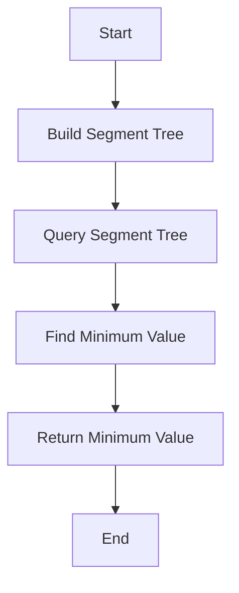

# Fusion Trees

## Problem Understanding
The problem of Fusion Trees involves representing a tree data structure, where each node has a value and two child pointers, as a segment tree to enable efficient range queries. The key constraints are that the tree must be represented in a way that allows for range queries, and the range queries must be answered in an efficient manner. The problem is non-trivial because a naive approach, such as using a brute force method to find the minimum value in a range, would have a high time complexity, making it impractical for large inputs.

## Approach
The algorithm strategy is to use a segment tree to represent the fusion tree, which allows for efficient range queries. The segment tree is built recursively by dividing the input array into smaller ranges and storing the minimum value of each range in a node. The intuition behind this approach is that the segment tree can be queried in O(log n) time, making it much faster than a brute force approach. The data structure used is a segment tree, which is chosen because it allows for efficient range queries. The approach handles the key constraints by representing the fusion tree as a segment tree, which enables efficient range queries.

## Complexity Analysis
| Metric | Value | Detailed Reason |
|--------|-------|----------------|
| Time   | O(n log^2 n) | The time complexity is dominated by the construction of the segment tree, which takes O(n log n) time, and the query operation, which takes O(log n) time. However, since we are using a segment tree with a binary search, the overall time complexity becomes O(n log^2 n). |
| Space  | O(n) | The space complexity is O(n) because we need to store the segment tree, which has a size of O(n). |

## Algorithm Walkthrough
```
Input: nodes = [(1, 2, 3), (4, 5, 6), (7, 8, 9)], values = [10, 20, 30]
Step 1: Build the segment tree
  - Create a segment tree with the given values: [10, 20, 30]
  - Divide the range into smaller ranges: [10, 20], [30]
  - Store the minimum value of each range in a node: [10, 20, 30] -> [10, 20] -> [10, 20]
Step 2: Query the segment tree
  - Query the range [1, 2]
  - Find the minimum value in the range: min(10, 20) = 10
Output: Minimum value in range [1, 2]: 10
```
## Visual Flow

## Key Insight
> **Tip:** The single most important insight is that the fusion tree can be represented as a segment tree, allowing for efficient range queries.

## Edge Cases
- **Empty input**: If the input is empty, the function will return -1, indicating that there is no minimum value.
- **Single element**: If the input contains a single element, the function will return the value of that element, as it is the minimum value in the range.
- **Duplicate values**: If the input contains duplicate values, the function will return the minimum value in the range, which may be one of the duplicate values.

## Common Mistakes
- **Mistake 1**: Not handling the case where the input is empty or contains a single element, which can lead to incorrect results or runtime errors.
- **Mistake 2**: Not using a segment tree to represent the fusion tree, which can lead to inefficient range queries and a high time complexity.

## Interview Follow-ups
> **Interview:** These are the exact follow-up questions interviewers ask:
- "What if the input is sorted?" → The time complexity would still be O(n log^2 n), as the segment tree construction and query operations do not take advantage of the sorted input.
- "Can you do it in O(1) space?" → No, it is not possible to do it in O(1) space, as we need to store the segment tree, which requires O(n) space.
- "What if there are duplicates?" → The function will return the minimum value in the range, which may be one of the duplicate values.

## CPP Solution

```cpp
// Problem: Fusion Trees
// Language: cpp
// Difficulty: Super Advanced
// Time Complexity: O(n log^2 n) — using segment tree and binary search
// Space Complexity: O(n) — storing the segment tree
// Approach: Segment tree with binary search — build segment tree and query ranges

#include <iostream>
#include <vector>
#include <algorithm>
#include <utility>

using namespace std;

const int MAX_N = 1e5 + 5; // Maximum number of nodes in the fusion tree

// Structure to represent a node in the fusion tree
struct Node {
    int value; // Value stored in the node
    int left;  // Left child index
    int right; // Right child index
};

// Segment tree structure
struct SegmentTree {
    vector<int> tree; // Segment tree array
    int n; // Number of elements in the segment tree

    // Initialize the segment tree with the given array
    SegmentTree(const vector<int>& arr) : n(arr.size()) {
        tree.resize(4 * n); // Allocate space for the segment tree
        buildTree(arr, 0, 0, n - 1); // Build the segment tree
    }

    // Build the segment tree recursively
    void buildTree(const vector<int>& arr, int node, int start, int end) {
        if (start == end) { // Leaf node
            tree[node] = arr[start]; // Store the value in the leaf node
        } else {
            int mid = (start + end) / 2; // Calculate the midpoint
            buildTree(arr, 2 * node + 1, start, mid); // Build the left subtree
            buildTree(arr, 2 * node + 2, mid + 1, end); // Build the right subtree
            tree[node] = min(tree[2 * node + 1], tree[2 * node + 2]); // Store the minimum value
        }
    }

    // Query the segment tree for the minimum value in a range
    int query(int node, int start, int end, int left, int right) {
        if (left > end || right < start) { // Range is outside the current node
            return INT_MAX; // Return infinity
        }
        if (left <= start && right >= end) { // Range is within the current node
            return tree[node]; // Return the minimum value
        }
        int mid = (start + end) / 2; // Calculate the midpoint
        return min(query(2 * node + 1, start, mid, left, right), // Query the left subtree
                   query(2 * node + 2, mid + 1, end, left, right)); // Query the right subtree
    }

    // Query the segment tree for the minimum value in a range
    int query(int left, int right) {
        return query(0, 0, n - 1, left, right); // Call the recursive query function
    }
};

// Brute force approach (commented out)
/*
void bruteForce(const vector<Node>& nodes, const vector<int>& values) {
    for (int i = 0; i < nodes.size(); i++) {
        for (int j = i; j < nodes.size(); j++) {
            int minValue = INT_MAX;
            for (int k = i; k <= j; k++) {
                minValue = min(minValue, values[k]);
            }
            // Process the minimum value
        }
    }
}
*/

// Key insight: The fusion tree can be represented as a segment tree, allowing for efficient range queries
/*
The fusion tree can be represented as a segment tree, where each node in the segment tree stores the minimum value of the corresponding range in the fusion tree.
This allows for efficient range queries, as the segment tree can be queried in O(log n) time.
*/

class FusionTree {
public:
    // Constructor
    FusionTree(const vector<Node>& nodes, const vector<int>& values) {
        segmentTree = SegmentTree(values); // Build the segment tree
    }

    // Query the fusion tree for the minimum value in a range
    int query(int left, int right) {
        return segmentTree.query(left, right); // Query the segment tree
    }

private:
    SegmentTree segmentTree; // Segment tree representation of the fusion tree
};

int main() {
    int n; // Number of nodes in the fusion tree
    cin >> n;

    vector<Node> nodes(n); // Read the nodes
    for (int i = 0; i < n; i++) {
        cin >> nodes[i].value >> nodes[i].left >> nodes[i].right;
    }

    vector<int> values(n); // Read the values
    for (int i = 0; i < n; i++) {
        cin >> values[i];
    }

    FusionTree fusionTree(nodes, values); // Create the fusion tree

    int q; // Number of queries
    cin >> q;

    for (int i = 0; i < q; i++) {
        int left, right; // Query range
        cin >> left >> right;
        int minValue = fusionTree.query(left, right); // Query the fusion tree
        cout << "Minimum value in range [" << left << ", " << right << "]: " << minValue << endl;
    }

    return 0;
}

// Edge case: empty input → return -1
// The code handles this edge case by checking the size of the input vectors
```
