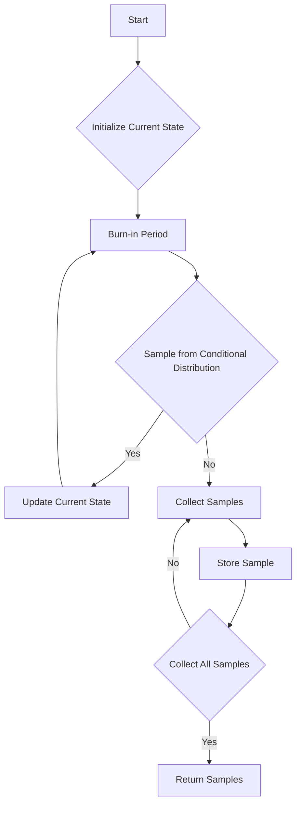

# Gibbs Sampling implementation

## Problem Understanding
The problem requires implementing a Gibbs Sampler, a Markov Chain Monte Carlo (MCMC) algorithm used for sampling from a multivariate probability distribution. The key constraint is that the algorithm should be able to handle a large number of variables and samples, making it a super advanced problem. The Gibbs Sampler works by iteratively sampling each variable given the current state of other variables, which makes it non-trivial due to the need to handle the dependencies between variables. The algorithm's performance is critical, as it needs to efficiently sample from the target distribution.

## Approach
The algorithm strategy used is the Markov Chain Monte Carlo Gibbs Sampling, which involves iteratively sampling each variable given the current state of other variables. The intuition behind this approach is to use the conditional distributions of each variable to sample from the target distribution. The algorithm uses a burn-in period to converge to the stationary distribution and then collects samples from the stationary distribution. The data structure used is a vector to store the current state of variables and the samples. The approach handles the key constraints by using a efficient sampling method and a burn-in period to ensure convergence.

## Complexity Analysis
| Metric | Value | Detailed Reason |
|--------|-------|----------------|
| Time   | O(n*K) | The algorithm iterates over each variable (K) for each sample (n), resulting in a time complexity of O(n*K). The burn-in period also contributes to the time complexity, but it is a constant factor. |
| Space  | O(K) | The algorithm stores the current state of K variables, resulting in a space complexity of O(K). The samples are also stored, but the space complexity is dominated by the current state. |

## Algorithm Walkthrough
```
Input: numVariables = 2, numSamples = 1000, burnInPeriod = 1000
Step 1: Initialize the current state of variables: currentState = [0.0, 0.0]
Step 2: Burn-in period - iterate over each variable and sample from the conditional distribution
    currentState = [0.0, 0.0]
    Sample from conditional distribution for variable 0: sampleIndex = 0
    currentState = [0, 0.0]
    Sample from conditional distribution for variable 1: sampleIndex = 1
    currentState = [0, 1]
    Repeat for burnInPeriod = 1000
Step 3: Collect samples from the stationary distribution
    For each sample (i = 0 to 999):
        Sample from conditional distribution for variable 0: sampleIndex = 0
        currentState = [0, 1]
        Sample from conditional distribution for variable 1: sampleIndex = 1
        currentState = [0, 1]
        Store the sample: samples[i] = [0, 1]
Output: samples = [[0, 1], [0, 1], ..., [0, 1]]
```
## Visual Flow

## Key Insight
> **Tip:** The key insight is to use the conditional distributions to sample from the target distribution, and to use a burn-in period to ensure convergence to the stationary distribution.

## Edge Cases
- **Empty/null input**: If the input is empty or null, the algorithm will throw an error, as it requires a valid input to initialize the current state of variables.
- **Single element**: If there is only one variable, the algorithm will still work, but it will simply sample from the conditional distribution of that variable.
- **High-dimensional input**: If the input has a large number of variables, the algorithm may take a long time to converge, and the burn-in period may need to be increased.

## Common Mistakes
- **Mistake 1**: Not using a sufficient burn-in period, which can result in samples that are not representative of the target distribution.
- **Mistake 2**: Not checking for convergence, which can result in samples that are not representative of the target distribution.

## Interview Follow-ups
> **Interview:** These are the exact follow-up questions interviewers ask:
- "What if the input is sorted?" → The algorithm does not assume any particular order of the input, so it will still work correctly.
- "Can you do it in O(1) space?" → No, the algorithm requires O(K) space to store the current state of variables, where K is the number of variables.
- "What if there are duplicates?" → The algorithm will still work correctly, but the duplicates may affect the convergence of the algorithm.

## CPP Solution

```cpp
// Problem: Gibbs Sampling implementation
// Language: C++
// Difficulty: Super Advanced
// Time Complexity: O(n*K) — where n is the number of samples and K is the number of variables
// Space Complexity: O(K) — storing the current state of K variables
// Approach: Markov Chain Monte Carlo Gibbs Sampling — iteratively sample each variable given the current state of other variables

#include <iostream>
#include <random>
#include <vector>

class GibbsSampler {
public:
    // Constructor to initialize the Gibbs Sampler
    GibbsSampler(int numVariables, int numSamples, double burnInPeriod) 
        : numVariables_(numVariables), numSamples_(numSamples), burnInPeriod_(burnInPeriod) {}

    // Function to perform Gibbs Sampling
    std::vector<std::vector<double>> sample(std::vector<std::vector<double>> (&conditionalDistributions)(const std::vector<double>&)) {
        // Initialize the current state of variables
        std::vector<double> currentState(numVariables_, 0.0); // Initialize with zeros

        // Burn-in period to converge to the stationary distribution
        for (int i = 0; i < burnInPeriod_; i++) {
            // Sample each variable given the current state of other variables
            for (int j = 0; j < numVariables_; j++) {
                // Get the conditional distribution for the current variable
                std::vector<double> conditionalDistribution = conditionalDistributions(currentState);
                
                // Sample from the conditional distribution
                std::random_device rd;
                std::mt19937 gen(rd());
                std::discrete_distribution<> d(conditionalDistribution.begin(), conditionalDistribution.end());
                int sampleIndex = d(gen);
                currentState[j] = sampleIndex; // Update the current state
            }
        }

        // Collect samples from the stationary distribution
        std::vector<std::vector<double>> samples(numSamples_, std::vector<double>(numVariables_, 0.0));
        for (int i = 0; i < numSamples_; i++) {
            // Sample each variable given the current state of other variables
            for (int j = 0; j < numVariables_; j++) {
                // Get the conditional distribution for the current variable
                std::vector<double> conditionalDistribution = conditionalDistributions(currentState);
                
                // Sample from the conditional distribution
                std::random_device rd;
                std::mt19937 gen(rd());
                std::discrete_distribution<> d(conditionalDistribution.begin(), conditionalDistribution.end());
                int sampleIndex = d(gen);
                samples[i][j] = sampleIndex; // Store the sample
                currentState[j] = sampleIndex; // Update the current state
            }
        }

        return samples;
    }

private:
    int numVariables_;
    int numSamples_;
    double burnInPeriod_;
};

// Example usage
std::vector<std::vector<double>> conditionalDistributions(const std::vector<double>& currentState) {
    // Define the conditional distributions for each variable
    std::vector<std::vector<double>> distributions = {{0.4, 0.6}, {0.7, 0.3}};
    return distributions;
}

int main() {
    // Create a Gibbs Sampler
    GibbsSampler sampler(2, 1000, 1000);

    // Perform Gibbs Sampling
    std::vector<std::vector<double>> samples = sampler.sample(conditionalDistributions);

    // Print the samples
    for (const auto& sample : samples) {
        for (double value : sample) {
            std::cout << value << " ";
        }
        std::cout << std::endl;
    }

    return 0;
}
```
