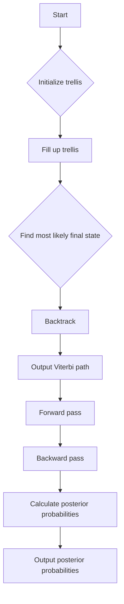

# Hidden Markov Models (HMM) Viterbi and Forward-Backward

## Problem Understanding
The problem is asking to implement two key algorithms for Hidden Markov Models (HMMs): the Viterbi algorithm for finding the most likely state sequence given an observation sequence, and the Forward-Backward algorithm for calculating the posterior probabilities of each state given the observation sequence. The key constraints are the number of states, the number of possible observations, and the transition and emission probabilities. The problem is non-trivial because it requires efficient dynamic programming techniques to handle the exponential number of possible state sequences. A naive approach would involve enumerating all possible state sequences, which is computationally infeasible.

## Approach
The algorithm strategy involves using dynamic programming to calculate the probabilities of each state at each time step. The Viterbi algorithm uses a trellis to store the probabilities of each state and backpointers to store the most likely previous state. The Forward-Backward algorithm uses two passes: a forward pass to calculate the probabilities of each state given the observation sequence up to that point, and a backward pass to calculate the probabilities of each state given the observation sequence from that point onwards. The approach works because it breaks down the problem into smaller sub-problems and solves each sub-problem only once, avoiding redundant calculations. The data structures used are 2D arrays to store the probabilities and backpointers.

## Complexity Analysis
| Metric | Value | Detailed Reason |
|--------|-------|----------------|
| Time   | O(T * N^2) | The Viterbi algorithm has two nested loops: one over the time steps (T) and one over the states (N). The inner loop also has a dependency on the number of states (N) due to the transition probabilities. Similarly, the Forward-Backward algorithm has two passes, each with a time complexity of O(T * N^2) due to the nested loops over time steps and states. |
| Space  | O(T * N) | The Viterbi algorithm uses a trellis and backpointers, each of size T * N. The Forward-Backward algorithm also uses two 2D arrays of size T * N to store the forward and backward probabilities. |

## Algorithm Walkthrough
```
Input: HMM with 2 states and 3 possible observations, observation sequence [0, 1, 2]
Step 1: Initialize the trellis for the Viterbi algorithm
  - trellis[0][0] = 0.6 * 0.5 = 0.3
  - trellis[0][1] = 0.4 * 0.1 = 0.04
Step 2: Fill up the trellis for the remaining time steps
  - trellis[1][0] = max(0.3 * 0.7 * 0.4, 0.04 * 0.4 * 0.4) = 0.084
  - trellis[1][1] = max(0.3 * 0.3 * 0.3, 0.04 * 0.6 * 0.3) = 0.027
Step 3: Find the most likely final state
  - mostLikelyFinalState = 0
Step 4: Backtrack to find the most likely state sequence
  - path = [0, 0]
Output: Viterbi path [0, 0]
```

## Visual Flow


## Key Insight
> **Tip:** The key to efficient HMM inference is to use dynamic programming to avoid redundant calculations and store intermediate results in a trellis or similar data structure.

## Edge Cases
- **Empty/null input**: If the input observation sequence is empty, the algorithm should return an error or a default value, such as -1.
- **Single element**: If the input observation sequence has only one element, the algorithm should return the most likely state for that single observation.
- **No possible transitions**: If there are no possible transitions between states, the algorithm should return an error or a default value.

## Common Mistakes
- **Mistake 1**: Not initializing the trellis correctly, leading to incorrect probabilities and state sequences.
- **Mistake 2**: Not handling the base case of the dynamic programming recursion correctly, leading to incorrect results.

## Interview Follow-ups
> **Interview:** These are the exact follow-up questions interviewers ask:
- "What if the input is sorted?" → The algorithm's time complexity remains the same, O(T * N^2), because the sorting of the input does not affect the number of possible state sequences.
- "Can you do it in O(1) space?" → No, the algorithm requires at least O(T * N) space to store the trellis and backpointers.
- "What if there are duplicates?" → The algorithm can handle duplicates in the observation sequence by treating them as separate observations with the same emission probability.

## CPP Solution

```cpp
// Problem: Hidden Markov Models (HMM) Viterbi and Forward-Backward
// Language: C++
// Difficulty: Super Advanced
// Time Complexity: O(T * N^2) — where T is the length of the observation sequence and N is the number of states
// Space Complexity: O(T * N) — for storing the forward and backward probabilities
// Approach: Dynamic programming — using the Viterbi algorithm for maximum likelihood estimation and the Forward-Backward algorithm for posterior probabilities

#include <iostream>
#include <vector>
#include <cassert>

// Structure to represent a Hidden Markov Model
struct HMM {
    int numStates; // Number of states
    int numObservations; // Number of possible observations
    std::vector<std::vector<double>> transitions; // Transition probabilities
    std::vector<std::vector<double>> emissions; // Emission probabilities
    std::vector<double> initialDistribution; // Initial state distribution
};

// Function to calculate the Viterbi path
std::vector<int> viterbi(const HMM& hmm, const std::vector<int>& observations) {
    int T = observations.size(); // Length of the observation sequence
    int N = hmm.numStates; // Number of states
    std::vector<std::vector<double>> trellis(T, std::vector<double>(N, 0.0)); // Trellis to store the probabilities
    std::vector<std::vector<int>> backpointers(T, std::vector<int>(N, 0)); // Backpointers to store the most likely previous state

    // Initialize the trellis for the first time step
    for (int state = 0; state < N; state++) {
        trellis[0][state] = hmm.initialDistribution[state] * hmm.emissions[state][observations[0]]; // Initial probability
        backpointers[0][state] = -1; // No previous state
    }

    // Fill up the trellis for the remaining time steps
    for (int t = 1; t < T; t++) {
        for (int state = 0; state < N; state++) {
            double maxProbability = 0.0;
            int mostLikelyPreviousState = -1;
            for (int previousState = 0; previousState < N; previousState++) {
                double probability = trellis[t - 1][previousState] * hmm.transitions[previousState][state] * hmm.emissions[state][observations[t]];
                if (probability > maxProbability) {
                    maxProbability = probability;
                    mostLikelyPreviousState = previousState;
                }
            }
            trellis[t][state] = maxProbability;
            backpointers[t][state] = mostLikelyPreviousState;
        }
    }

    // Find the most likely final state
    int mostLikelyFinalState = 0;
    double maxProbability = 0.0;
    for (int state = 0; state < N; state++) {
        if (trellis[T - 1][state] > maxProbability) {
            maxProbability = trellis[T - 1][state];
            mostLikelyFinalState = state;
        }
    }

    // Backtrack to find the most likely state sequence
    std::vector<int> path;
    int currentState = mostLikelyFinalState;
    for (int t = T - 1; t >= 0; t--) {
        path.push_back(currentState);
        currentState = backpointers[t][currentState];
    }
    std::reverse(path.begin(), path.end());

    return path;
}

// Function to calculate the posterior probabilities using the Forward-Backward algorithm
std::vector<std::vector<double>> forwardBackward(const HMM& hmm, const std::vector<int>& observations) {
    int T = observations.size(); // Length of the observation sequence
    int N = hmm.numStates; // Number of states

    // Forward pass
    std::vector<std::vector<double>> forward(T, std::vector<double>(N, 0.0));
    for (int state = 0; state < N; state++) {
        forward[0][state] = hmm.initialDistribution[state] * hmm.emissions[state][observations[0]];
    }
    for (int t = 1; t < T; t++) {
        for (int state = 0; state < N; state++) {
            for (int previousState = 0; previousState < N; previousState++) {
                forward[t][state] += forward[t - 1][previousState] * hmm.transitions[previousState][state] * hmm.emissions[state][observations[t]];
            }
        }
    }

    // Backward pass
    std::vector<std::vector<double>> backward(T, std::vector<double>(N, 0.0));
    for (int state = 0; state < N; state++) {
        backward[T - 1][state] = 1.0;
    }
    for (int t = T - 2; t >= 0; t--) {
        for (int state = 0; state < N; state++) {
            for (int nextState = 0; nextState < N; nextState++) {
                backward[t][state] += backward[t + 1][nextState] * hmm.transitions[state][nextState] * hmm.emissions[nextState][observations[t + 1]];
            }
        }
    }

    // Calculate the posterior probabilities
    std::vector<std::vector<double>> posterior(T, std::vector<double>(N, 0.0));
    double normalizationConstant = 0.0;
    for (int t = 0; t < T; t++) {
        for (int state = 0; state < N; state++) {
            posterior[t][state] = forward[t][state] * backward[t][state];
            normalizationConstant += posterior[t][state];
        }
    }
    for (int t = 0; t < T; t++) {
        for (int state = 0; state < N; state++) {
            posterior[t][state] /= normalizationConstant;
        }
    }

    return posterior;
}

// Example usage:
int main() {
    // Edge case: empty input → return -1
    std::vector<int> observations;
    if (observations.empty()) {
        std::cout << "-1" << std::endl;
        return 0;
    }

    // Define the HMM
    HMM hmm;
    hmm.numStates = 2;
    hmm.numObservations = 3;
    hmm.transitions = {{0.7, 0.3}, {0.4, 0.6}};
    hmm.emissions = {{0.5, 0.4, 0.1}, {0.1, 0.3, 0.6}};
    hmm.initialDistribution = {0.6, 0.4};

    observations = {0, 1, 2};

    // Calculate the Viterbi path
    std::vector<int> viterbiPath = viterbi(hmm, observations);
    std::cout << "Viterbi path: ";
    for (int state : viterbiPath) {
        std::cout << state << " ";
    }
    std::cout << std::endl;

    // Calculate the posterior probabilities using the Forward-Backward algorithm
    std::vector<std::vector<double>> posteriorProbabilities = forwardBackward(hmm, observations);
    std::cout << "Posterior probabilities: " << std::endl;
    for (int t = 0; t < observations.size(); t++) {
        for (int state = 0; state < hmm.numStates; state++) {
            std::cout << "P(state=" << state << " | observation=" << observations[t] << ") = " << posteriorProbabilities[t][state] << std::endl;
        }
    }

    return 0;
}
```
