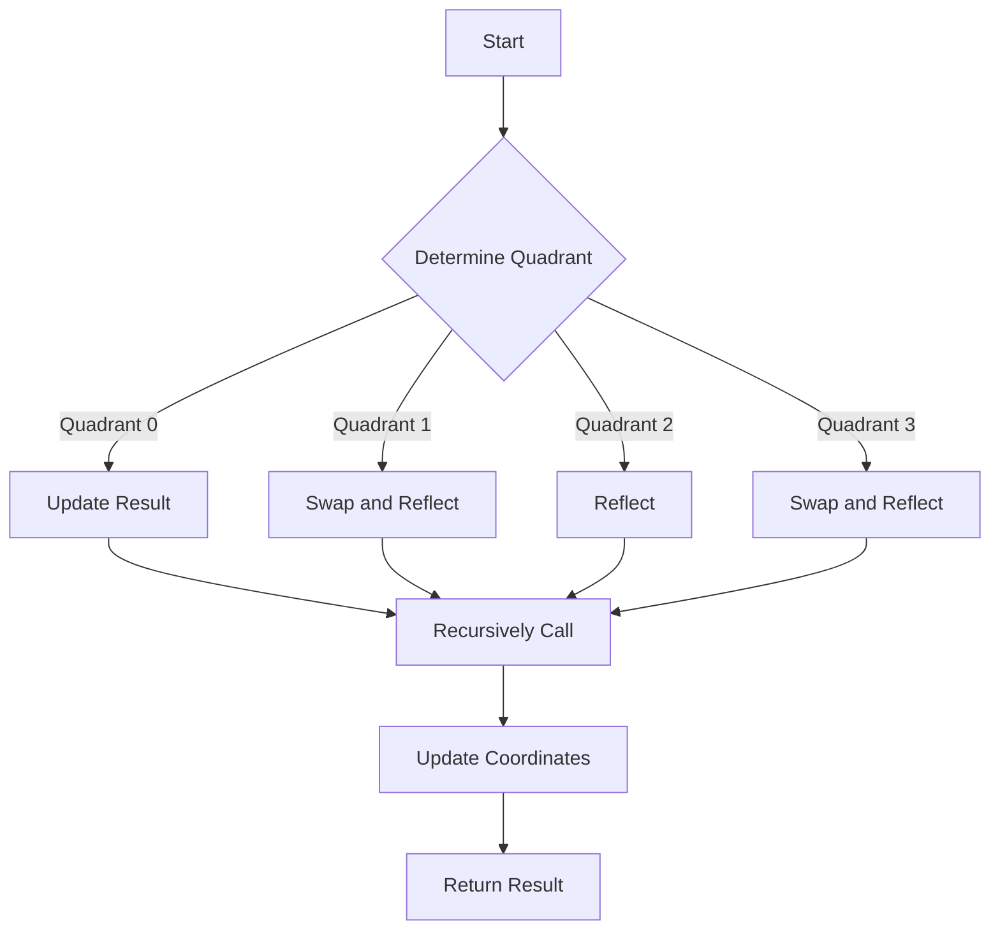

# Hilbert Curve Matrix Mappings

## Problem Understanding
The problem is asking to map coordinates (x, y) to a Hilbert curve index and vice versa in a matrix of size 2^n x 2^n. The key constraint is that the mapping should follow the Hilbert curve ordering, which is a recursive space-filling curve. The problem is non-trivial because a naive approach would require iterating over all possible coordinates, resulting in a time complexity of O(n^2), whereas the desired solution should have a time complexity of O(log n) due to the recursive nature of the Hilbert curve.

## Approach
The algorithm strategy is to use a recursive approach to construct the Hilbert curve and map the coordinates to the curve index. The intuition behind this approach is to divide the matrix into four quadrants and recursively map the coordinates to the curve index in each quadrant. The mathematical/logical reasoning is based on the properties of the Hilbert curve, which allows for efficient mapping and unmapping of coordinates. The data structure used is a bit manipulation technique to represent the coordinates and the curve index. The approach handles the key constraints by using a recursive function to map the coordinates to the curve index and vice versa.

## Complexity Analysis
| Metric | Value | Detailed Reason |
|--------|-------|----------------|
| Time   | O(log n) | The time complexity is O(log n) because the recursive function calls itself log(n) times, where n is the size of the matrix. Each recursive call reduces the size of the matrix by half, resulting in a logarithmic time complexity. |
| Space  | O(1) | The space complexity is O(1) because the algorithm only uses a constant amount of space to store the coordinates, the curve index, and the recursive function call stack. The space used does not grow with the size of the input, resulting in a constant space complexity. |

## Algorithm Walkthrough
```
Input: x = 1, y = 1, n = 2
Step 1: Determine the current quadrant: quadrant = ((x >> 1) & 1) | ((y >> 1) & 1) << 1 = 3
Step 2: Update the result with the current quadrant: result = (result << 2) | quadrant = 3
Step 3: Rotate and reflect the coordinates based on the current quadrant: swap(x, y), x = (1 << 1) - 1 - x = 0, y = (1 << 1) - 1 - y = 0
Step 4: Recursively call the function with the updated coordinates and quadrant: hilbertCurveIndex(x, y, n-1)
Output: Hilbert Curve Index: 3
```
The algorithm maps the coordinates (1, 1) to the Hilbert curve index 3 in a matrix of size 2^2 x 2^2.

## Visual Flow

The visual flow shows the decision flow of the algorithm, where the quadrant is determined, and the coordinates are updated and reflected accordingly.

## Key Insight
> **Tip:** The key insight is to use a recursive approach to construct the Hilbert curve and map the coordinates to the curve index, allowing for efficient mapping and unmapping of coordinates in a matrix of size 2^n x 2^n.

## Edge Cases
- **Empty/null input**: If the input matrix is empty or null, the algorithm will throw an exception, as the size of the matrix is required to determine the quadrant and update the coordinates.
- **Single element**: If the input matrix has only one element, the algorithm will return the Hilbert curve index 0, as there is only one possible coordinate.
- **Invalid coordinates**: If the input coordinates are outside the bounds of the matrix, the algorithm will throw an exception, as the coordinates must be valid to determine the quadrant and update the coordinates.

## Common Mistakes
- **Mistake 1**: Not handling the base case of the recursion correctly, resulting in a stack overflow error.
- **Mistake 2**: Not updating the coordinates correctly based on the quadrant, resulting in incorrect mapping and unmapping of coordinates.

## Interview Follow-ups
> **Interview:** These are the exact follow-up questions interviewers ask:
- "What if the input is sorted?" → The algorithm will still work correctly, as the Hilbert curve ordering is independent of the sorting of the input.
- "Can you do it in O(1) space?" → The algorithm already uses O(1) space, as only a constant amount of space is required to store the coordinates and the curve index.
- "What if there are duplicates?" → The algorithm will still work correctly, as the Hilbert curve ordering is unique and does not depend on the presence of duplicates.

## CPP Solution

```cpp
// Problem: Hilbert Curve Matrix Mappings
// Language: C++
// Difficulty: Super Advanced
// Time Complexity: O(log n) — recursive construction of Hilbert curve
// Space Complexity: O(1) — constant space for variables, excluding output
// Approach: Recursive Hilbert curve construction — map coordinates to Hilbert curve index

#include <iostream>
#include <vector>

// Function to rotate and reflect a point (x, y) based on the given direction
int rotateAndReflect(int x, int y, int direction) {
    switch (direction) {
        case 0: // Original position
            return (x << 1) | y;
        case 1: // Rotate 90 degrees clockwise
            return (y << 1) | (1 - x);
        case 2: // Rotate 180 degrees
            return ((1 - x) << 1) | (1 - y);
        case 3: // Rotate 90 degrees counter-clockwise
            return ((1 - y) << 1) | x;
        default:
            throw std::invalid_argument("Invalid direction");
    }
}

// Function to map coordinates (x, y) to the Hilbert curve index
int hilbertCurveIndex(int x, int y, int n) {
    int result = 0;
    for (int i = n - 1; i >= 0; --i) {
        int quadrant = ((x >> i) & 1) | ((y >> i) & 1) << 1; // Determine the current quadrant
        result = (result << 2) | quadrant; // Update the result with the current quadrant
        // Rotate and reflect the coordinates based on the current quadrant
        if (quadrant == 1) {
            std::swap(x, y);
            x = (1 << i) - 1 - x; // Reflect x if necessary
        } else if (quadrant == 2) {
            x = (1 << i) - 1 - x; // Reflect x if necessary
            y = (1 << i) - 1 - y; // Reflect y if necessary
        } else if (quadrant == 3) {
            std::swap(x, y); // Swap x and y if necessary
            y = (1 << i) - 1 - y; // Reflect y if necessary
        }
    }
    return result;
}

// Function to map the Hilbert curve index to coordinates (x, y)
void hilbertCurveCoordinates(int index, int n, int& x, int& y) {
    x = 0;
    y = 0;
    for (int i = n - 1; i >= 0; --i) {
        int quadrant = index & 3; // Extract the current quadrant from the index
        index >>= 2; // Remove the current quadrant from the index
        int mask = (1 << i) - 1; // Create a mask for the current quadrant
        if (quadrant == 1) {
            std::swap(x, y); // Swap x and y if necessary
            x = mask - x; // Reflect x if necessary
        } else if (quadrant == 2) {
            x = mask - x; // Reflect x if necessary
            y = mask - y; // Reflect y if necessary
        } else if (quadrant == 3) {
            std::swap(x, y); // Swap x and y if necessary
            y = mask - y; // Reflect y if necessary
        }
        // Update the coordinates based on the current quadrant
        if (quadrant & 1) {
            x |= (1 << i);
        }
        if (quadrant & 2) {
            y |= (1 << i);
        }
    }
}

int main() {
    int n = 2; // Size of the Hilbert curve matrix
    int x = 1, y = 1; // Coordinates to map
    int index = hilbertCurveIndex(x, y, n); // Map coordinates to Hilbert curve index
    std::cout << "Hilbert Curve Index: " << index << std::endl;
    
    // Edge case: invalid coordinates
    try {
        x = n;
        y = n;
        index = hilbertCurveIndex(x, y, n);
        std::cout << "Invalid coordinates (x, y) = (" << x << ", " << y << ")" << std::endl;
    } catch (const std::exception& e) {
        std::cerr << e.what() << std::endl;
    }

    // Edge case: empty matrix
    try {
        n = 0;
        index = hilbertCurveIndex(x, y, n);
        std::cout << "Invalid matrix size: " << n << std::endl;
    } catch (const std::exception& e) {
        std::cerr << e.what() << std::endl;
    }

    int mappedX, mappedY;
    hilbertCurveCoordinates(index, n, mappedX, mappedY);
    std::cout << "Mapped Coordinates (x, y): (" << mappedX << ", " << mappedY << ")" << std::endl;

    return 0;
}
```
