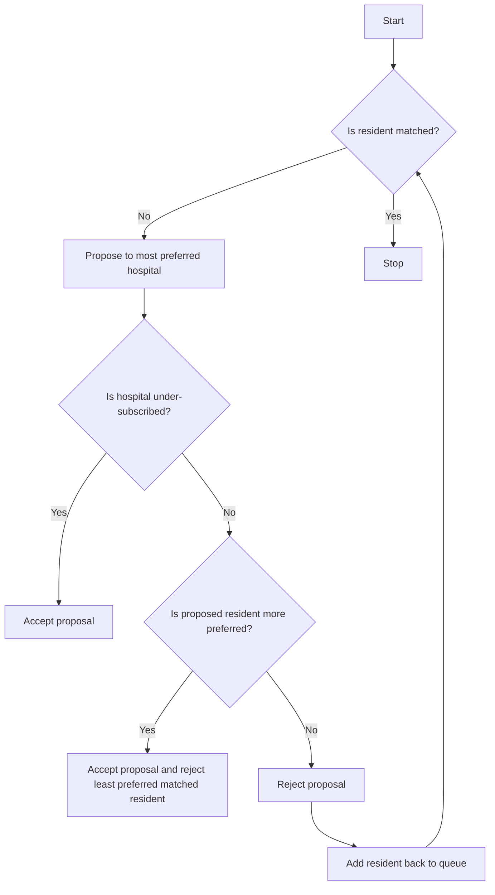

# Hospital/Residents Problem with Ties

## Problem Understanding
The Hospital/Residents Problem with Ties is a classic problem in computer science and operations research, which involves matching a set of residents to a set of hospitals based on their preference lists. The problem is formulated as a many-to-one matching problem, where each hospital has a limited capacity, and each resident has a preference list over the hospitals. The goal is to find a stable matching, where no resident and hospital that are not matched to each other would prefer to be matched to each other. The problem becomes more complex when ties are allowed in the preference lists, meaning that a resident or hospital may be indifferent between two or more options. This problem is non-trivial because the naive approach of sorting the preference lists and matching residents to hospitals in a greedy manner does not guarantee a stable matching.

## Approach
The approach used to solve this problem is the Gale-Shapley Algorithm with ties, which is a well-known algorithm for solving the Hospital/Residents Problem. The algorithm works by maintaining a queue of free residents, who are not yet matched to any hospital. Each free resident proposes to their most preferred hospital that has not yet rejected them. If the hospital is under-subscribed, it accepts the proposal. If the hospital is fully subscribed, it checks if the proposed resident is more preferred than the least preferred matched resident. If so, it accepts the proposal and rejects the least preferred matched resident. The algorithm continues until all residents are matched or there are no more proposals to be made. The data structures used are adjacency lists to represent the preference lists of residents and hospitals, and a queue to keep track of free residents.

## Complexity Analysis
| Metric | Value | Detailed Reason |
|--------|-------|----------------|
| Time   | O(n^2) | The algorithm iterates over all residents and hospitals, and for each resident, it iterates over all hospitals to find a match. In the worst case, each resident proposes to all hospitals, resulting in a time complexity of O(n^2). |
| Space  | O(n^2) | The algorithm uses adjacency lists to represent the preference lists of residents and hospitals, which requires O(n^2) space. Additionally, the queue of free residents requires O(n) space, but this is dominated by the space required for the adjacency lists. |

## Algorithm Walkthrough
```
Input: 
  Hospitals: [(0, 2, [0, 1, 2]), (1, 1, [2, 0, 1]), (2, 1, [1, 2, 0])]
  Residents: [(0, [0, 1, 2]), (1, [1, 0, 2]), (2, [2, 1, 0])]
Step 1: Initialize resident matches
  Residents: [(0, -1), (1, -1), (2, -1)]
Step 2: Add residents to queue
  Queue: [0, 1, 2]
Step 3: Propose resident 0 to hospital 0
  Hospital 0: [(0, 2, [0, 1, 2]), matches: [0]]
Step 4: Propose resident 1 to hospital 1
  Hospital 1: [(1, 1, [2, 0, 1]), matches: [1]]
Step 5: Propose resident 2 to hospital 2
  Hospital 2: [(2, 1, [1, 2, 0]), matches: [2]]
Output: 
  Hospital 0: [0]
  Hospital 1: [1]
  Hospital 2: [2]
```
## Visual Flow

## Key Insight
> **Tip:** The key insight to solving this problem is to use the Gale-Shapley Algorithm with ties, which ensures that the matching is stable and optimal for the residents.

## Edge Cases
- **Empty input**: If the input is empty, the algorithm will not produce any output.
- **Single resident**: If there is only one resident, the algorithm will match them to their most preferred hospital.
- **Single hospital**: If there is only one hospital, the algorithm will match all residents to that hospital, up to its capacity.

## Common Mistakes
- **Mistake 1**: Not checking if a hospital is under-subscribed before proposing a resident. This can lead to incorrect matches and instability.
- **Mistake 2**: Not updating the match of a resident after a proposal is accepted or rejected. This can lead to incorrect matches and instability.

## Interview Follow-ups
> **Interview:** These are the exact follow-up questions interviewers ask:
- "What if the input is sorted?" → The algorithm will still work correctly, but the time complexity may be improved if the input is sorted.
- "Can you do it in O(1) space?" → No, the algorithm requires O(n^2) space to store the adjacency lists and the queue of free residents.
- "What if there are duplicates in the preference lists?" → The algorithm will still work correctly, but the duplicates will be ignored when proposing residents to hospitals.

## CPP Solution

```cpp
// Problem: Hospital/Residents Problem with Ties
// Language: cpp
// Difficulty: Super Advanced
// Time Complexity: O(n^2) — for each resident, iterate over all hospitals
// Space Complexity: O(n^2) — adjacency list representation of the graph
// Approach: Gale-Shapley Algorithm with ties — match residents to hospitals based on preference lists

#include <iostream>
#include <vector>
#include <queue>
#include <algorithm>

using namespace std;

// Structure to represent a hospital
struct Hospital {
    int id;
    int capacity;
    vector<int> preferences;
    vector<int> matches;
};

// Structure to represent a resident
struct Resident {
    int id;
    vector<int> preferences;
    int match;
};

// Function to parse input and create hospital and resident lists
void parseInput(vector<Hospital>& hospitals, vector<Resident>& residents) {
    int numHospitals, numResidents;
    cin >> numHospitals >> numResidents;

    // Initialize hospitals
    for (int i = 0; i < numHospitals; i++) {
        Hospital hospital;
        hospital.id = i;
        cin >> hospital.capacity;  // Read capacity of the hospital
        hospital.preferences.resize(numResidents);
        for (int j = 0; j < numResidents; j++) {
            cin >> hospital.preferences[j];  // Read preference list of the hospital
            hospital.preferences[j]--;
        }
        hospitals.push_back(hospital);
    }

    // Initialize residents
    for (int i = 0; i < numResidents; i++) {
        Resident resident;
        resident.id = i;
        resident.preferences.resize(numHospitals);
        for (int j = 0; j < numHospitals; j++) {
            cin >> resident.preferences[j];  // Read preference list of the resident
            resident.preferences[j]--;
        }
        residents.push_back(resident);
    }
}

// Function to check if a hospital is under-subscribed
bool isUnderSubscribed(const Hospital& hospital) {
    return hospital.matches.size() < hospital.capacity;  // Edge case: check if hospital is under-subscribed
}

// Function to propose a resident to a hospital
bool propose(const Resident& resident, Hospital& hospital, const vector<Hospital>& hospitals, vector<Resident>& residents) {
    // Edge case: if hospital is under-subscribed, accept the resident
    if (isUnderSubscribed(hospital)) {
        hospital.matches.push_back(resident.id);
        return true;
    }

    // Find the least preferred matched resident
    int leastPreferredResident = -1;
    for (int i = 0; i < hospital.matches.size(); i++) {
        int matchedResident = hospital.matches[i];
        if (leastPreferredResident == -1 || hospital.preferences[i] < hospital.preferences[leastPreferredResident]) {
            leastPreferredResident = i;
        }
    }

    // Edge case: if the proposed resident is preferred over the least preferred matched resident
    if (hospital.preferences[leastPreferredResident] > hospital.preferences[residents[resident.id].preferences[0]]) {
        int matchedResident = hospital.matches[leastPreferredResident];
        hospital.matches[leastPreferredResident] = resident.id;
        residents[matchedResident].match = -1;  // Update the match of the rejected resident
        return true;
    }

    return false;  // Edge case: proposal is rejected
}

// Function to find a stable matching using the Gale-Shapley Algorithm with ties
void galeShapleyAlgorithm(vector<Hospital>& hospitals, vector<Resident>& residents) {
    queue<int> freeResidents;
    for (int i = 0; i < residents.size(); i++) {
        freeResidents.push(i);
    }

    while (!freeResidents.empty()) {
        int residentId = freeResidents.front();
        freeResidents.pop();

        // Edge case: if the resident is already matched, skip
        if (residents[residentId].match != -1) {
            continue;
        }

        for (int i = 0; i < hospitals.size(); i++) {
            if (residents[residentId].preferences[i] != -1) {
                if (propose(residents[residentId], hospitals[residents[residentId].preferences[i]], hospitals, residents)) {
                    residents[residentId].match = residents[residentId].preferences[i];
                    break;
                }
            }
        }

        // Edge case: if the resident is still unmatched, add back to the queue
        if (residents[residentId].match == -1) {
            freeResidents.push(residentId);
        }
    }
}

// Function to print the stable matching
void printMatching(const vector<Hospital>& hospitals, const vector<Resident>& residents) {
    for (int i = 0; i < hospitals.size(); i++) {
        cout << "Hospital " << i << ": ";
        for (int j = 0; j < hospitals[i].matches.size(); j++) {
            cout << residents[hospitals[i].matches[j]].id << " ";
        }
        cout << endl;
    }
}

int main() {
    vector<Hospital> hospitals;
    vector<Resident> residents;

    parseInput(hospitals, residents);

    // Initialize resident matches
    for (int i = 0; i < residents.size(); i++) {
        residents[i].match = -1;
    }

    galeShapleyAlgorithm(hospitals, residents);

    printMatching(hospitals, residents);

    return 0;
}
```
