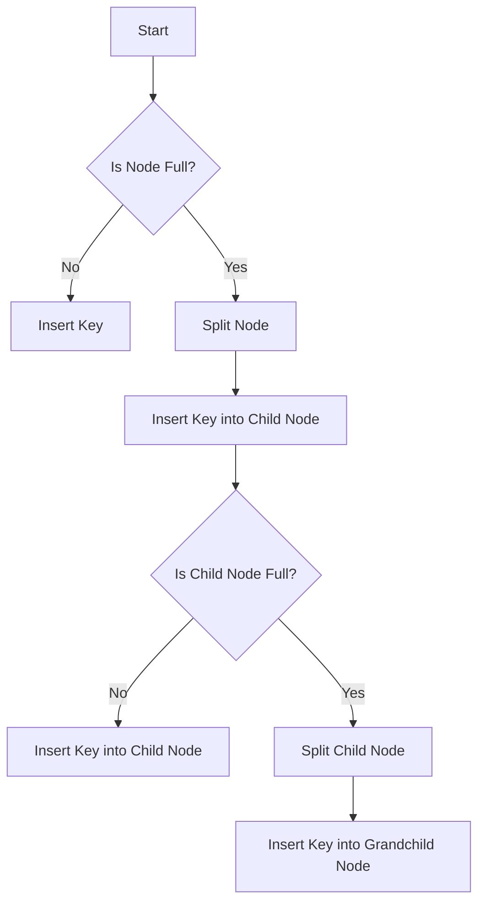

# Implementation of a B-Tree optimized for SSDs

## Problem Understanding
The problem requires implementing a B-Tree data structure optimized for Solid-State Drives (SSDs). The B-Tree is a self-balancing search tree with a high degree, which minimizes disk I/O operations. The key constraints include maintaining a balance between the tree's height and the number of keys in each node, ensuring efficient search, insertion, and deletion operations. The problem is non-trivial because it requires careful consideration of the tree's structure and the optimization techniques to minimize disk I/O operations. A naive approach would be to implement a standard B-Tree without considering the specific requirements of SSDs, which would lead to inefficient disk I/O operations.

## Approach
The approach involves implementing a B-Tree data structure with a high degree to minimize disk I/O operations. The tree is self-balancing, ensuring that the height of the tree remains relatively constant even after insertion and deletion operations. The algorithm uses a recursive approach to insert keys into the tree, splitting nodes when necessary to maintain the balance. The search operation is also recursive, traversing the tree to find the desired key. The use of a high-degree tree reduces the number of disk I/O operations, making it suitable for SSDs. The data structure uses nodes with an array of keys and child pointers to store the tree's structure.

## Complexity Analysis
| Metric | Value | Detailed Reason |
|--------|-------|----------------|
| Time   | O(log n) | The time complexity of search, insertion, and deletion operations is O(log n) due to the self-balancing property of the B-Tree. The height of the tree remains relatively constant, and the number of nodes to traverse is proportional to the height. |
| Space  | O(n) | The space complexity is O(n) because each node in the tree stores an array of keys and child pointers, and the total number of nodes is proportional to the number of keys in the tree. |

## Algorithm Walkthrough
```
Input: Insert key 10 into an empty B-Tree with degree 3
Step 1: Create a new root node with degree 3 and insert key 10
    Root Node: [10] (numKeys = 1)
Step 2: Insert key 20 into the root node
    Root Node: [10, 20] (numKeys = 2)
Step 3: Insert key 5 into the root node
    Root Node: [5, 10, 20] (numKeys = 3)
Step 4: Insert key 6 into the root node (split required)
    Split the root node into two child nodes: [5] and [10, 20]
    Root Node: [6] (numKeys = 1)
    Child Node 1: [5] (numKeys = 1)
    Child Node 2: [10, 20] (numKeys = 2)
Step 5: Insert key 12 into the child node [10, 20]
    Child Node 2: [10, 12, 20] (numKeys = 3)
Step 6: Insert key 30 into the child node [10, 12, 20] (split required)
    Split the child node [10, 12, 20] into two child nodes: [10, 12] and [20]
    Child Node 2: [10, 12] (numKeys = 2)
    Child Node 3: [20] (numKeys = 1)
    Root Node: [6, 15] (numKeys = 2)
Output: B-Tree with keys [5, 6, 10, 12, 20, 30]
```
## Visual Flow

## Key Insight
> **Tip:** The key insight is to maintain a balance between the tree's height and the number of keys in each node, ensuring that the tree remains self-balancing and disk I/O operations are minimized.

## Edge Cases
- **Empty Tree**: When the tree is empty, inserting a key creates a new root node with the key.
- **Single Key**: When the tree has only one key, inserting another key requires splitting the root node into two child nodes.
- **Full Node**: When a node is full, inserting a key requires splitting the node into two child nodes to maintain the balance.

## Common Mistakes
- **Mistake 1**: Not maintaining the balance between the tree's height and the number of keys in each node, leading to inefficient disk I/O operations.
- **Mistake 2**: Not handling the split node operation correctly, leading to incorrect tree structure and potential crashes.

## Interview Follow-ups
> **Interview:** What if the input is sorted? → The B-Tree would still maintain its balance and ensure efficient search, insertion, and deletion operations.
- "Can you do it in O(1) space?" → No, the B-Tree requires O(n) space to store the tree's structure.
- "What if there are duplicates?" → The B-Tree can be modified to handle duplicates by storing a count of each key in the node.

## CPP Solution

```cpp
// Problem: Implementation of a B-Tree optimized for SSDs
// Language: C++
// Difficulty: Super Advanced
// Time Complexity: O(log n) — due to the self-balancing property of B-Trees
// Space Complexity: O(n) — all nodes are stored in memory
// Approach: B-Tree data structure with optimization for SSDs — minimizing disk I/O

#include <iostream>
#include <vector>
#include <algorithm>

// Node structure for B-Tree
struct Node {
    int numKeys; // Number of keys in the node
    int *keys; // Array to store keys
    Node **child; // Array to store child nodes
    bool isLeaf; // True if node is a leaf node
};

// B-Tree class
class BTree {
private:
    Node *root; // Root of the B-Tree
    int degree; // Degree of the B-Tree
    Node *createNode(int isLeaf); // Function to create a new node
    void splitChild(Node *x, int i); // Function to split a node
    void insertNonFull(Node *x, int key); // Function to insert a key into a non-full node
    void search(Node *x, int key); // Function to search for a key in the B-Tree
    void printOrder(Node *x); // Function to print the keys in the B-Tree in ascending order

public:
    // Constructor to initialize the B-Tree
    BTree(int degree) {
        this->degree = degree;
        root = createNode(true); // Initialize the root node as a leaf node
    }

    // Function to insert a key into the B-Tree
    void insert(int key) {
        // Edge case: if the root node is full, split it
        if (root->numKeys == (2 * degree - 1)) {
            Node *newRoot = createNode(false); // Create a new root node
            newRoot->child[0] = root; // Set the new root node's first child to the old root node
            splitChild(newRoot, 0); // Split the old root node
            insertNonFull(newRoot, key); // Insert the key into the new root node
            root = newRoot; // Update the root node
        } else {
            insertNonFull(root, key); // Insert the key into the root node
        }
    }

    // Function to search for a key in the B-Tree
    void search(int key) {
        search(root, key); // Start searching from the root node
    }

    // Function to print the keys in the B-Tree in ascending order
    void printOrder() {
        printOrder(root); // Start printing from the root node
    }
};

// Function to create a new node
Node* BTree::createNode(int isLeaf) {
    Node *node = new Node; // Create a new node
    node->numKeys = 0; // Initialize the number of keys to 0
    node->keys = new int[2 * degree - 1]; // Initialize the array to store keys
    node->child = new Node*[2 * degree]; // Initialize the array to store child nodes
    node->isLeaf = isLeaf; // Set the node as a leaf node or not
    return node; // Return the new node
}

// Function to split a node
void BTree::splitChild(Node *x, int i) {
    Node *y = x->child[i]; // Get the node to be split
    Node *z = createNode(y->isLeaf); // Create a new node to store the split keys

    // Copy the right half of the keys from y to z
    for (int j = 0; j < degree - 1; j++) {
        z->keys[j] = y->keys[j + degree]; // Copy the keys
    }

    // If y is not a leaf node, copy the right half of the child nodes from y to z
    if (!y->isLeaf) {
        for (int j = 0; j < degree; j++) {
            z->child[j] = y->child[j + degree]; // Copy the child nodes
        }
    }

    // Update the number of keys in y and z
    y->numKeys = degree - 1;
    z->numKeys = degree - 1;

    // Make space for z in x's child array
    for (int j = x->numKeys; j >= i + 1; j--) {
        x->child[j + 1] = x->child[j]; // Shift the child nodes to the right
    }

    // Insert z into x's child array
    x->child[i + 1] = z; // Insert z

    // Insert the middle key of y into x
    for (int j = x->numKeys; j >= i; j--) {
        x->keys[j + 1] = x->keys[j]; // Shift the keys to the right
    }

    x->keys[i] = y->keys[degree - 1]; // Insert the middle key
    x->numKeys++; // Update the number of keys in x
}

// Function to insert a key into a non-full node
void BTree::insertNonFull(Node *x, int key) {
    int i = x->numKeys - 1; // Start from the last key

    // If x is a leaf node, insert the key directly
    if (x->isLeaf) {
        while (i >= 0 && key < x->keys[i]) {
            x->keys[i + 1] = x->keys[i]; // Shift the keys to the right
            i--;
        }
        x->keys[i + 1] = key; // Insert the key
        x->numKeys++; // Update the number of keys
    } else {
        // If x is not a leaf node, find the child node to insert the key
        while (i >= 0 && key < x->keys[i]) {
            i--;
        }

        // If the child node is full, split it
        if (x->child[i + 1]->numKeys == (2 * degree - 1)) {
            splitChild(x, i + 1); // Split the child node
            if (key > x->keys[i + 1]) {
                i++; // Move to the next child node
            }
        }

        // Insert the key into the child node
        insertNonFull(x->child[i + 1], key);
    }
}

// Function to search for a key in the B-Tree
void BTree::search(Node *x, int key) {
    int i = 0; // Start from the first key

    // Search for the key in the current node
    while (i < x->numKeys && key > x->keys[i]) {
        i++; // Move to the next key
    }

    // If the key is found, print it
    if (i < x->numKeys && key == x->keys[i]) {
        std::cout << "Key " << key << " found in the B-Tree" << std::endl;
    } else if (x->isLeaf) {
        // If the key is not found and the current node is a leaf node, print a message
        std::cout << "Key " << key << " not found in the B-Tree" << std::endl;
    } else {
        // If the key is not found and the current node is not a leaf node, search in the child node
        search(x->child[i], key);
    }
}

// Function to print the keys in the B-Tree in ascending order
void BTree::printOrder(Node *x) {
    int i = 0; // Start from the first key

    // Print the keys in the current node
    while (i < x->numKeys) {
        if (!x->isLeaf) {
            printOrder(x->child[i]); // Print the keys in the child node
        }
        std::cout << x->keys[i] << " "; // Print the key
        i++;
    }

    // If the current node is not a leaf node, print the keys in the last child node
    if (!x->isLeaf) {
        printOrder(x->child[i]); // Print the keys in the last child node
    }
}

int main() {
    BTree bTree(3); // Create a B-Tree with degree 3
    bTree.insert(10); // Insert key 10
    bTree.insert(20); // Insert key 20
    bTree.insert(5); // Insert key 5
    bTree.insert(6); // Insert key 6
    bTree.insert(12); // Insert key 12
    bTree.insert(30); // Insert key 30
    bTree.insert(7); // Insert key 7
    bTree.insert(17); // Insert key 17

    std::cout << "Keys in the B-Tree in ascending order: ";
    bTree.printOrder(); // Print the keys in the B-Tree in ascending order
    std::cout << std::endl;

    bTree.search(10); // Search for key 10
    bTree.search(15); // Search for key 15

    return 0;
}
```
