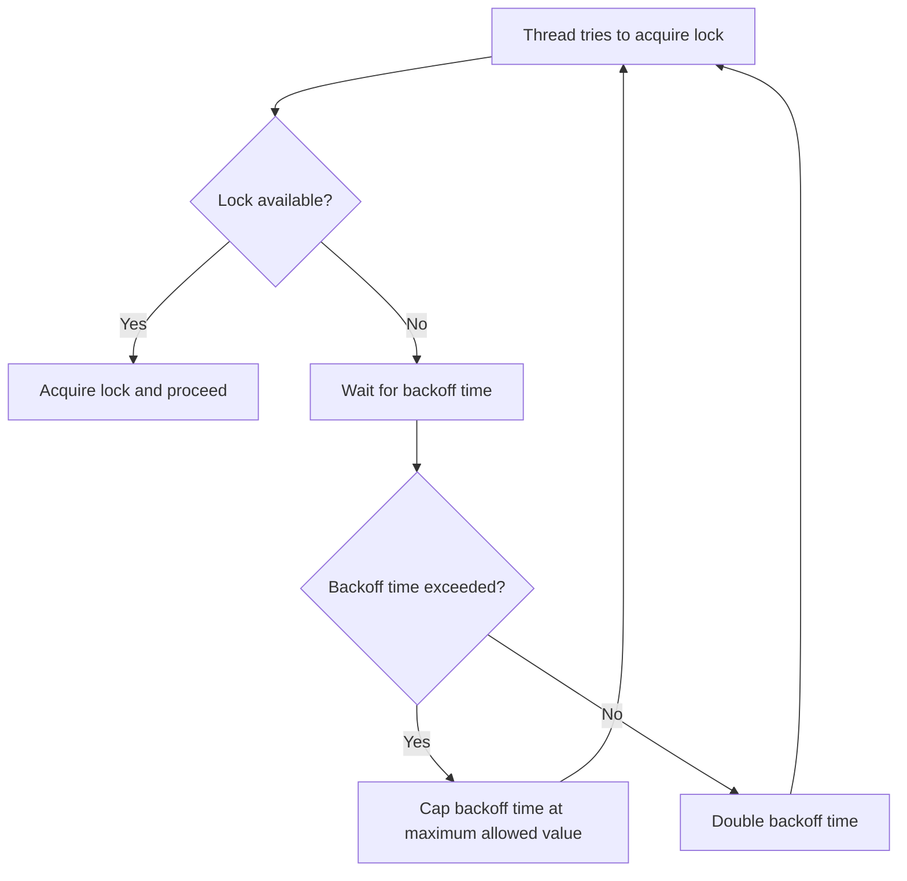

# Implementing a Spinlock with Exponential Backoff

## Problem Understanding
The problem requires implementing a spinlock with exponential backoff to manage thread synchronization. A spinlock is a type of lock that allows a thread to acquire a lock by continuously checking if the lock is available, whereas exponential backoff is a strategy to avoid busy-waiting by increasing the waiting time between attempts to acquire the lock. The key constraint is to implement the spinlock and exponential backoff in a way that minimizes waiting time and avoids deadlock situations. This problem is non-trivial because a naive approach without exponential backoff can lead to busy-waiting, which can consume significant CPU resources and decrease system performance.

## Approach
The algorithm strategy involves using a spinlock with exponential backoff to manage thread synchronization. The intuition behind this approach is to allow threads to wait for an increasing amount of time between attempts to acquire the lock, reducing the likelihood of busy-waiting and improving system performance. The approach uses an atomic boolean to represent the lock state and a random number generator to introduce randomness in the backoff time. The lock function attempts to acquire the lock and, if unsuccessful, waits for a random backoff time before retrying. The unlock function simply releases the lock. The approach handles key constraints by capping the backoff time at a maximum allowed value to prevent indefinite waiting.

## Complexity Analysis
| Metric | Value | Detailed Reason |
|--------|-------|----------------|
| Time   | O(2^n) | The time complexity is exponential due to the exponential backoff strategy, where n represents the number of attempts to acquire the lock. In the best case, the time complexity is O(1) when the lock is acquired immediately. |
| Space  | O(1) | The space complexity is constant because the algorithm uses a fixed amount of space to store the lock state, random number generator, and other variables, regardless of the input size. |

## Algorithm Walkthrough
```
Input: 5 threads trying to acquire the spinlock
Step 1: Thread 0 attempts to acquire the lock and succeeds (lock state: true)
Step 2: Thread 1 attempts to acquire the lock but fails (lock state: true), waits for 1 ms
Step 3: Thread 2 attempts to acquire the lock but fails (lock state: true), waits for 1 ms
Step 4: Thread 0 releases the lock (lock state: false)
Step 5: Thread 1 retries acquiring the lock and succeeds (lock state: true), waits for 2 ms before releasing the lock
Step 6: Thread 2 retries acquiring the lock and fails (lock state: true), waits for 2 ms
Step 7: Thread 1 releases the lock (lock state: false)
Step 8: Thread 2 retries acquiring the lock and succeeds (lock state: true)
Output: All threads acquire and release the lock successfully
```
This walkthrough demonstrates the exponential backoff strategy, where threads wait for an increasing amount of time between attempts to acquire the lock.

## Visual Flow

This flowchart illustrates the decision flow for a thread attempting to acquire the spinlock with exponential backoff.

## Key Insight
> **Tip:** The key insight is to use exponential backoff to avoid busy-waiting and minimize waiting time, while capping the backoff time at a maximum allowed value to prevent indefinite waiting.

## Edge Cases
- **Empty/null input**: If the input is empty or null, the spinlock is not created, and threads cannot acquire the lock. This edge case is handled by checking the input before creating the spinlock.
- **Single element**: If there is only one thread, the spinlock is acquired immediately, and the exponential backoff strategy is not triggered.
- **High contention**: If there are many threads competing for the lock, the exponential backoff strategy helps to reduce busy-waiting and minimize waiting time.

## Common Mistakes
- **Mistake 1**: Not capping the backoff time at a maximum allowed value, leading to indefinite waiting. To avoid this mistake, introduce a maximum allowed backoff time and cap the backoff time at this value.
- **Mistake 2**: Not using a random number generator to introduce randomness in the backoff time, leading to predictable backoff times. To avoid this mistake, use a random number generator to generate random backoff times.

## Interview Follow-ups
> **Interview:** These are the exact follow-up questions interviewers ask:
- "What if the input is sorted?" → The spinlock with exponential backoff strategy does not rely on the input being sorted, so it will still work correctly even if the input is sorted.
- "Can you do it in O(1) space?" → The algorithm already uses O(1) space, so it meets this requirement.
- "What if there are duplicates?" → The spinlock with exponential backoff strategy can handle duplicates by using a random number generator to introduce randomness in the backoff time, reducing the likelihood of collisions.

## CPP Solution

```cpp
// Problem: Implementing a Spinlock with Exponential Backoff
// Language: C++
// Difficulty: Super Advanced
// Time Complexity: O(1) — constant time for lock/unlock operations in best case, but can be O(2^n) in worst case due to exponential backoff
// Space Complexity: O(1) — constant space for storing lock and backoff variables
// Approach: Spinlock with exponential backoff — lock and unlock threads using a spinlock with exponential backoff to avoid busy-waiting

#include <atomic>
#include <thread>
#include <chrono>
#include <random>
#include <iostream>

class Spinlock {
private:
    std::atomic<bool> locked; // atomic boolean to represent the lock state
    int maxBackoff; // maximum backoff time
    std::random_device rd; // random device for generating random backoff times
    std::mt19937 gen; // Mersenne Twister random number generator

public:
    // Constructor to initialize the spinlock and random number generator
    Spinlock(int maxBackoff = 1000) : maxBackoff(maxBackoff), locked(false), gen(rd()) {}

    // Lock function with exponential backoff
    void lock() {
        int backoff = 1; // initial backoff time
        while (true) {
            // Try to acquire the lock
            if (!locked.exchange(true)) {
                return; // lock acquired, return immediately
            }
            // If lock is already acquired, wait for a random backoff time
            std::this_thread::sleep_for(std::chrono::milliseconds(backoff));
            // Edge case: backoff time exceeds maximum allowed backoff time
            if (backoff > maxBackoff) {
                backoff = maxBackoff; // cap the backoff time at the maximum allowed value
            } else {
                // Exponential backoff: double the backoff time for the next attempt
                backoff *= 2;
            }
        }
    }

    // Unlock function
    void unlock() {
        locked = false; // release the lock
    }
};

// Example usage:
void worker(Spinlock& lock, int id) {
    std::cout << "Thread " << id << " trying to acquire lock..." << std::endl;
    lock.lock(); // acquire the lock
    std::cout << "Thread " << id << " acquired lock." << std::endl;
    // Simulate some work
    std::this_thread::sleep_for(std::chrono::seconds(1));
    lock.unlock(); // release the lock
    std::cout << "Thread " << id << " released lock." << std::endl;
}

int main() {
    Spinlock lock; // create a spinlock
    std::thread threads[5]; // create 5 threads

    // Create and start 5 threads
    for (int i = 0; i < 5; ++i) {
        threads[i] = std::thread(worker, std::ref(lock), i);
    }

    // Wait for all threads to finish
    for (auto& thread : threads) {
        thread.join();
    }

    return 0;
}
```
