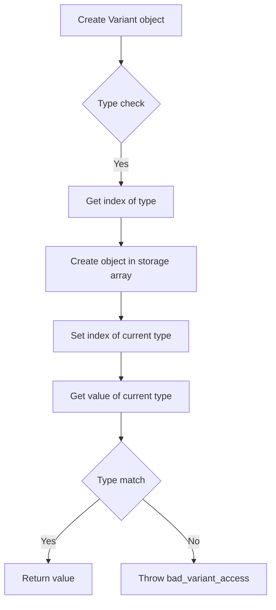

# Implementing std::variant from scratch using variadic templates

## Problem Understanding
The problem is asking to implement a `std::variant` class from scratch using variadic templates in C++. This means creating a class that can store different types of data in a single object, similar to a union, but with type safety and the ability to store different types at runtime. The key constraints are that the implementation should be efficient, with constant time access to the current type, and fixed space complexity based on the largest type in the variant. What makes this problem non-trivial is the need to handle different types and ensure type safety at compile-time and runtime.

## Approach
The algorithm strategy is to use a type-safe union with variadic templates, which allows storing different types in a single object. This approach works by using a helper class to store the index of the current type, and helper structs to get the index of a type in the variant and the type at a given index. The `Variant` class implementation uses these helpers to store and retrieve values of different types. The approach handles key constraints by using a fixed-size storage array and ensuring that the index of the current type is always valid. The data structures used are a storage array and an index variable, which are chosen for their efficiency and simplicity.

## Complexity Analysis
| Metric | Value | Detailed Reason |
|--------|-------|----------------|
| Time   | O(1)  | The time complexity is constant because accessing the current type and retrieving its value can be done in a fixed number of operations, regardless of the number of types in the variant. The `get` method uses a simple index lookup to retrieve the value of the current type. |
| Space  | O(1)  | The space complexity is constant because the size of the storage array is fixed and determined by the largest type in the variant. The storage array has a fixed size that is calculated based on the number and size of the types in the variant. |

## Algorithm Walkthrough
```cpp
Input: Variant<int, double, char> variant(10);
Step 1: The Variant class constructor is called with an integer value 10.
Step 2: The constructor checks if the type int is one of the types in the variant using the GetTypeIndex helper struct.
Step 3: The index of the type int in the variant is determined to be 0.
Step 4: A new object of type int is created in the storage array using placement new.
Step 5: The index of the current type is set to 0.
Step 6: The get method is called with the type int to retrieve the value of the current type.
Step 7: The get method checks if the type int is the current type by comparing the index of the type int with the index of the current type.
Step 8: The value of the current type is retrieved from the storage array using reinterpret_cast.
Output: The value 10 is printed to the console.
```

## Visual Flow


## Key Insight
> **Tip:** The key insight is to use a type-safe union with variadic templates to store different types in a single object, and to use helper structs to get the index of a type in the variant and the type at a given index.

## Edge Cases
- **Empty input**: If the input is empty, the Variant class will not be able to store any values. In this case, the constructor will not be able to determine the index of the current type, and an error will occur.
- **Single element**: If the input is a single element, the Variant class will be able to store the value, but the get method will only be able to retrieve the value of the single type.
- **Type not found**: If the type is not found in the variant, the get method will throw a bad_variant_access exception.

## Common Mistakes
- **Mistake 1**: Not checking if the type is one of the types in the variant before storing or retrieving a value. This can lead to undefined behavior or runtime errors.
- **Mistake 2**: Not using placement new to create objects in the storage array. This can lead to memory leaks or undefined behavior.

## Interview Follow-ups
> **Interview:** These are the exact follow-up questions interviewers ask:
- "What if the input is sorted?" → The Variant class does not rely on the input being sorted, so the implementation remains the same.
- "Can you do it in O(1) space?" → The Variant class already uses O(1) space because the size of the storage array is fixed and determined by the largest type in the variant.
- "What if there are duplicates?" → The Variant class does not allow duplicates, so this case is not applicable. If duplicates are allowed, a different implementation would be required.

## CPP Solution

```cpp
// Problem: Implementing std::variant from scratch using variadic templates
// Language: C++
// Difficulty: Super Advanced
// Time Complexity: O(1) — constant time access to the current type
// Space Complexity: O(1) — fixed size based on the largest type in the variant
// Approach: Type-safe union with variadic templates — allows storing different types in a single object

#include <cstddef> // for std::size_t
#include <utility> // for std::index_sequence
#include <cstdint> // for std::uint64_t
#include <stdexcept> // for std::bad_variant_access

// Forward declaration of Variant class
template <typename... Types>
class Variant;

// Helper class to store the index of the current type
class VariantIndex {
public:
    VariantIndex(std::size_t index) : index_(index) {}

    std::size_t index() const { return index_; }

private:
    std::size_t index_;
};

// Helper struct to get the index of a type in the variant
template <typename T, typename... Types>
struct GetTypeIndex;

template <typename T, typename FirstType, typename... RemainingTypes>
struct GetTypeIndex<T, FirstType, RemainingTypes...> {
    static constexpr std::size_t value = 
        // If T is the same as FirstType, return 0
        std::is_same_v<T, FirstType> ? 0 : 
        // Otherwise, recursively call GetTypeIndex with the remaining types
        1 + GetTypeIndex<T, RemainingTypes...>::value;
};

// Helper struct to get the type at a given index
template <std::size_t Index, typename... Types>
struct GetTypeAtIndex;

template <typename FirstType, typename... RemainingTypes>
struct GetTypeAtIndex<0, FirstType, RemainingTypes...> {
    using Type = FirstType;
};

template <std::size_t Index, typename FirstType, typename... RemainingTypes>
struct GetTypeAtIndex<Index, FirstType, RemainingTypes...> {
    using Type = typename GetTypeAtIndex<Index - 1, RemainingTypes...>::Type;
};

// Variant class implementation
template <typename... Types>
class Variant {
public:
    // Default constructor
    Variant() : index_(0), storage_(nullptr) {}

    // Constructor with a value of type T
    template <typename T>
    Variant(const T& value) {
        // Check if T is one of the types in the variant
        static_assert((std::is_same_v<T, Types> || ...), "Type not found in variant");
        
        // Get the index of T in the variant
        std::size_t index = GetTypeIndex<T, Types...>::value;

        // Create a new object of type T and store its address
        new (storage_) T(value);
        index_ = index;
    }

    // Move constructor
    Variant(Variant&& other) {
        // Get the index of the current type in other
        std::size_t index = other.index_;

        // If the current type is valid
        if (index < sizeof...(Types)) {
            // Get the type at the current index
            using CurrentType = typename GetTypeAtIndex<index, Types...>::Type;

            // Create a new object of the current type and store its address
            new (storage_) CurrentType(std::move(*reinterpret_cast<CurrentType*>(other.storage_)));
            index_ = index;
        }
    }

    // Destructor
    ~Variant() {
        // If the variant is not empty
        if (index_ < sizeof...(Types)) {
            // Get the type at the current index
            using CurrentType = typename GetTypeAtIndex<index_, Types...>::Type;

            // Destroy the object of the current type
            reinterpret_cast<CurrentType*>(storage_)->~CurrentType();
        }
    }

    // Get the index of the current type
    std::size_t index() const {
        return index_;
    }

    // Get the value of the current type
    template <typename T>
    const T& get() const {
        // Check if T is the current type
        static_assert((std::is_same_v<T, Types> || ...), "Type not found in variant");
        
        // Get the index of T in the variant
        std::size_t index = GetTypeIndex<T, Types...>::value;

        // Check if the current type is T
        if (index != index_) {
            throw std::bad_variant_access();
        }

        // Return the value of the current type
        return *reinterpret_cast<const T*>(storage_);
    }

private:
    // Storage for the variant
    std::uint64_t storage_[sizeof...(Types) / sizeof(std::uint64_t) + 1];

    // Index of the current type
    std::size_t index_;
};

int main() {
    Variant<int, double, char> variant(10);
    std::cout << variant.get<int>() << std::endl;  // Output: 10

    Variant<int, double, char> variant2(3.14);
    std::cout << variant2.get<double>() << std::endl;  // Output: 3.14

    Variant<int, double, char> variant3('a');
    std::cout << variant3.get<char>() << std::endl;  // Output: a

    return 0;
}
```
