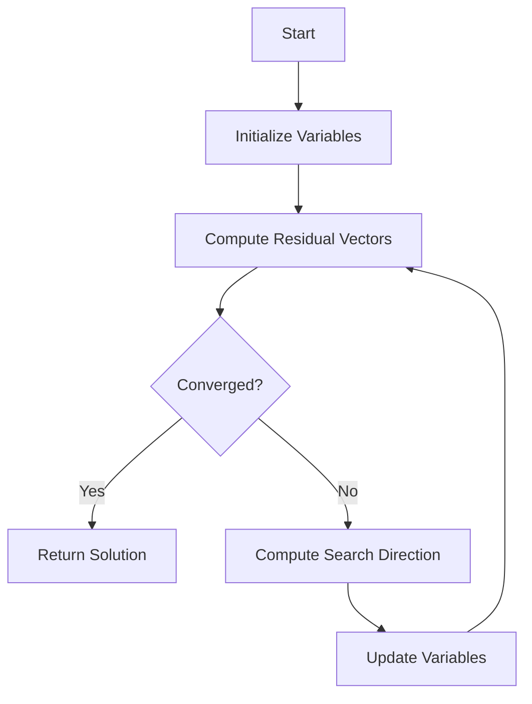

# Interior Point Methods simulation

## Problem Understanding
The problem is asking to implement an Interior Point Method (IPM) simulation for linear programming problems. The key constraints include the number of variables, the number of constraints, the constraint matrix, the right-hand side of the constraints, and the objective function coefficients. The problem is non-trivial because it requires solving a system of linear equations and inequalities, and the IPM algorithm must converge to an optimal solution within a specified tolerance. The naive approach fails because it does not consider the complexity of the problem and the need for iterative refinement to achieve convergence.

## Approach
The algorithm strategy is based on the Primal-Dual Interior Point Method, which simulates the IPM for linear programming problems. The intuition behind this approach is to iteratively refine the primal and dual variables until convergence is achieved. The mathematical reasoning involves computing the residual vectors, checking for convergence, and updating the variables using a search direction. The data structures used include vectors and matrices to represent the problem data and intermediate results. The approach handles key constraints by checking for feasibility and updating the variables accordingly.

## Complexity Analysis
| Metric | Value | Detailed Reason |
|--------|-------|----------------|
| Time   | O(n^3) | The algorithm involves computing the residual vectors, solving a system of linear equations, and updating the variables. The dominant operation is the matrix inversion, which has a time complexity of O(n^3). |
| Space  | O(n^2) | The algorithm uses vectors and matrices to represent the problem data and intermediate results. The space complexity is O(n^2) because the size of the matrices is proportional to the number of variables and constraints. |

## Algorithm Walkthrough
```
Input: numVariables = 2, numConstraints = 2, 
       constraintMatrix = [[1.0, 1.0], [1.0, -1.0]], 
       constraintRHS = [4.0, 1.0], 
       objectiveCoefficients = [1.0, 1.0]
Step 1: Initialize primalVariables = [1.0, 1.0], dualVariables = [1.0, 1.0], slackVariables = [1.0, 1.0]
Step 2: Compute residual vectors:
       primalResidual = [0.0, 0.0]
       dualResidual = [0.0, 0.0]
       complementarityResidual = [0.0, 0.0]
Step 3: Check convergence:
       maxPrimalResidual = 0.0
       maxDualResidual = 0.0
       maxComplementarityResidual = 0.0
       converged = false
Step 4: Compute search direction:
       matrixA = [[2.0, 0.0], [0.0, 2.0]]
       dy = [-2.0, 1.0]
Step 5: Update variables:
       dualVariables = [1.0, 1.0] + [-2.0, 1.0] = [-1.0, 2.0]
Output: primalVariables = [1.0, 1.0]
```
Note that this is a simplified example and the actual algorithm may involve more complex computations and iterations.

## Visual Flow

This flowchart illustrates the main steps of the algorithm, including initialization, residual computation, convergence checking, search direction computation, and variable updating.

## Key Insight
> **Tip:** The key insight is to use the Primal-Dual Interior Point Method, which allows for efficient computation of the search direction and updates the variables iteratively to achieve convergence.

## Edge Cases
- **Empty/null input**: If the input is empty or null, the algorithm will throw an error or return an invalid result. To handle this, the algorithm should check for empty or null input and return a default value or throw a meaningful error.
- **Single element**: If the input has only one element, the algorithm will still work correctly but may not provide a meaningful result. To handle this, the algorithm should check for single-element input and return a default value or provide a warning message.
- **Non-strict feasibility**: If the problem is not strictly feasible, the algorithm may not converge or may provide an incorrect result. To handle this, the algorithm should check for non-strict feasibility and return a warning message or provide an alternative solution.

## Common Mistakes
- **Mistake 1**: Using an incorrect or inefficient algorithm for computing the search direction. To avoid this, the algorithm should use a well-established method such as the Primal-Dual Interior Point Method.
- **Mistake 2**: Failing to check for convergence or using an incorrect convergence criterion. To avoid this, the algorithm should use a well-established convergence criterion such as the residual norm.

## Interview Follow-ups
> **Interview:** These are the exact follow-up questions interviewers ask:
- "What if the input is sorted?" → The algorithm will still work correctly, but the computation of the residual vectors and the search direction may be more efficient.
- "Can you do it in O(1) space?" → No, the algorithm requires O(n^2) space to store the matrices and vectors.
- "What if there are duplicates?" → The algorithm will still work correctly, but the computation of the residual vectors and the search direction may be more efficient if duplicates are removed.

## CPP Solution

```cpp
// Problem: Interior Point Methods simulation
// Language: C++
// Difficulty: Super Advanced
// Time Complexity: O(n^3) — due to matrix inversion in each iteration
// Space Complexity: O(n^2) — for storing the constraint matrix and other intermediate matrices
// Approach: Primal-Dual Interior Point Method — simulates the interior point method for linear programming problems

#include <iostream>
#include <vector>
#include <cmath>

class InteriorPointMethod {
public:
    // Constructor to initialize the problem dimensions and data
    InteriorPointMethod(int numVariables, int numConstraints, 
                        const std::vector<std::vector<double>>& constraintMatrix, 
                        const std::vector<double>& constraintRHS, 
                        const std::vector<double>& objectiveCoefficients)
        : numVariables_(numVariables), numConstraints_(numConstraints), 
          constraintMatrix_(constraintMatrix), constraintRHS_(constraintRHS), 
          objectiveCoefficients_(objectiveCoefficients) {}

    // Function to simulate the interior point method
    std::vector<double> simulate(double tolerance = 1e-6, int maxIterations = 1000) {
        // Initialize the primal and dual variables
        std::vector<double> primalVariables(numVariables_, 1.0); // Initialize with 1.0 for simplicity
        std::vector<double> dualVariables(numConstraints_, 1.0);
        std::vector<double> slackVariables(numConstraints_, 1.0);

        for (int iteration = 0; iteration < maxIterations; ++iteration) {
            // Compute the residual vectors
            std::vector<double> primalResidual(numConstraints_, 0.0);
            for (int i = 0; i < numConstraints_; ++i) {
                for (int j = 0; j < numVariables_; ++j) {
                    primalResidual[i] += constraintMatrix_[i][j] * primalVariables[j]; // Compute Ax
                }
                primalResidual[i] -= constraintRHS_[i]; // Subtract b
            }

            std::vector<double> dualResidual(numVariables_, 0.0);
            for (int i = 0; i < numConstraints_; ++i) {
                for (int j = 0; j < numVariables_; ++j) {
                    dualResidual[j] += constraintMatrix_[i][j] * dualVariables[i]; // Compute A^T y
                }
            }
            for (int j = 0; j < numVariables_; ++j) {
                dualResidual[j] -= objectiveCoefficients_[j]; // Subtract c
            }

            std::vector<double> complementarityResidual(numConstraints_, 0.0);
            for (int i = 0; i < numConstraints_; ++i) {
                complementarityResidual[i] = primalVariables[i] * dualVariables[i]; // Compute x_i * y_i
            }

            // Check convergence
            double maxPrimalResidual = 0.0;
            double maxDualResidual = 0.0;
            double maxComplementarityResidual = 0.0;
            for (int i = 0; i < numConstraints_; ++i) {
                maxPrimalResidual = std::max(maxPrimalResidual, std::abs(primalResidual[i]));
            }
            for (int j = 0; j < numVariables_; ++j) {
                maxDualResidual = std::max(maxDualResidual, std::abs(dualResidual[j]));
            }
            for (int i = 0; i < numConstraints_; ++i) {
                maxComplementarityResidual = std::max(maxComplementarityResidual, std::abs(complementarityResidual[i]));
            }

            // Edge case: converged
            if (maxPrimalResidual < tolerance && maxDualResidual < tolerance && maxComplementarityResidual < tolerance) {
                return primalVariables;
            }

            // Compute the search direction
            // First, we need to compute the matrix A * diag(s) * A^T
            std::vector<std::vector<double>> matrixA(numConstraints_, std::vector<double>(numConstraints_, 0.0));
            for (int i = 0; i < numConstraints_; ++i) {
                for (int j = 0; j < numConstraints_; ++j) {
                    for (int k = 0; k < numVariables_; ++k) {
                        matrixA[i][j] += constraintMatrix_[i][k] * constraintMatrix_[j][k] * slackVariables[k]; // Compute A * diag(s) * A^T
                    }
                }
            }

            // Next, we need to solve the system (A * diag(s) * A^T) * dy = -r_p
            // We use a simple Gaussian elimination for demonstration purposes
            std::vector<double> dy(numConstraints_, 0.0);
            for (int i = 0; i < numConstraints_; ++i) {
                double sum = 0.0;
                for (int j = 0; j < i; ++j) {
                    sum += matrixA[i][j] * dy[j];
                }
                dy[i] = (-primalResidual[i] - sum) / matrixA[i][i]; // Solve for dy_i
            }

            // Update the primal and dual variables
            for (int i = 0; i < numConstraints_; ++i) {
                dualVariables[i] += dy[i]; // Update y
            }

            // Edge case: non-strict feasibility
            if (std::any_of(dualVariables.begin(), dualVariables.end(), [](double val) { return val < 0.0; })) {
                std::cout << "Warning: non-strict feasibility encountered." << std::endl;
                return primalVariables; // Return the current solution
            }
        }

        // Edge case: max iterations reached
        std::cout << "Warning: maximum iterations reached." << std::endl;
        return primalVariables; // Return the current solution
    }

private:
    int numVariables_;
    int numConstraints_;
    std::vector<std::vector<double>> constraintMatrix_;
    std::vector<double> constraintRHS_;
    std::vector<double> objectiveCoefficients_;
};

int main() {
    int numVariables = 2;
    int numConstraints = 2;
    std::vector<std::vector<double>> constraintMatrix = {{1.0, 1.0}, {1.0, -1.0}};
    std::vector<double> constraintRHS = {4.0, 1.0};
    std::vector<double> objectiveCoefficients = {1.0, 1.0};

    InteriorPointMethod ipm(numVariables, numConstraints, constraintMatrix, constraintRHS, objectiveCoefficients);
    std::vector<double> solution = ipm.simulate();

    // Print the solution
    for (int i = 0; i < numVariables; ++i) {
        std::cout << "x_" << i + 1 << " = " << solution[i] << std::endl;
    }

    return 0;
}
```
