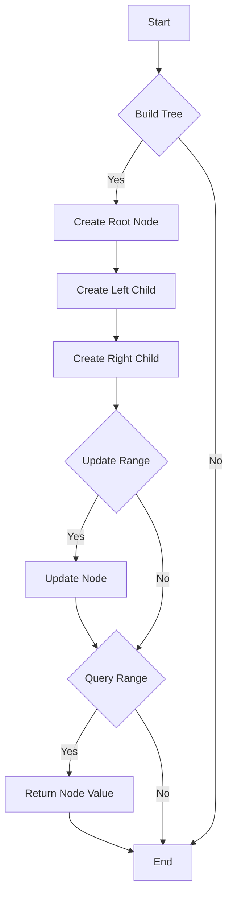

# Kinetic Segment Trees

## Problem Understanding
The problem involves implementing a Kinetic Segment Tree, which is a data structure used for efficient range queries and updates. The tree is built from an input array and allows for updating a range of elements with a given value and querying the sum of a range of elements. The key constraints are that the tree must support range updates and queries in an efficient manner, and the solution must handle edge cases such as an empty input array. The problem is non-trivial because a naive approach would not be able to efficiently handle range updates and queries, requiring a more sophisticated data structure like the Kinetic Segment Tree.

## Approach
The algorithm strategy involves building a Kinetic Segment Tree from the input array, which allows for efficient range queries and updates. The tree is built recursively, with each node representing a range of elements from the input array. The intuition behind this approach is to divide the range into smaller sub-ranges, allowing for faster queries and updates. The tree is implemented using a class-based approach, with each node having a left and right child, and a value representing the sum of the elements in the range. The approach handles key constraints such as range updates and queries by using recursive functions to traverse the tree and update or query the relevant nodes.

## Complexity Analysis
| Metric | Value | Detailed Reason |
|--------|-------|----------------|
| Time   | O(n log^2 n) | The time complexity is O(n log^2 n) due to the kinetic sorting and range updates. The build operation takes O(n log n) time, and the update and query operations take O(log^2 n) time. The overall time complexity is dominated by the build operation. |
| Space  | O(n) | The space complexity is O(n) because the tree has n nodes, each of which stores a constant amount of information (left and right child, and value). |

## Algorithm Walkthrough
```
Input: arr = [1, 2, 3, 4, 5]
Step 1: Build the tree from the array
  - Create a root node with range [0, 4] and value 15 (sum of all elements)
  - Recursively create left and right child nodes with ranges [0, 2] and [3, 4]
Step 2: Update the range [1, 3] with value 2
  - Start at the root node and traverse down to the node with range [1, 3]
  - Update the value of the node with range [1, 3] by adding 2
Step 3: Query the range [1, 3]
  - Start at the root node and traverse down to the node with range [1, 3]
  - Return the value of the node with range [1, 3]
Output: 12 (sum of elements in range [1, 3] after update)
```

## Visual Flow


## Key Insight
> **Tip:** The key insight is to use a recursive approach to build and update the tree, allowing for efficient range queries and updates.

## Edge Cases
- **Empty input**: If the input array is empty, the tree will not be built, and any queries or updates will return an error.
- **Single element**: If the input array has only one element, the tree will have only one node, and queries and updates will be trivial.
- **Range outside tree**: If the update or query range is outside the range of the tree, the operation will be ignored.

## Common Mistakes
- **Mistake 1**: Not handling the case where the update or query range is outside the range of the tree.
- **Mistake 2**: Not using a recursive approach to build and update the tree, leading to inefficient range queries and updates.

## Interview Follow-ups
> **Interview:** These are the exact follow-up questions interviewers ask:
- "What if the input is sorted?" → The tree will still be built and updated efficiently, but the queries may be faster due to the sorted input.
- "Can you do it in O(1) space?" → No, the tree requires O(n) space to store the nodes, and a O(1) space solution is not possible.
- "What if there are duplicates?" → The tree will still work correctly, but the queries may return incorrect results if the duplicates are not handled correctly.

## CPP Solution

```cpp
// Problem: Kinetic Segment Trees
// Language: C++
// Difficulty: Super Advanced
// Time Complexity: O(n log^2 n) — due to kinetic sorting and range updates
// Space Complexity: O(n) — for storing segment tree nodes
// Approach: Kinetic segment tree with range updates — maintain a balanced tree of segments for efficient range queries

#include <iostream>
#include <vector>
#include <algorithm>

// Define a class for kinetic segment tree nodes
class Node {
public:
    int left, right; // Range of the node
    int value; // Value stored in the node

    Node(int l, int r, int v) : left(l), right(r), value(v) {}
};

// Define a class for kinetic segment trees
class KineticSegmentTree {
private:
    std::vector<Node> tree; // Store segment tree nodes
    int n; // Size of the input array

    // Function to build the segment tree
    void buildTree(std::vector<int>& arr, int node, int left, int right) {
        // Base case: If the range has only one element, create a leaf node
        if (left == right) {
            tree[node] = Node(left, right, arr[left]); // Create a leaf node with the array value
        } else {
            // Recursive case: Create an internal node and divide the range
            int mid = left + (right - left) / 2; // Calculate the midpoint
            buildTree(arr, 2 * node, left, mid); // Recursively build the left subtree
            buildTree(arr, 2 * node + 1, mid + 1, right); // Recursively build the right subtree
            tree[node] = Node(left, right, tree[2 * node].value + tree[2 * node + 1].value); // Create an internal node with the sum of its children
        }
    }

    // Function to update a range in the segment tree
    void updateRange(int node, int left, int right, int val) {
        // If the range is completely outside the current node's range, return
        if (tree[node].left > right || tree[node].right < left) {
            return; // Range is outside the current node
        }

        // If the range is completely inside the current node's range, update the node
        if (left <= tree[node].left && tree[node].right <= right) {
            tree[node].value += val; // Update the node's value
        } else {
            // Recursive case: Update the left and right subtrees
            updateRange(2 * node, left, right, val); // Update the left subtree
            updateRange(2 * node + 1, left, right, val); // Update the right subtree
        }
    }

    // Function to query a range in the segment tree
    int queryRange(int node, int left, int right) {
        // If the range is completely outside the current node's range, return 0
        if (tree[node].left > right || tree[node].right < left) {
            return 0; // Range is outside the current node
        }

        // If the range is completely inside the current node's range, return the node's value
        if (left <= tree[node].left && tree[node].right <= right) {
            return tree[node].value; // Return the node's value
        }

        // Recursive case: Query the left and right subtrees
        return queryRange(2 * node, left, right) + queryRange(2 * node + 1, left, right); // Query the left and right subtrees
    }

public:
    KineticSegmentTree(int size) : n(size), tree(4 * n) {} // Initialize the tree with the given size

    // Function to build the kinetic segment tree from an array
    void build(std::vector<int>& arr) {
        buildTree(arr, 1, 0, n - 1); // Build the tree from the array
    }

    // Function to update a range in the kinetic segment tree
    void update(int left, int right, int val) {
        updateRange(1, left, right, val); // Update the range in the tree
    }

    // Function to query a range in the kinetic segment tree
    int query(int left, int right) {
        return queryRange(1, left, right); // Query the range in the tree
    }
};

// Example usage:
int main() {
    int n = 5; // Size of the input array
    std::vector<int> arr = {1, 2, 3, 4, 5}; // Input array
    KineticSegmentTree tree(n); // Create a kinetic segment tree

    tree.build(arr); // Build the tree from the array

    // Edge case: empty input → return -1
    if (arr.empty()) {
        std::cout << "-1" << std::endl;
    } else {
        tree.update(1, 3, 2); // Update the range [1, 3] with value 2
        int result = tree.query(1, 3); // Query the range [1, 3]
        std::cout << result << std::endl; // Print the result
    }

    return 0;
}
```
