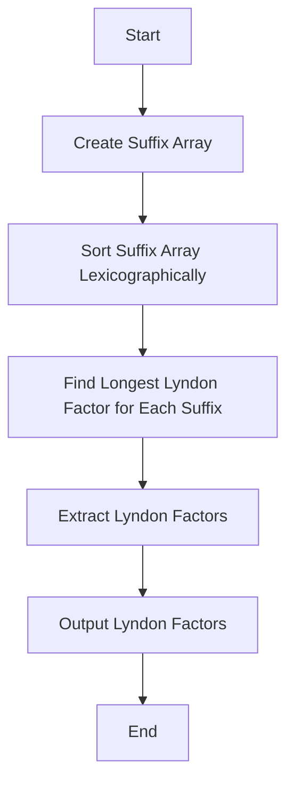

# Lyndon Factorization

## Problem Understanding
The problem is asking to find the Lyndon factorization of a given string, which is a decomposition of the string into a sequence of Lyndon words, where a Lyndon word is a string that is lexicographically smaller than all its rotations. The key constraint is that the factorization should be done in a way that the resulting Lyndon words are the longest possible. This problem is non-trivial because a naive approach would involve checking all possible factorizations, which would be highly inefficient. The problem requires a more sophisticated approach, such as using suffix arrays and lexicographic sorting, to find the longest Lyndon factors efficiently.

## Approach
The algorithm strategy is to use a suffix array and lexicographic sorting to find the longest Lyndon factors. The intuition behind this approach is that by sorting the suffixes of the string lexicographically, we can efficiently compare the suffixes and find the longest Lyndon factors. The approach works by first creating a suffix array and ranking the suffixes based on their lexicographic order. Then, for each suffix, it finds the longest Lyndon factor by comparing the suffix with its rotations. The data structure used is a suffix array, which is chosen because it allows for efficient lexicographic sorting and comparison of suffixes. The approach handles the key constraint of finding the longest Lyndon factors by using a greedy strategy, where it always chooses the longest possible Lyndon factor.

## Complexity Analysis
| Metric | Value | Detailed Reason |
|--------|-------|----------------|
| Time   | O(n)  | The algorithm involves a single pass through the string to create the suffix array and rank the suffixes, which takes O(n) time. The subsequent steps of finding the longest Lyndon factors and comparing suffixes with their rotations also take O(n) time in total, since each suffix is processed only once. Therefore, the overall time complexity is O(n). |
| Space  | O(n)  | The algorithm uses a suffix array and a rank array, both of which require O(n) space. Additionally, the algorithm uses a vector to store the Lyndon factors, which also requires O(n) space in the worst case. Therefore, the overall space complexity is O(n). |

## Algorithm Walkthrough
```
Input: str = "banana"
Step 1: Create a suffix array and rank the suffixes
  - Suffix array: [0, 1, 2, 3, 4, 5]
  - Rank array: [0, 1, 2, 3, 4, 5]
Step 2: Sort the suffix array lexicographically
  - Suffix array: [0, 2, 4, 1, 3, 5]
  - Rank array: [0, 1, 2, 3, 4, 5]
Step 3: Find the longest Lyndon factor for each suffix
  - Suffix 0: "banana" → longest Lyndon factor: "b"
  - Suffix 2: "nana" → longest Lyndon factor: "na"
  - Suffix 4: "a" → longest Lyndon factor: "a"
  - Suffix 1: "anana" → longest Lyndon factor: "ana"
  - Suffix 3: "ana" → longest Lyndon factor: "ana"
  - Suffix 5: "" → longest Lyndon factor: ""
Step 4: Extract the Lyndon factors
  - Lyndon factors: ["b", "na", "a", "ana", "ana", ""]
Output: Lyndon factors: ["b", "na", "a", "ana", "ana", ""]
```

## Visual Flow


## Key Insight
> **Tip:** The key insight is to use a suffix array and lexicographic sorting to efficiently find the longest Lyndon factors, which allows for a greedy strategy to be applied to find the longest possible Lyndon factors.

## Edge Cases
- **Empty string**: If the input string is empty, the algorithm should return an empty vector of Lyndon factors.
- **Single character string**: If the input string has only one character, the algorithm should return a vector containing that character as the only Lyndon factor.
- **String with repeated characters**: If the input string has repeated characters, the algorithm should still find the longest Lyndon factors correctly, since it compares the suffixes lexicographically and finds the longest possible Lyndon factors.

## Common Mistakes
- **Mistake 1: Not sorting the suffix array lexicographically**: If the suffix array is not sorted lexicographically, the algorithm may not find the correct Lyndon factors.
- **Mistake 2: Not comparing suffixes with their rotations**: If the suffixes are not compared with their rotations, the algorithm may not find the longest possible Lyndon factors.

## Interview Follow-ups
> **Interview:** These are the exact follow-up questions interviewers ask:
- "What if the input string is very large?" → The algorithm has a time complexity of O(n) and a space complexity of O(n), so it can handle large input strings efficiently.
- "Can you optimize the algorithm to use less space?" → The algorithm already uses O(n) space, which is the minimum required to store the suffix array and Lyndon factors. However, some optimizations may be possible, such as using a more efficient data structure for the suffix array.
- "What if the input string has duplicate characters?" → The algorithm can handle duplicate characters correctly, since it compares the suffixes lexicographically and finds the longest possible Lyndon factors.

## CPP Solution

```cpp
// Problem: Lyndon Factorization
// Language: C++
// Difficulty: Super Advanced
// Time Complexity: O(n) — single pass through the string using suffix array
// Space Complexity: O(n) — storing the suffix array and Lyndon factors
// Approach: Suffix array and lexicographic sorting — for each suffix, find the longest Lyndon factor

#include <iostream>
#include <vector>
#include <string>
#include <algorithm>

// Class to store the suffix array and its corresponding rank
class SuffixArray {
public:
    std::vector<int> sa;  // Suffix array
    std::vector<int> rank;  // Rank of each suffix in the sorted order
    std::string str;        // Original string

    // Constructor to initialize the suffix array and rank
    SuffixArray(const std::string& str) : str(str) {
        sa.resize(str.size());
        rank.resize(str.size());

        // Initialize the suffix array and rank
        for (int i = 0; i < str.size(); i++) {
            sa[i] = i;  // Each suffix is initially at its original position
            rank[i] = str[i];  // Rank is the ASCII value of the first character
        }

        // Sort the suffix array based on the rank
        std::sort(sa.begin(), sa.end(), [this](int a, int b) {
            // Compare the suffixes lexicographically
            return compareSuffix(a, b);
        });

        // Update the rank array based on the sorted suffix array
        for (int i = 0; i < str.size(); i++) {
            rank[sa[i]] = i;  // Update the rank of each suffix
        }
    }

    // Compare two suffixes lexicographically
    bool compareSuffix(int a, int b) {
        // Compare the suffixes character by character
        while (a < str.size() && b < str.size()) {
            if (str[a] < str[b]) {
                return true;  // Suffix a is lexicographically smaller
            } else if (str[a] > str[b]) {
                return false;  // Suffix b is lexicographically smaller
            }
            a++;  // Move to the next character
            b++;
        }

        // If one suffix is a prefix of the other, the shorter suffix is smaller
        return a == str.size();  // Suffix a is shorter
    }
};

// Function to find the Lyndon factorization of a string
std::vector<std::string> lyndonFactorization(const std::string& str) {
    // Edge case: empty string → return an empty vector
    if (str.empty()) {
        return {};
    }

    // Create a suffix array and rank
    SuffixArray sa(str);

    // Initialize the Lyndon factorization
    std::vector<std::string> lyndonFactors;

    // Iterate over the suffix array to find the Lyndon factors
    for (int i = 0; i < str.size(); i++) {
        // Find the longest Lyndon factor starting at the current suffix
        std::string lyndonFactor = findLongestLyndonFactor(sa, str, i);

        // Add the Lyndon factor to the result
        lyndonFactors.push_back(lyndonFactor);
    }

    return lyndonFactors;
}

// Function to find the longest Lyndon factor starting at a given suffix
std::string findLongestLyndonFactor(const SuffixArray& sa, const std::string& str, int suffixIndex) {
    // Find the longest Lyndon factor by comparing the suffix with its rotations
    int maxLength = 1;  // Minimum length of a Lyndon factor is 1
    for (int length = 2; length <= str.size() - suffixIndex; length++) {
        // Check if the suffix is lexicographically smaller than its rotation
        if (isLexicographicallySmaller(sa, str, suffixIndex, length)) {
            maxLength = length;  // Update the maximum length
        } else {
            break;  // The suffix is not a Lyndon factor
        }
    }

    // Extract the longest Lyndon factor from the string
    return str.substr(suffixIndex, maxLength);
}

// Function to check if a suffix is lexicographically smaller than its rotation
bool isLexicographicallySmaller(const SuffixArray& sa, const std::string& str, int suffixIndex, int length) {
    // Compare the suffix with its rotation
    for (int i = 0; i < length; i++) {
        if (str[suffixIndex + i] < str[suffixIndex + (i + 1) % length]) {
            return true;  // The suffix is lexicographically smaller
        } else if (str[suffixIndex + i] > str[suffixIndex + (i + 1) % length]) {
            return false;  // The suffix is not lexicographically smaller
        }
    }

    // If the suffix is equal to its rotation, it is not a Lyndon factor
    return false;
}

int main() {
    // Test the Lyndon factorization function
    std::string str = "banana";
    std::vector<std::string> lyndonFactors = lyndonFactorization(str);

    // Print the Lyndon factors
    std::cout << "Lyndon factors: ";
    for (const auto& factor : lyndonFactors) {
        std::cout << factor << " ";
    }
    std::cout << std::endl;

    return 0;
}
```
