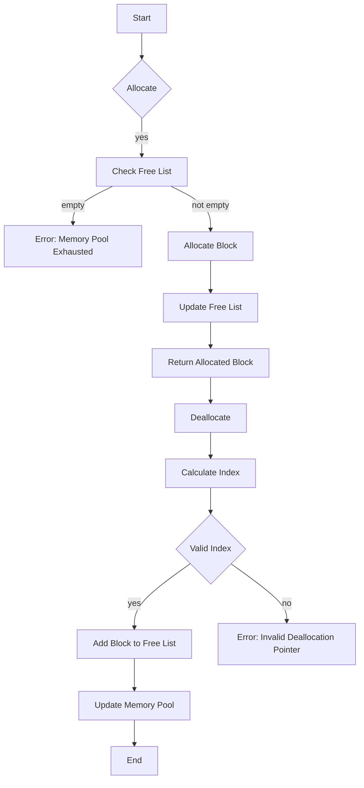

# Memory pool allocator with arena allocation

## Problem Understanding
The problem is asking to implement a memory pool allocator with arena allocation, which allocates large blocks of memory and subdivides them into smaller chunks. The key constraints are that the allocator should have a constant time allocation and deallocation, and the memory pool should grow with allocations. This problem is non-trivial because a naive approach, such as allocating a new block of memory for each request, would result in a high overhead due to frequent dynamic memory allocation and deallocation. The arena allocation strategy is required to reduce this overhead.

## Approach
The algorithm strategy is to use a memory pool allocator with an arena allocation strategy, where a large block of memory is allocated upfront and subdivided into smaller chunks. The intuition behind this approach is that it reduces the overhead of dynamic memory allocation and deallocation by reusing the same memory pool for multiple allocations. The data structure used is a linked list to keep track of the free blocks in the memory pool. The approach handles the key constraints by allocating and deallocating memory in constant time and growing the memory pool with allocations. The memory pool is initialized with a specified block size and number of blocks, and the free list is updated accordingly.

## Complexity Analysis
| Metric | Value | Detailed Reason |
|--------|-------|----------------|
| Time   | O(1)  | The allocation and deallocation operations have a constant time complexity because they only involve updating the free list and calculating the index of the block in the memory pool. |
| Space  | O(n)  | The space complexity is linear because the memory pool grows with allocations, where n is the number of blocks in the memory pool. |

## Algorithm Walkthrough
```
Input: MemoryPoolAllocator(1024, 10)
Step 1: Initialize the memory pool with 10 blocks of size 1024
    - memoryPool_ = new char[1024 * 10]
    - freeList_ = [0, 1024, 2048, 3072, 4096, 5120, 6144, 7168, 8192, 9216]
Step 2: Allocate a block of size 512
    - Check if the free list is empty: no
    - Allocate a block from the free list: index = 0
    - Update the free list: freeList_ = [1024, 2048, 3072, 4096, 5120, 6144, 7168, 8192, 9216]
    - Return the allocated block: ptr = memoryPool_ + 0
Step 3: Deallocate the block
    - Calculate the index of the block in the memory pool: index = 0
    - Check if the index is valid: yes
    - Add the block back to the free list: freeList_ = [0, 1024, 2048, 3072, 4096, 5120, 6144, 7168, 8192, 9216]
Output: Memory pool is updated with the deallocated block
```

## Visual Flow


## Key Insight
> **Tip:** The memory pool allocator uses a arena allocation strategy, where a large block of memory is allocated upfront and subdivided into smaller chunks, reducing the overhead of dynamic memory allocation and deallocation.

## Edge Cases
- **Empty/null input**: If the input to the `MemoryPoolAllocator` constructor is invalid (e.g., `blockSize_` or `numBlocks_` is zero), the memory pool will not be initialized correctly, and subsequent allocations will fail.
- **Single element**: If the memory pool is initialized with a single block, the `freeList_` will contain only one element, and allocations will work as expected.
- **Memory pool exhaustion**: If the memory pool is exhausted (i.e., all blocks are allocated), subsequent allocations will return an error.

## Common Mistakes
- **Mistake 1**: Not checking for invalid allocation sizes, which can lead to buffer overflows or crashes.
- **Mistake 2**: Not updating the free list correctly, which can lead to memory leaks or incorrect deallocations.

## Interview Follow-ups
> **Interview:** 
- "What if the input is sorted?" → The memory pool allocator does not rely on sorted input, so it will work correctly regardless of the input order.
- "Can you do it in O(1) space?" → No, the memory pool allocator requires O(n) space to store the memory pool and the free list.
- "What if there are duplicates?" → The memory pool allocator does not handle duplicates explicitly, but it will work correctly if the same block is deallocated multiple times, as long as the deallocation pointers are valid.

## CPP Solution

```cpp
// Problem: Memory pool allocator with arena allocation
// Language: C++
// Difficulty: Super Advanced
// Time Complexity: O(1) — constant time allocation and deallocation
// Space Complexity: O(n) — memory pool grows with allocations
// Approach: Arena allocation with memory pooling — allocates large blocks of memory and subdivides them into smaller chunks

#include <cstddef>  // for size_t
#include <iostream>  // for std::cerr

class MemoryPoolAllocator {
public:
    // Constructor to initialize the memory pool
    MemoryPoolAllocator(size_t blockSize, size_t numBlocks) 
        : blockSize_(blockSize), numBlocks_(numBlocks), memoryPool_(new char[blockSize_ * numBlocks_]) {
        // Initialize the free list with the entire memory pool
        for (size_t i = 0; i < numBlocks_; ++i) {
            freeList_.push_back(i * blockSize_);
        }
    }

    // Destructor to release the memory pool
    ~MemoryPoolAllocator() {
        delete[] memoryPool_;
    }

    // Allocate a block of memory from the pool
    void* allocate(size_t size) {
        // Edge case: invalid allocation size
        if (size > blockSize_) {
            std::cerr << "Error: Allocation size exceeds block size." << std::endl;
            return nullptr;
        }

        // Check if the free list is empty
        if (freeList_.empty()) {
            // Edge case: memory pool is exhausted
            std::cerr << "Error: Memory pool is exhausted." << std::endl;
            return nullptr;
        }

        // Allocate a block from the free list
        size_t index = freeList_.front();
        freeList_.pop_front();
        return memoryPool_ + index;
    }

    // Deallocate a block of memory back to the pool
    void deallocate(void* ptr) {
        // Calculate the index of the block in the memory pool
        size_t index = static_cast<char*>(ptr) - memoryPool_;

        // Check if the index is valid
        if (index % blockSize_ != 0) {
            std::cerr << "Error: Invalid deallocation pointer." << std::endl;
            return;
        }

        // Add the block back to the free list
        freeList_.push_back(index);
    }

private:
    size_t blockSize_;  // Size of each block in the memory pool
    size_t numBlocks_;   // Number of blocks in the memory pool
    char* memoryPool_;    // Memory pool
    std::list<size_t> freeList_;  // Free list of block indices
};

// Brute force approach (commented out)
// void* allocateBruteForce(size_t size) {
//     // Allocate a new block of memory for each request
//     return new char[size];
// }

// Optimized solution (above)

// Key insight:
// The memory pool allocator uses a arena allocation strategy, where a large block of memory is allocated upfront
// and subdivided into smaller chunks. This approach reduces the overhead of dynamic memory allocation and
// deallocation, making it more efficient for frequent allocations and deallocations.

int main() {
    MemoryPoolAllocator allocator(1024, 10);
    void* ptr = allocator.allocate(512);
    allocator.deallocate(ptr);
    return 0;
}
```
