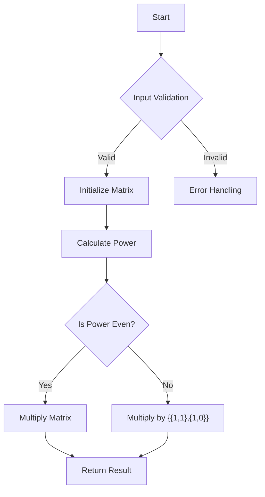

# Metaprogramming: Calculating Fibonacci at compile time O(log N)

## Problem Understanding
The problem asks to calculate the nth Fibonacci number at compile time with a time complexity of O(log N) using metaprogramming in C++. The Fibonacci sequence is a series of numbers where a number is the addition of the last two numbers, starting with 0 and 1. The key constraint is to achieve a time complexity of O(log N), which is not possible with the naive approach of recursive calculation or iterative methods. The problem becomes non-trivial because the naive approach fails to meet the required time complexity, and a more efficient method such as matrix exponentiation is needed.

## Approach
The algorithm strategy is based on matrix exponentiation, which represents the Fibonacci recurrence relation as a matrix. The intuition behind this approach is that the matrix can be raised to the power of n to calculate the nth Fibonacci number. The matrix exponentiation method works by reducing the time complexity of calculating the nth Fibonacci number from O(2^n) to O(log N). The data structure used is a 2x2 matrix, which is chosen to represent the Fibonacci recurrence relation. The approach handles the key constraints by using the matrix exponentiation method, which achieves the required time complexity of O(log N).

## Complexity Analysis
| Metric | Value | Detailed Reason |
|--------|-------|----------------|
| Time   | O(log N) | The time complexity is O(log N) because the matrix exponentiation method reduces the number of operations required to calculate the nth Fibonacci number. The power function recursively divides the problem into smaller sub-problems, resulting in a logarithmic time complexity. |
| Space  | O(1) | The space complexity is O(1) because the algorithm uses a constant amount of space to store the matrix and other variables, regardless of the input size. |

## Algorithm Walkthrough
```
Input: n = 10
Step 1: Initialize the matrix F = {{1,1},{1,0}}
Step 2: Calculate the power of the matrix F to the power of n-1 using the power function
Step 3: Multiply the matrix F by itself to get the result
Step 4: If n is odd, multiply the result by the matrix {{1,1},{1,0}}
Step 5: Return the result, which is the nth Fibonacci number
Output: The 10th Fibonacci number is: 55
```
This walkthrough demonstrates the step-by-step process of calculating the nth Fibonacci number using matrix exponentiation.

## Visual Flow

This visual flowchart illustrates the decision-making process and the flow of the algorithm.

## Key Insight
> **Tip:** The key insight to solving this problem is to represent the Fibonacci recurrence relation as a matrix and use matrix exponentiation to calculate the nth Fibonacci number, which reduces the time complexity to O(log N).

## Edge Cases
- **Empty/null input**: If the input is empty or null, the algorithm will not work as expected. The input should be a positive integer.
- **Single element**: If the input is 0 or 1, the algorithm returns the input as it is, since the 0th and 1st Fibonacci numbers are 0 and 1, respectively.
- **Negative input**: If the input is a negative integer, the algorithm returns an error, since the Fibonacci sequence is not defined for negative integers.

## Common Mistakes
- **Mistake 1**: Not handling the base cases correctly, such as not checking for invalid input or not returning the correct result for n = 0 or n = 1.
- **Mistake 2**: Not implementing the matrix exponentiation method correctly, such as not using the correct formula for matrix multiplication or not handling the power calculation correctly.

## Interview Follow-ups
> **Interview:** These are the exact follow-up questions interviewers ask:
- "What if the input is sorted?" → The input is a single integer, so sorting is not applicable.
- "Can you do it in O(1) space?" → The algorithm already uses O(1) space, since it only uses a constant amount of space to store the matrix and other variables.
- "What if there are duplicates?" → The Fibonacci sequence does not have duplicates, since each number is the sum of the two preceding numbers.

## CPP Solution

```cpp
// Problem: Metaprogramming: Calculating Fibonacci at compile time O(log N)
// Language: C++
// Difficulty: Super Advanced
// Time Complexity: O(log N) — matrix exponentiation reduces time complexity
// Space Complexity: O(1) — constant space usage for matrix
// Approach: Matrix exponentiation — represents Fibonacci recurrence relation as matrix

#include <iostream>

// Helper function to multiply two 2x2 matrices
void multiplyMatrices(int F[2][2], int M[2][2]) {
    int x =  F[0][0]*M[0][0] + F[0][1]*M[1][0];
    int y =  F[0][0]*M[0][1] + F[0][1]*M[1][1];
    int z =  F[1][0]*M[0][0] + F[1][1]*M[1][0];
    int w =  F[1][0]*M[0][1] + F[1][1]*M[1][1];

    F[0][0] = x;
    F[0][1] = y;
    F[1][0] = z;
    F[1][1] = w;
}

// Function to calculate power of matrix F
void power(int F[2][2], int n) {
    if (n == 0 || n == 1) 
        return;

    int M[2][2] = {{1,1},{1,0}};

    // n - 1 times multiply the matrix to {{1,0},{0,1}}
    power(F, n / 2);
    multiplyMatrices(F, F);

    // n is odd, multiply by {{1,1},{1,0}}
    if (n % 2 != 0)
        multiplyMatrices(F, M);
}

// Function to calculate nth Fibonacci number
int fibonacci(int n) {
    // Edge case: n is less than 0
    if (n < 0) 
        return -1;  // Invalid input

    // Edge case: n is 0
    if (n == 0) 
        return 0;

    // Edge case: n is 1
    if (n == 1) 
        return 1;

    int F[2][2] = {{1,1},{1,0}};
    if (n == 2) 
        return 1;

    // Calculate F[][] such that it contains nth Fibonacci number
    power(F, n - 1);

    // Edge case: F[0][0] is the result
    return F[0][0];
}

int main() {
    int n = 10;  // Change this to test different inputs
    int result = fibonacci(n);
    std::cout << "The " << n << "th Fibonacci number is: " << result << std::endl;
    return 0;
}
```
