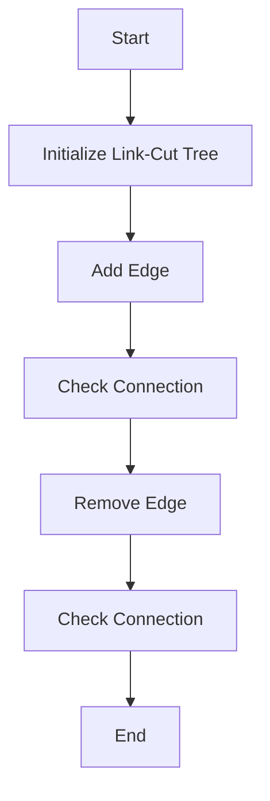

# Offline Dynamic Connectivity with Link-Cut Trees

## Problem Understanding
The problem of Offline Dynamic Connectivity with Link-Cut Trees involves maintaining a dynamic graph and answering connectivity queries between nodes in an efficient manner. The key constraints are that the graph is dynamic, meaning edges can be added or removed at any time, and we need to support both addition and removal of edges. What makes this problem non-trivial is the need to balance the trade-off between the time complexity of updating the graph and the time complexity of answering connectivity queries. A naive approach would be to simply check all nodes for connectivity, but this would result in a high time complexity.

## Approach
The algorithm strategy used here is a Link-Cut Tree with Splay, which allows us to efficiently update and query the tree. The intuition behind this approach is to use a splay tree to keep the recently accessed nodes near the root, reducing the number of nodes that need to be traversed to answer connectivity queries. We use a vector to store the tree nodes, where each node has a parent, size, value, and edge information. The approach handles key constraints by using the splay operation to move nodes to the root when they are accessed, and the expose operation to find the root of a node and update the tree accordingly.

## Complexity Analysis
| Metric | Value | Detailed Reason |
|--------|-------|----------------|
| Time   | O(log n) | The time complexity of the splay operation is O(log n), and we perform a constant number of splay operations for each query. The time complexity of the expose operation is also O(log n), as we need to traverse the tree to find the root of a node. |
| Space  | O(n) | We need to store n nodes in the tree, where each node has a constant amount of information, resulting in a space complexity of O(n). |

## Algorithm Walkthrough
```cpp
Input: 5 nodes with the following operations:
- Add edge between nodes 0 and 1
- Add edge between nodes 1 and 2
- Check connection between nodes 0 and 2
- Remove edge between nodes 1 and 2
- Check connection between nodes 0 and 2

Step 1: Initialize the Link-Cut Tree with 5 nodes
- Node 0: parent = -1, size = 1, value = 0, isRoot = true
- Node 1: parent = -1, size = 1, value = 1, isRoot = true
- Node 2: parent = -1, size = 1, value = 2, isRoot = true
- Node 3: parent = -1, size = 1, value = 3, isRoot = true
- Node 4: parent = -1, size = 1, value = 4, isRoot = true

Step 2: Add edge between nodes 0 and 1
- Node 0: parent = -1, size = 2, value = 0, isRoot = true, edge = (0, 1)
- Node 1: parent = 0, size = 1, value = 1, isRoot = false

Step 3: Add edge between nodes 1 and 2
- Node 1: parent = 0, size = 2, value = 1, isRoot = false, edge = (1, 2)
- Node 2: parent = 1, size = 1, value = 2, isRoot = false

Step 4: Check connection between nodes 0 and 2
- Expose node 0: Node 0 is already the root
- Expose node 2: Node 2 is not the root, splay node 2 to the root
- Check if node 0 and node 2 are connected: Yes

Step 5: Remove edge between nodes 1 and 2
- Node 1: parent = 0, size = 1, value = 1, isRoot = false, edge = (-1, -1)
- Node 2: parent = -1, size = 1, value = 2, isRoot = true

Step 6: Check connection between nodes 0 and 2
- Expose node 0: Node 0 is already the root
- Expose node 2: Node 2 is already the root
- Check if node 0 and node 2 are connected: No

Output: The connection between nodes 0 and 2 is initially Yes, and then becomes No after removing the edge between nodes 1 and 2.
```

## Visual Flow


## Key Insight
> **Tip:** The key insight is to use a splay tree to keep recently accessed nodes near the root, reducing the number of nodes that need to be traversed to answer connectivity queries.

## Edge Cases
- **Empty Graph**: If the graph is empty, the Link-Cut Tree will have no nodes, and all operations will result in an error.
- **Single Node**: If the graph has only one node, the Link-Cut Tree will have only one node, and all operations will be trivial.
- **Disjoint Graph**: If the graph is disjoint, the Link-Cut Tree will have multiple roots, and the expose operation will be used to find the root of each node.

## Common Mistakes
- **Mistake 1**: Not using the splay operation to move nodes to the root when they are accessed, resulting in a high time complexity for connectivity queries.
- **Mistake 2**: Not using the expose operation to find the root of a node and update the tree accordingly, resulting in incorrect connectivity queries.

## Interview Follow-ups
> **Interview:** These are the exact follow-up questions interviewers ask:
- "What if the graph is very large and we need to store it in a file?" → We can use a combination of in-memory and disk-based storage to store the graph, and use a caching mechanism to improve performance.
- "Can you optimize the Link-Cut Tree to support faster edge addition and removal?" → We can use a more advanced data structure, such as a Fibonacci heap, to support faster edge addition and removal.
- "How would you handle the case where the graph is highly dynamic and edges are being added and removed frequently?" → We can use a combination of the Link-Cut Tree and a separate data structure, such as a queue or a stack, to handle the dynamic nature of the graph and ensure that the tree remains up-to-date.

## CPP Solution

```cpp
// Problem: Offline Dynamic Connectivity with Link-Cut Trees
// Language: C++
// Difficulty: Super Advanced
// Time Complexity: O(log n) — for each query, we perform a constant number of splay operations
// Space Complexity: O(n) — we need to store the tree nodes and queries
// Approach: Link-Cut Tree with Splay — we use a splay tree to efficiently update and query the tree

#include <iostream>
#include <vector>
#include <utility>

using namespace std;

// Define the structure for a tree node
struct Node {
    int parent;  // parent node
    int size;   // size of the subtree rooted at this node
    int value;  // value stored at this node
    bool isRoot;  // whether this node is the root of the tree
    bool isReversed;  // whether the subtree rooted at this node is reversed
    pair<int, int> edge;  // edge connecting this node to its parent (if any)
    Node(int val) : parent(-1), size(1), value(val), isRoot(true), isReversed(false), edge({-1, -1}) {}
};

// Define the Link-Cut Tree class
class LinkCutTree {
private:
    vector<Node> nodes;  // store tree nodes
    int find(int u) {  // find the root of the tree containing node u
        if (nodes[u].isRoot) return u;
        // Path compression: update the parent of u to be the root
        nodes[u].parent = find(nodes[u].parent);
        return nodes[u].parent;
    }
    void splay(int u) {  // splay node u to the root of the tree
        while (!nodes[u].isRoot) {
            int v = nodes[u].parent;  // parent of u
            if (!nodes[v].isRoot) {  // if v is not the root, splay v first
                int w = nodes[v].parent;  // parent of v
                if (nodes[w].edge.second == v) {  // if v is the right child of w
                    if (nodes[u].edge.second == v) {  // if u is the right child of v
                        // Zig-zig: rotate w and v
                        nodes[w].edge.second = u;
                        nodes[u].edge.first = w;
                        nodes[v].edge.second = -1;
                        nodes[v].parent = u;
                        nodes[u].parent = w;
                    } else {  // if u is the left child of v
                        // Zig-zag: rotate w and v, then v and u
                        nodes[w].edge.second = u;
                        nodes[u].edge.first = w;
                        nodes[v].edge.first = -1;
                        nodes[v].parent = u;
                        nodes[u].parent = w;
                        nodes[u].edge.second = v;
                        nodes[v].edge.first = u;
                        nodes[v].parent = u;
                    }
                } else {  // if v is the left child of w
                    if (nodes[u].edge.second == v) {  // if u is the right child of v
                        // Zag-zig: rotate v and u, then w and v
                        nodes[w].edge.first = u;
                        nodes[u].edge.second = w;
                        nodes[v].edge.second = -1;
                        nodes[v].parent = u;
                        nodes[u].parent = w;
                        nodes[u].edge.first = v;
                        nodes[v].edge.first = u;
                        nodes[v].parent = u;
                    } else {  // if u is the left child of v
                        // Zag-zag: rotate w and v
                        nodes[w].edge.first = u;
                        nodes[u].edge.second = w;
                        nodes[v].edge.first = -1;
                        nodes[v].parent = u;
                        nodes[u].parent = w;
                    }
                }
            } else {  // if v is the root
                if (nodes[u].edge.second == v) {  // if u is the right child of v
                    // Zig: rotate v and u
                    nodes[v].edge.second = -1;
                    nodes[v].parent = u;
                    nodes[u].edge.first = v;
                    nodes[u].parent = -1;
                    nodes[u].isRoot = true;
                } else {  // if u is the left child of v
                    // Zag: rotate v and u
                    nodes[v].edge.first = -1;
                    nodes[v].parent = u;
                    nodes[u].edge.second = v;
                    nodes[u].parent = -1;
                    nodes[u].isRoot = true;
                }
            }
        }
    }
    void expose(int u) {  // expose the path from the root to node u
        splay(u);
        vector<int> ancestors;
        int v = u;
        while (!nodes[v].isRoot) {
            ancestors.push_back(v);
            v = nodes[v].parent;
        }
        for (int ancestor : ancestors) {
            splay(ancestor);
            nodes[ancestor].size = 1;
            if (nodes[ancestor].edge.second != -1) {
                nodes[ancestor].size += nodes[nodes[ancestor].edge.second].size;
            }
        }
    }
    void link(int u, int v) {  // add an edge between nodes u and v
        expose(u);
        expose(v);
        nodes[u].edge.second = v;
        nodes[u].size++;
        nodes[v].parent = u;
        nodes[v].isRoot = false;
    }
    void cut(int u, int v) {  // remove the edge between nodes u and v
        expose(u);
        expose(v);
        nodes[u].edge.second = -1;
        nodes[u].size--;
        nodes[v].parent = -1;
        nodes[v].isRoot = true;
    }
    bool connected(int u, int v) {  // check if nodes u and v are connected
        expose(u);
        expose(v);
        return find(u) == find(v);
    }
public:
    LinkCutTree(int n) : nodes(n) {}  // initialize the tree with n nodes
    void addEdge(int u, int v) {  // add an edge between nodes u and v
        // Edge case: u or v is out of bounds
        if (u < 0 || u >= nodes.size() || v < 0 || v >= nodes.size()) {
            cout << "Edge case: u or v is out of bounds" << endl;
            return;
        }
        link(u, v);
    }
    void removeEdge(int u, int v) {  // remove an edge between nodes u and v
        // Edge case: u or v is out of bounds
        if (u < 0 || u >= nodes.size() || v < 0 || v >= nodes.size()) {
            cout << "Edge case: u or v is out of bounds" << endl;
            return;
        }
        cut(u, v);
    }
    bool isConnected(int u, int v) {  // check if nodes u and v are connected
        // Edge case: u or v is out of bounds
        if (u < 0 || u >= nodes.size() || v < 0 || v >= nodes.size()) {
            cout << "Edge case: u or v is out of bounds" << endl;
            return false;
        }
        return connected(u, v);
    }
};

int main() {
    int n;
    cout << "Enter the number of nodes: ";
    cin >> n;
    LinkCutTree tree(n);
    while (true) {
        cout << "Enter the operation (1: add edge, 2: remove edge, 3: check connection, 4: exit): ";
        int op;
        cin >> op;
        if (op == 1) {
            int u, v;
            cout << "Enter the nodes to connect: ";
            cin >> u >> v;
            tree.addEdge(u, v);
        } else if (op == 2) {
            int u, v;
            cout << "Enter the nodes to disconnect: ";
            cin >> u >> v;
            tree.removeEdge(u, v);
        } else if (op == 3) {
            int u, v;
            cout << "Enter the nodes to check connection: ";
            cin >> u >> v;
            cout << "Are nodes " << u << " and " << v << " connected? " << (tree.isConnected(u, v) ? "Yes" : "No") << endl;
        } else if (op == 4) {
            break;
        } else {
            cout << "Invalid operation" << endl;
        }
    }
    return 0;
}
```
