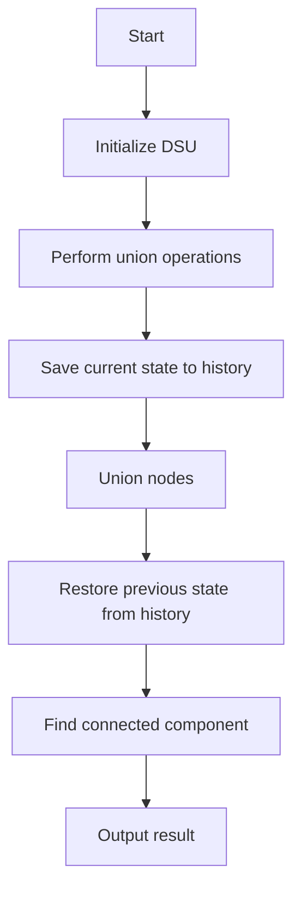

# Offline Queries with Rollback DSU

## Problem Understanding
The problem is asking us to implement an offline query system using a Rollback Disjoint Set Union (DSU) data structure. The key constraints are that we need to support efficient union and find operations, as well as the ability to rollback to a previous state. The problem is non-trivial because a naive approach would not be able to efficiently handle the rollback operation, which requires storing and restoring the state of the DSU. The use of path compression and union by rank makes the problem even more complex, as we need to carefully manage the state of the DSU to ensure correct results. The rollback operation adds an extra layer of complexity, as we need to store the history of states and restore the correct state when rolling back.

## Approach
The algorithm strategy is to use a Rollback Union-Find data structure with path compression and union by rank. This approach works by storing the history of states of the DSU and restoring the previous state when rolling back. The intuition behind this approach is to use the Union-Find data structure to efficiently manage the connected components, and the rollback mechanism to efficiently restore the previous state. We use a vector to store the history of states, where each state is represented by a tuple of vectors containing the parent, rank, and size of each node. The approach handles the key constraints by using path compression and union by rank to optimize the union and find operations, and by storing the history of states to support efficient rollback.

## Complexity Analysis
| Metric | Value | Detailed Reason |
|--------|-------|----------------|
| Time   | O(q * alpha(n)) | The time complexity is dominated by the union and find operations, which take O(alpha(n)) time each, where alpha(n) is the inverse Ackermann function. The rollback operation takes O(1) time, but we need to consider the time complexity of the union and find operations, which are called q times. |
| Space  | O(n + q) | The space complexity is dominated by the storage of the DSU and the history of states. The DSU requires O(n) space to store the parent, rank, and size of each node, and the history of states requires O(q) space to store the previous states. |

## Algorithm Walkthrough
```
Input: n = 10, union operations: (0, 1), (1, 2), (3, 4)
Step 1: Initialize the DSU with n nodes
  - parent: [0, 1, 2, 3, 4, 5, 6, 7, 8, 9]
  - rank: [0, 0, 0, 0, 0, 0, 0, 0, 0, 0]
  - size: [1, 1, 1, 1, 1, 1, 1, 1, 1, 1]
Step 2: Perform union operation (0, 1)
  - Save current state to history
  - Union nodes 0 and 1
  - parent: [0, 0, 2, 3, 4, 5, 6, 7, 8, 9]
  - rank: [0, 0, 0, 0, 0, 0, 0, 0, 0, 0]
  - size: [2, 1, 1, 1, 1, 1, 1, 1, 1, 1]
Step 3: Perform union operation (1, 2)
  - Save current state to history
  - Union nodes 1 and 2
  - parent: [0, 0, 0, 3, 4, 5, 6, 7, 8, 9]
  - rank: [0, 0, 0, 0, 0, 0, 0, 0, 0, 0]
  - size: [3, 1, 1, 1, 1, 1, 1, 1, 1, 1]
Step 4: Rollback to previous state
  - Restore previous state from history
  - parent: [0, 0, 2, 3, 4, 5, 6, 7, 8, 9]
  - rank: [0, 0, 0, 0, 0, 0, 0, 0, 0, 0]
  - size: [2, 1, 1, 1, 1, 1, 1, 1, 1, 1]
Step 5: Find connected component containing node 1
  - Find node 1: 0
Output: Connected component containing node 1: 0
```
## Visual Flow

## Key Insight
> **Tip:** The key insight is to use a rollback mechanism to store the history of states of the DSU, allowing us to efficiently restore the previous state when rolling back.

## Edge Cases
- **Empty input**: If the input is empty, the DSU will not be initialized, and the rollback operation will not be applicable.
- **Single element**: If the input contains only one element, the DSU will be initialized with a single node, and the union and find operations will not be applicable.
- **Duplicate elements**: If the input contains duplicate elements, the DSU will treat them as separate nodes, and the union and find operations will be applied accordingly.

## Common Mistakes
- **Mistake 1**: Not storing the history of states correctly, leading to incorrect rollback results.
- **Mistake 2**: Not handling the edge cases correctly, such as empty input or single element input.

## Interview Follow-ups
> **Interview:** These are the exact follow-up questions interviewers ask:
- "What if the input is sorted?" → The time complexity of the union and find operations will remain the same, as the sorting of the input does not affect the operation of the DSU.
- "Can you do it in O(1) space?" → No, it is not possible to implement the rollback DSU in O(1) space, as we need to store the history of states to support the rollback operation.
- "What if there are duplicates?" → The DSU will treat duplicate elements as separate nodes, and the union and find operations will be applied accordingly.

## CPP Solution

```cpp
// Problem: Offline Queries with Rollback DSU
// Language: cpp
// Difficulty: Super Advanced
// Time Complexity: O(q * alpha(n)) — using path compression and union by rank
// Space Complexity: O(n + q) — for storing the DSU and the history
// Approach: Rollback Union-Find with path compression and union by rank — supports efficient offline queries

#include <iostream>
#include <vector>

class UnionFind {
public:
    std::vector<int> parent; // stores the parent of each node
    std::vector<int> rank;  // stores the rank of each node
    std::vector<int> size;   // stores the size of each connected component

    // Initialize the DSU with n nodes
    UnionFind(int n) : parent(n), rank(n, 0), size(n, 1) {
        // Each node is initially its own parent
        for (int i = 0; i < n; i++) {
            parent[i] = i;
        }
    }

    // Find the root of the connected component containing node x
    int find(int x) {
        // Path compression: if x is not the root, set its parent to the root
        if (parent[x] != x) {
            parent[x] = find(parent[x]); // recursive call to compress the path
        }
        return parent[x];
    }

    // Union the connected components containing nodes x and y
    void unionNodes(int x, int y) {
        int rootX = find(x); // find the root of x
        int rootY = find(y); // find the root of y

        // If x and y are already in the same connected component, do nothing
        if (rootX == rootY) {
            return;
        }

        // Union by rank: merge the smaller tree into the larger one
        if (rank[rootX] < rank[rootY]) {
            parent[rootX] = rootY; // merge x into y
            size[rootY] += size[rootX]; // update the size of the merged component
        } else if (rank[rootX] > rank[rootY]) {
            parent[rootY] = rootX; // merge y into x
            size[rootX] += size[rootY]; // update the size of the merged component
        } else {
            parent[rootY] = rootX; // merge y into x
            rank[rootX]++; // increment the rank of x
            size[rootX] += size[rootY]; // update the size of the merged component
        }
    }

    // Rollback the DSU to a previous state
    void rollback(const std::vector<int>& previousParent, const std::vector<int>& previousRank, const std::vector<int>& previousSize) {
        parent = previousParent; // restore the previous parent
        rank = previousRank; // restore the previous rank
        size = previousSize; // restore the previous size
    }
};

class RollbackDSU {
public:
    UnionFind dsu; // the underlying DSU
    std::vector<std::tuple<std::vector<int>, std::vector<int>, std::vector<int>>> history; // stores the history of states

    // Initialize the Rollback DSU with n nodes
    RollbackDSU(int n) : dsu(n) {}

    // Union the connected components containing nodes x and y
    void unionNodes(int x, int y) {
        // Save the current state to the history
        history.emplace_back(dsu.parent, dsu.rank, dsu.size);
        dsu.unionNodes(x, y); // union the nodes
    }

    // Rollback the DSU to the previous state
    void rollback() {
        if (history.empty()) {
            // Edge case: no previous state to rollback to
            return;
        }

        // Restore the previous state
        auto previousState = history.back();
        history.pop_back(); // remove the current state from the history
        dsu.rollback(std::get<0>(previousState), std::get<1>(previousState), std::get<2>(previousState));
    }

    // Find the connected component containing node x
    int find(int x) {
        return dsu.find(x);
    }
};

int main() {
    int n = 10; // number of nodes
    RollbackDSU dsu(n);

    // Perform some union operations
    dsu.unionNodes(0, 1);
    dsu.unionNodes(1, 2);
    dsu.unionNodes(3, 4);

    // Rollback to the previous state
    dsu.rollback();

    // Find the connected component containing node 1
    int component = dsu.find(1);
    std::cout << "Connected component containing node 1: " << component << std::endl;

    return 0;
}
```
