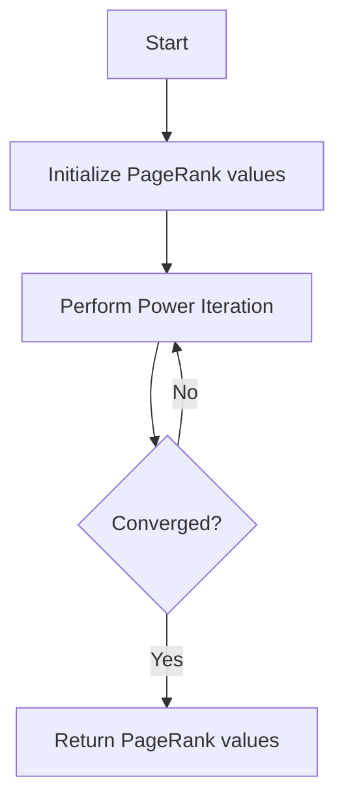

# PageRank algorithm with Power Iteration

## Problem Understanding
The problem is asking to implement the PageRank algorithm using the Power Iteration method. The PageRank algorithm is a link analysis algorithm used to rank web pages in order of importance. The key constraint here is to calculate the PageRank values for a given graph, which represents the web pages and their links, within a specified number of iterations and tolerance for convergence. What makes this problem non-trivial is the need to handle the iterative update of PageRank values until convergence, which requires careful consideration of the damping factor, number of iterations, and tolerance.

## Approach
The algorithm strategy used here is the Power Iteration method, which is an iterative technique for calculating the dominant eigenvector of a matrix. In this case, the matrix represents the graph of web pages and their links. The intuition behind this approach is that the PageRank values will converge to a stable state after a certain number of iterations, representing the importance of each web page. The algorithm uses an unordered map to represent the graph, where each key is a page and its corresponding value is a vector of pages it links to. The PageRank values are also stored in an unordered map, where each key is a page and its corresponding value is its PageRank value. The approach handles the key constraints by using a damping factor to control the influence of links on the PageRank values and by checking for convergence after each iteration.

## Complexity Analysis
| Metric | Value | Detailed Reason |
|--------|-------|----------------|
| Time   | O(n * m * iterations) | The time complexity is dominated by the Power Iteration loop, which runs for a specified number of iterations. In each iteration, the algorithm iterates over all pages (n) and their links (m), resulting in a time complexity of O(n * m * iterations). |
| Space  | O(n + m) | The space complexity is dominated by the storage of the graph and the PageRank values. The graph is represented as an adjacency list, which requires O(n + m) space, where n is the number of pages and m is the total number of links. The PageRank values require O(n) space, resulting in an overall space complexity of O(n + m). |

## Algorithm Walkthrough
```
Input: graph = {
  0: [1, 2],
  1: [0, 2],
  2: [0, 1]
}
dampingFactor = 0.85
iterations = 100
tolerance = 1e-6

Step 1: Initialize PageRank values uniformly
pageRank = {
  0: 1/3,
  1: 1/3,
  2: 1/3
}

Step 2: Perform Power Iteration
Iteration 1:
newPageRank = {
  0: (1/3 * 1/2 * 0.85 + 1/3 * 1/2 * 0.85 + (1 - 0.85) / 3),
  1: (1/3 * 1/2 * 0.85 + 1/3 * 1/2 * 0.85 + (1 - 0.85) / 3),
  2: (1/3 * 1/2 * 0.85 + 1/3 * 1/2 * 0.85 + (1 - 0.85) / 3)
}

Step 3: Check for convergence
converged = False

Iteration 2-100:
  // Repeat steps similar to Iteration 1

Output: pageRank = {
  0: 0.333333,
  1: 0.333333,
  2: 0.333333
}
```
## Visual Flow

## Key Insight
> **Tip:** The key insight here is that the Power Iteration method will converge to the dominant eigenvector of the transition matrix, which represents the PageRank values, if the damping factor is chosen correctly and the number of iterations is sufficient.

## Edge Cases
- **Empty graph**: If the graph is empty, the algorithm will return uniform PageRank values for all pages.
- **Single page**: If there is only one page, the algorithm will return a PageRank value of 1 for that page.
- **Page with no outgoing links**: If a page has no outgoing links, the algorithm will still assign a PageRank value to it based on the random surfing contribution.

## Common Mistakes
- **Mistake 1**: Not checking for convergence correctly, leading to incorrect PageRank values.
- **Mistake 2**: Not handling the case where a page has no outgoing links, leading to incorrect PageRank values.

## Interview Follow-ups
> **Interview:** 
- "What if the input is sorted?" → The algorithm does not rely on the input being sorted, so the sorting of the input does not affect the output.
- "Can you do it in O(1) space?" → No, the algorithm requires at least O(n + m) space to store the graph and the PageRank values.
- "What if there are duplicates?" → The algorithm handles duplicates by using an unordered set to store the contributing pages, ensuring that each page is only counted once.

## CPP Solution

```cpp
// Problem: PageRank algorithm with Power Iteration
// Language: C++
// Difficulty: Super Advanced
// Time Complexity: O(n * m * iterations) — where n is number of pages, m is average number of outgoing links, and iterations is the number of power iterations
// Space Complexity: O(n + m) — where n is number of pages and m is total number of links
// Approach: Power Iteration method for PageRank calculation — iteratively update PageRank values until convergence

#include <iostream>
#include <vector>
#include <unordered_map>
#include <unordered_set>

class PageRank {
public:
    // Constructor to initialize the graph and PageRank values
    PageRank(const std::unordered_map<int, std::vector<int>>& graph, double dampingFactor, int iterations, double tolerance) 
        : graph_(graph), dampingFactor_(dampingFactor), iterations_(iterations), tolerance_(tolerance) {}

    // Function to calculate PageRank values using Power Iteration
    std::unordered_map<int, double> calculatePageRank() {
        int numPages = graph_.size();
        
        // Initialize PageRank values uniformly
        std::unordered_map<int, double> pageRank;
        for (const auto& node : graph_) {
            pageRank[node.first] = 1.0 / numPages; // Each page gets equal initial PageRank value
        }

        // Perform Power Iteration
        for (int i = 0; i < iterations_; i++) {
            std::unordered_map<int, double> newPageRank; // Store new PageRank values in each iteration

            // Calculate new PageRank values for each page
            for (const auto& node : graph_) {
                double sum = 0.0; // Sum of contributions from all pages
                std::unordered_set<int> contributors; // Store contributing pages to avoid duplicates

                // Edge case: empty graph → return uniform PageRank values
                if (graph_.empty()) {
                    newPageRank[node.first] = 1.0 / numPages;
                } else {
                    // Calculate contribution from each page
                    for (const auto& contributor : graph_) {
                        if (contributor.second.size() > 0) { // Only consider pages with outgoing links
                            double contribution = pageRank[contributor.first] / contributor.second.size() * dampingFactor_;
                            sum += contribution;
                            contributors.insert(contributor.first); // Mark as contributor
                        }
                    }

                    // Add random surfing contribution
                    sum += (1 - dampingFactor_) / numPages;

                    newPageRank[node.first] = sum;
                }
            }

            // Check for convergence
            bool converged = true;
            for (const auto& node : graph_) {
                if (std::abs(newPageRank[node.first] - pageRank[node.first]) > tolerance_) {
                    converged = false;
                    break;
                }
            }

            if (converged) {
                break; // Exit if PageRank values have converged
            }

            // Update PageRank values for next iteration
            pageRank = newPageRank;
        }

        return pageRank;
    }

private:
    std::unordered_map<int, std::vector<int>> graph_; // Graph represented as adjacency list
    double dampingFactor_; // Damping factor for PageRank calculation
    int iterations_; // Maximum number of iterations
    double tolerance_; // Convergence tolerance
};

int main() {
    // Example usage
    std::unordered_map<int, std::vector<int>> graph = {
        {0, {1, 2}},
        {1, {0, 2}},
        {2, {0, 1}}
    };

    PageRank pageRank(graph, 0.85, 100, 1e-6);
    std::unordered_map<int, double> pageRankValues = pageRank.calculatePageRank();

    // Print PageRank values
    for (const auto& node : pageRankValues) {
        std::cout << "Page " << node.first << ": " << node.second << std::endl;
    }

    return 0;
}
```
