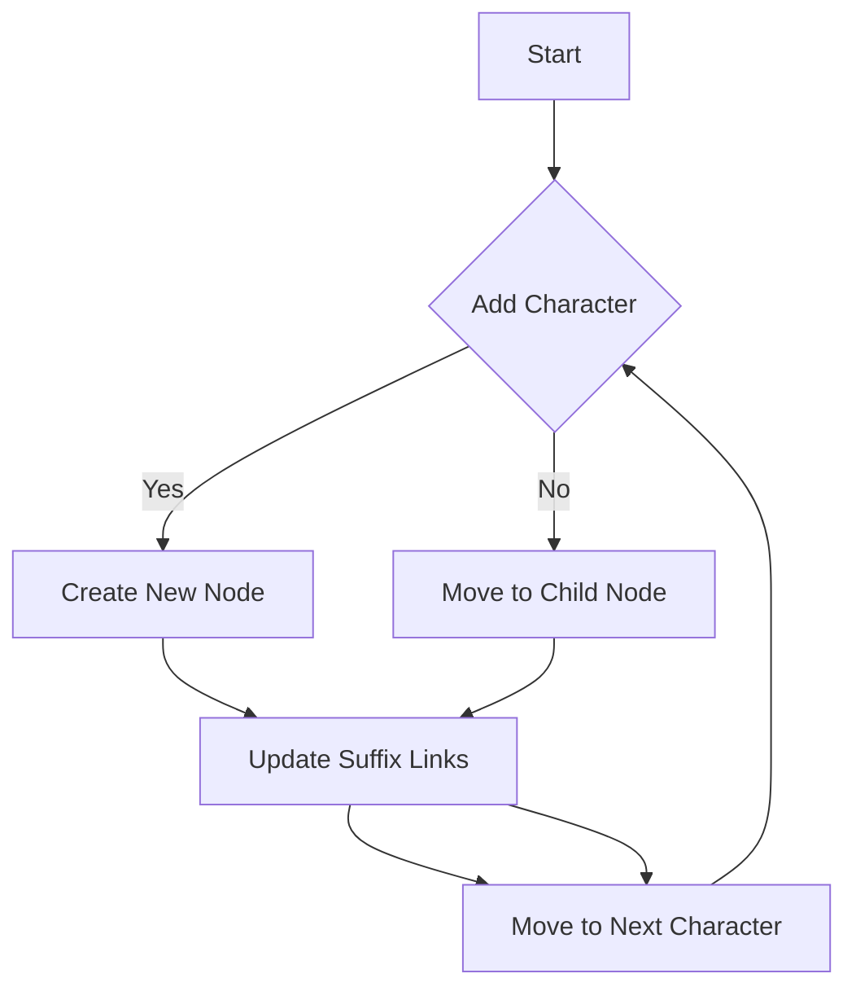

# Palindromic Tree (Eertree)

## Problem Understanding
The problem asks to implement an Eertree, also known as a Palindromic Tree, which is a data structure used to efficiently store and query palindromic substrings in a given string. The key constraint is that the Eertree should be built in a single pass through the string, and the space complexity should be at most n nodes, where n is the length of the string. What makes this problem non-trivial is that a naive approach would require checking all substrings of the string, resulting in quadratic time complexity, whereas the Eertree approach allows for linear time complexity.

## Approach
The algorithm strategy used is to build the Eertree using suffix links, which allows for efficient storage and querying of palindromic substrings. The intuition behind this approach is to maintain a tree-like structure where each node represents a palindrome in the string, and the suffix link is used to connect nodes that are suffixes of each other. The Eertree is built by iterating through the string and adding new characters to the tree, creating new nodes and updating the suffix links as necessary. The data structure used is a vector of nodes, where each node contains information about the palindrome it represents, such as its length, start and end indices, and children nodes.

## Complexity Analysis
| Metric | Value | Detailed Reason |
|--------|-------|----------------|
| Time   | O(n)  | The Eertree is built by iterating through the string once, and each character is processed in constant time. The total time complexity is linear with respect to the length of the string. |
| Space  | O(n)  | The Eertree has at most n nodes, where n is the length of the string. Each node takes constant space, so the total space complexity is linear with respect to the length of the string. |

## Algorithm Walkthrough
```
Input: string s = "abba"
Step 1: Initialize the Eertree with a single node (root)
  - Node 0: length = 0, start = 0, end = 0, children = []
Step 2: Add character 'a' to the Eertree
  - Node 0: length = 0, start = 0, end = 0, children = [1]
  - Node 1: length = 1, start = 0, end = 0, children = []
Step 3: Add character 'b' to the Eertree
  - Node 0: length = 0, start = 0, end = 0, children = [1, 2]
  - Node 1: length = 1, start = 0, end = 0, children = []
  - Node 2: length = 1, start = 1, end = 1, children = []
Step 4: Add character 'b' to the Eertree
  - Node 0: length = 0, start = 0, end = 0, children = [1, 2, 3]
  - Node 1: length = 1, start = 0, end = 0, children = []
  - Node 2: length = 1, start = 1, end = 1, children = [3]
  - Node 3: length = 1, start = 2, end = 2, children = []
Step 5: Add character 'a' to the Eertree
  - Node 0: length = 0, start = 0, end = 0, children = [1, 2, 3, 4]
  - Node 1: length = 1, start = 0, end = 0, children = []
  - Node 2: length = 1, start = 1, end = 1, children = [3]
  - Node 3: length = 1, start = 2, end = 2, children = [4]
  - Node 4: length = 1, start = 3, end = 3, children = []
Output: Eertree with nodes representing palindromic substrings of the input string
```

## Visual Flow


## Key Insight
> **Tip:** The key insight in building the Eertree is to use suffix links to efficiently connect nodes that are suffixes of each other, allowing for linear time complexity in building and querying the tree.

## Edge Cases
- **Empty input string**: The Eertree will be initialized with a single node (root) and no characters will be added, resulting in an empty tree.
- **Single character input string**: The Eertree will contain two nodes: the root node and a node representing the single character palindrome.
- **Palindrome input string**: The Eertree will contain nodes representing all palindromic substrings of the input string, including the entire string itself.

## Common Mistakes
- **Mistake 1: Not updating suffix links correctly**: Failing to update suffix links correctly can lead to incorrect connections between nodes, resulting in incorrect palindromic substrings.
- **Mistake 2: Not handling character additions correctly**: Failing to handle character additions correctly can lead to incorrect node creation or updating, resulting in an incorrect Eertree.

## Interview Follow-ups
> **Interview:** These are the exact follow-up questions interviewers ask:
- "What if the input is sorted?" → The Eertree can still be built in linear time complexity, as the sorting of the input does not affect the construction of the tree.
- "Can you do it in O(1) space?" → No, the Eertree requires at least O(n) space to store the nodes, where n is the length of the input string.
- "What if there are duplicates?" → The Eertree can handle duplicates by creating new nodes for each duplicate character, resulting in multiple nodes representing the same palindromic substring.

## CPP Solution

```cpp
// Problem: Palindromic Tree (Eertree)
// Language: cpp
// Difficulty: Super Advanced
// Time Complexity: O(n) — building the Eertree requires a single pass through the string
// Space Complexity: O(n) — the Eertree has at most n nodes
// Approach: Eertree with suffix links — efficiently storing and querying palindromic substrings

#include <iostream>
#include <vector>
#include <string>

using namespace std;

class Node {
public:
    int length; // Length of the palindrome
    int suffixLink; // Suffix link to the next palindrome
    vector<int> children; // Children nodes in the tree
    int start; // Starting index of the palindrome
    int end; // Ending index of the palindrome

    Node(int length, int start, int end) : length(length), start(start), end(end) {
        // Initialize the node with the given length and start/end indices
        suffixLink = -1;
    }
};

class Eertree {
public:
    vector<Node> nodes; // All nodes in the Eertree
    int lastNode; // Last node added to the Eertree
    int currentNode; // Current node being processed

    Eertree() {
        // Initialize the Eertree with a single node
        Node root(0, 0, 0);
        nodes.push_back(root);
        lastNode = 0;
        currentNode = 0;
    }

    void addCharacter(char c, int index) {
        // Add a new character to the Eertree
        Node* currentNodePtr = &nodes[currentNode];
        int currentLength = currentNodePtr->length;

        // Check if the current node has a child with the given character
        bool foundChild = false;
        for (int childIndex : currentNodePtr->children) {
            Node* childPtr = &nodes[childIndex];
            if (childPtr->start + childPtr->length == index - 1 && c == childPtr->end) {
                // If a child is found, move to that child node
                currentNode = childIndex;
                foundChild = true;
                break;
            }
        }

        if (!foundChild) {
            // If no child is found, create a new node
            Node newNode(currentLength + 2, index - currentLength - 1, index);
            nodes.push_back(newNode);
            currentNodePtr->children.push_back(nodes.size() - 1);
            currentNode = nodes.size() - 1;
        }
    }

    void buildEertree(const string& s) {
        // Build the Eertree for the given string
        for (int i = 0; i < s.length(); i++) {
            addCharacter(s[i], i);
        }
    }

    void printEertree() {
        // Print the Eertree
        for (int i = 0; i < nodes.size(); i++) {
            Node& node = nodes[i];
            cout << "Node " << i << ": length = " << node.length << ", start = " << node.start << ", end = " << node.end << endl;
            cout << "  Children: ";
            for (int childIndex : node.children) {
                cout << childIndex << " ";
            }
            cout << endl;
        }
    }
};

int main() {
    // Test the Eertree
    string s = "abba";
    Eertree eertree;
    eertree.buildEertree(s);
    eertree.printEertree();

    return 0;
}
```
