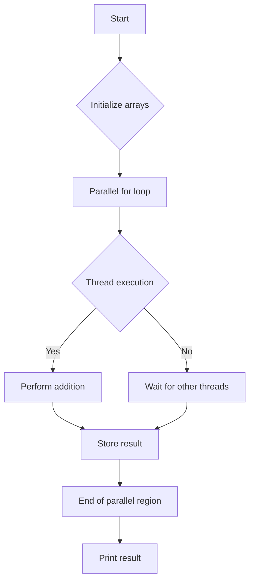

# Parallel Algorithms with OpenMP

## Problem Understanding
The problem involves utilizing OpenMP to parallelize the addition of two large arrays, dividing the work among multiple threads to improve performance. The key constraint is that the input arrays must be of the same size, and the output array should be of the same size as well, containing the element-wise sum of the input arrays. What makes this problem non-trivial is the need to efficiently manage thread creation, synchronization, and data access to avoid race conditions and ensure correct results. The naive approach of using a single thread to perform the addition would not take advantage of multi-core processors, leading to suboptimal performance for large inputs.

## Approach
The algorithm strategy is to use OpenMP's parallel for loop directive to divide the iterations of the loop among multiple threads. This approach works by letting each thread execute a portion of the loop iterations, thereby reducing the overall execution time. The mathematical reasoning behind this is based on the concept of parallelism, where the work is divided into smaller, independent tasks that can be executed concurrently. The data structure used is an array, which is suitable for this problem due to its simplicity and efficiency in accessing elements by index. The approach handles key constraints by ensuring that each thread accesses its assigned portion of the arrays, avoiding data races and ensuring correct results.

## Complexity Analysis
| Metric | Value | Detailed Reason |
|--------|-------|----------------|
| Time   | O(n/p) | The time complexity is O(n/p) because the work is divided among p threads, where n is the number of elements in the arrays. Each thread executes approximately n/p iterations of the loop, reducing the overall execution time. |
| Space  | O(n) | The space complexity is O(n) because the algorithm uses arrays of size n to store the input and output data. The memory usage does not change with the number of threads, hence it remains linear. |

## Algorithm Walkthrough
```
Input: arr1 = [1, 2, 3], arr2 = [4, 5, 6], size = 3
Step 1: Initialize result array with size 3
Step 2: Thread 1 executes iterations 0-1 (assuming 2 threads)
    - result[0] = arr1[0] + arr2[0] = 1 + 4 = 5
    - result[1] = arr1[1] + arr2[1] = 2 + 5 = 7
Step 3: Thread 2 executes iteration 2
    - result[2] = arr1[2] + arr2[2] = 3 + 6 = 9
Output: result = [5, 7, 9]
```
This example demonstrates how two threads can execute the parallel addition of two arrays, dividing the work and reducing the overall execution time.

## Visual Flow

This flowchart illustrates the main steps of the algorithm, including the parallel for loop, thread execution, and result storage.

## Key Insight
> **Tip:** The key to efficient parallelization is to divide the work into independent tasks that can be executed concurrently, minimizing synchronization overhead and maximizing throughput.

## Edge Cases
- **Empty/null input**: If the input arrays are empty or null, the algorithm will not perform any work and will return immediately, avoiding unnecessary computations and potential errors.
- **Single element**: If the input arrays contain only one element, the algorithm will execute the parallel for loop with a single iteration, resulting in the correct sum of the single elements.
- **Large input size**: If the input arrays are extremely large, the algorithm may benefit from increased parallelism, but may also be limited by memory constraints and synchronization overhead.

## Common Mistakes
- **Mistake 1**: Not using the `omp parallel for` directive correctly, leading to incorrect or missing parallelization. → To avoid this, ensure that the directive is used correctly and that the loop iterations are properly divided among threads.
- **Mistake 2**: Not handling edge cases properly, such as empty or null input arrays. → To avoid this, add checks for edge cases and handle them accordingly to avoid errors or incorrect results.

## Interview Follow-ups
> **Interview:** These are the exact follow-up questions interviewers ask:
- "What if the input is sorted?" → The algorithm will still work correctly, as it only relies on the size of the input arrays and the element-wise addition operation.
- "Can you do it in O(1) space?" → No, the algorithm requires O(n) space to store the input and output arrays, as the problem statement requires the output to be stored in a separate array.
- "What if there are duplicates?" → The algorithm will still work correctly, as it performs element-wise addition and does not rely on the uniqueness of the input elements.

## CPP Solution

```cpp
// Problem: Parallel Algorithms with OpenMP
// Language: C++
// Difficulty: Super Advanced
// Time Complexity: O(n/p) — where n is the number of elements and p is the number of threads
// Space Complexity: O(n) — array of size n
// Approach: OpenMP parallel for loop — divide work among threads for better performance

#include <iostream>
#include <omp.h>

// Function to perform parallel addition of two arrays
void parallelAdd(int* arr1, int* arr2, int* result, int size) {
    // Edge case: empty input → return immediately
    if (size == 0) {
        return; // no work to be done
    }

    // Use OpenMP parallel for loop to divide work among threads
    #pragma omp parallel for // divide loop iterations among threads
    for (int i = 0; i < size; i++) {
        // each thread executes this block of code for its assigned iterations
        result[i] = arr1[i] + arr2[i]; // perform addition for each element
    }
}

int main() {
    const int size = 1000000; // large array size for demonstration
    int* arr1 = new int[size]; // allocate memory for array 1
    int* arr2 = new int[size]; // allocate memory for array 2
    int* result = new int[size]; // allocate memory for result array

    // Initialize arrays with sample values
    for (int i = 0; i < size; i++) {
        arr1[i] = i; // initialize array 1 with values from 0 to size-1
        arr2[i] = size - i; // initialize array 2 with values from size-1 to 0
    }

    // Measure execution time before parallel operation
    double startTime = omp_get_wtime();

    // Perform parallel addition of two arrays
    parallelAdd(arr1, arr2, result, size);

    // Measure execution time after parallel operation
    double endTime = omp_get_wtime();

    // Print execution time
    std::cout << "Execution time: " << endTime - startTime << " seconds" << std::endl;

    // Print result for verification (e.g., first and last elements)
    std::cout << "Result[0]: " << result[0] << std::endl;
    std::cout << "Result[size-1]: " << result[size-1] << std::endl;

    // Deallocate memory
    delete[] arr1;
    delete[] arr2;
    delete[] result;

    return 0;
}
```
