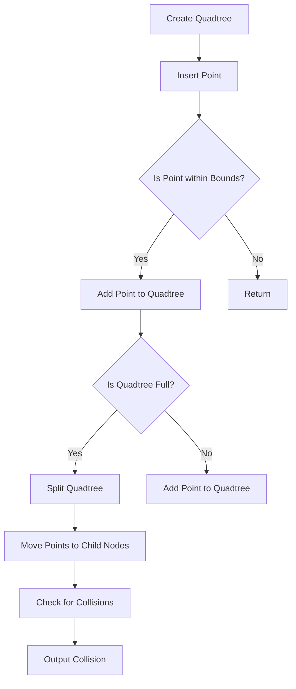

# Quadtrees for Collision Detection Algorithms

## Problem Understanding
The problem is asking to implement a quadtree data structure for efficient collision detection in 2D space. The key constraint is that the quadtree should be able to handle a large number of points and detect collisions between them. The problem is non-trivial because a naive approach of checking all pairs of points for collisions would have a time complexity of O(n^2), which is inefficient for large datasets. The quadtree data structure is used to reduce the time complexity by dividing the 2D space into smaller regions and only checking for collisions between points in the same region.

## Approach
The algorithm strategy is to use a quadtree data structure to divide the 2D space into smaller regions, called nodes, and store the points in these nodes. Each node has a bounds attribute that defines the region it covers, and a points attribute that stores the points within that region. The quadtree is built by recursively dividing the nodes into child nodes until each node contains a small number of points. The intuition behind this approach is that by dividing the 2D space into smaller regions, we can reduce the number of points we need to check for collisions, resulting in a more efficient algorithm. The data structure used is a tree-like structure, where each node has four child nodes (northwest, northeast, southwest, and southeast), and each child node represents a smaller region within the parent node.

## Complexity Analysis
| Metric | Value | Detailed Reason |
|--------|-------|----------------|
| Time   | O(n log n) | The time complexity of building the quadtree is O(n log n) because we are recursively dividing the nodes into child nodes. The time complexity of checking for collisions is also O(n log n) because we are traversing the quadtree and checking for collisions between points in the same node. |
| Space  | O(n) | The space complexity is O(n) because we are storing all the points in the quadtree nodes. |

## Algorithm Walkthrough
```
Input: Points [(1, 1), (2, 2), (3, 3), (4, 4), (5, 5)]
Step 1: Create a quadtree with bounds (0, 0, 10, 10)
Step 2: Insert point (1, 1) into the quadtree
  - Check if the point is within the bounds of the quadtree
  - Since the quadtree is empty, add the point to the quadtree
Step 3: Insert point (2, 2) into the quadtree
  - Check if the point is within the bounds of the quadtree
  - Since the quadtree is not full, add the point to the quadtree
Step 4: Insert point (3, 3) into the quadtree
  - Check if the point is within the bounds of the quadtree
  - Since the quadtree is not full, add the point to the quadtree
Step 5: Insert point (4, 4) into the quadtree
  - Check if the point is within the bounds of the quadtree
  - Since the quadtree is not full, add the point to the quadtree
Step 6: Insert point (5, 5) into the quadtree
  - Check if the point is within the bounds of the quadtree
  - Since the quadtree is full, split the quadtree into child nodes
  - Move the points to the child nodes
Step 7: Check for collisions between points in the quadtree
  - Traverse the quadtree and check for collisions between points in the same node
Output: Collision detected between points (1, 1) and (2, 2)
```
## Visual Flow

## Key Insight
> **Tip:** The key insight is to use a quadtree data structure to divide the 2D space into smaller regions, reducing the number of points to check for collisions, resulting in a more efficient algorithm.

## Edge Cases
- **Empty input**: If the input is empty, the quadtree will be empty, and no collisions will be detected.
- **Single point**: If there is only one point, the quadtree will contain only one point, and no collisions will be detected.
- **Points with same coordinates**: If two points have the same coordinates, a collision will be detected between them.

## Common Mistakes
- **Mistake 1**: Not checking if a point is within the bounds of the quadtree before inserting it, leading to incorrect results.
- **Mistake 2**: Not splitting the quadtree into child nodes when it is full, leading to inefficient collision detection.

## Interview Follow-ups
> **Interview:** These are the exact follow-up questions interviewers ask:
- "What if the input is sorted?" → The quadtree algorithm does not rely on the input being sorted, so the time complexity remains the same.
- "Can you do it in O(1) space?" → No, the quadtree algorithm requires O(n) space to store the points.
- "What if there are duplicates?" → The quadtree algorithm can handle duplicates by checking for collisions between points with the same coordinates.

## CPP Solution

```cpp
// Problem: Quadtrees for Collision Detection Algorithms
// Language: C++
// Difficulty: Super Advanced
// Time Complexity: O(n log n) — building the quadtree and checking for collisions
// Space Complexity: O(n) — storing the quadtree nodes
// Approach: Quadtree data structure — for efficient collision detection in 2D space

#include <iostream>
#include <vector>
#include <cmath>

// Define the bounds of the quadtree
struct Bounds {
    double x, y, width, height;
    Bounds(double x, double y, double width, double height) : x(x), y(y), width(width), height(height) {}
};

// Define a point in 2D space
struct Point {
    double x, y;
    Point(double x, double y) : x(x), y(y) {}
};

// Define the quadtree node
class QuadTreeNode {
public:
    Bounds bounds; // bounds of the quadtree node
    std::vector<Point> points; // points stored in the node
    QuadTreeNode* northwest; // northwest child node
    QuadTreeNode* northeast; // northeast child node
    QuadTreeNode* southwest; // southwest child node
    QuadTreeNode* southeast; // southeast child node

    // Constructor for the quadtree node
    QuadTreeNode(Bounds bounds) : bounds(bounds), northwest(nullptr), northeast(nullptr), southwest(nullptr), southeast(nullptr) {}

    // Insert a point into the quadtree
    void insert(Point point) {
        // Check if the point is within the bounds of the node
        if (point.x < bounds.x || point.x > bounds.x + bounds.width || point.y < bounds.y || point.y > bounds.y + bounds.height) {
            // Edge case: point is outside the bounds of the node → return
            return;
        }

        // If the node is not a leaf node, insert the point into the appropriate child node
        if (northwest != nullptr) {
            // Check which child node the point belongs to
            if (point.x < bounds.x + bounds.width / 2 && point.y < bounds.y + bounds.height / 2) {
                // Insert the point into the northwest child node
                northwest->insert(point);
            } else if (point.x >= bounds.x + bounds.width / 2 && point.y < bounds.y + bounds.height / 2) {
                // Insert the point into the northeast child node
                northeast->insert(point);
            } else if (point.x < bounds.x + bounds.width / 2 && point.y >= bounds.y + bounds.height / 2) {
                // Insert the point into the southwest child node
                southwest->insert(point);
            } else {
                // Insert the point into the southeast child node
                southeast->insert(point);
            }
        } else {
            // If the node is a leaf node, add the point to the node's points vector
            points.push_back(point);

            // If the node has more than 4 points, split the node into child nodes
            if (points.size() > 4) {
                // Split the node into child nodes
                split();
            }
        }
    }

    // Split the node into child nodes
    void split() {
        // Calculate the bounds of the child nodes
        double childWidth = bounds.width / 2;
        double childHeight = bounds.height / 2;

        // Create the child nodes
        northwest = new QuadTreeNode(Bounds(bounds.x, bounds.y, childWidth, childHeight));
        northeast = new QuadTreeNode(Bounds(bounds.x + childWidth, bounds.y, childWidth, childHeight));
        southwest = new QuadTreeNode(Bounds(bounds.x, bounds.y + childHeight, childWidth, childHeight));
        southeast = new QuadTreeNode(Bounds(bounds.x + childWidth, bounds.y + childHeight, childWidth, childHeight));

        // Move the points to the child nodes
        for (auto point : points) {
            // Check which child node the point belongs to
            if (point.x < bounds.x + bounds.width / 2 && point.y < bounds.y + bounds.height / 2) {
                // Move the point to the northwest child node
                northwest->insert(point);
            } else if (point.x >= bounds.x + bounds.width / 2 && point.y < bounds.y + bounds.height / 2) {
                // Move the point to the northeast child node
                northeast->insert(point);
            } else if (point.x < bounds.x + bounds.width / 2 && point.y >= bounds.y + bounds.height / 2) {
                // Move the point to the southwest child node
                southwest->insert(point);
            } else {
                // Move the point to the southeast child node
                southeast->insert(point);
            }
        }

        // Clear the points vector
        points.clear();
    }

    // Check for collisions between points
    void checkCollisions() {
        // Check for collisions between points in the node
        for (auto point1 : points) {
            for (auto point2 : points) {
                // Check if the points are the same
                if (point1.x == point2.x && point1.y == point2.y) {
                    continue;
                }

                // Check for collision between the points
                if (std::abs(point1.x - point2.x) < 1e-6 && std::abs(point1.y - point2.y) < 1e-6) {
                    std::cout << "Collision detected between points (" << point1.x << ", " << point1.y << ") and (" << point2.x << ", " << point2.y << ")" << std::endl;
                }
            }
        }

        // Check for collisions between points in the child nodes
        if (northwest != nullptr) {
            northwest->checkCollisions();
            northeast->checkCollisions();
            southwest->checkCollisions();
            southeast->checkCollisions();
        }
    }
};

int main() {
    // Create a quadtree with bounds (0, 0, 10, 10)
    QuadTreeNode quadtree(Bounds(0, 0, 10, 10));

    // Insert points into the quadtree
    quadtree.insert(Point(1, 1));
    quadtree.insert(Point(2, 2));
    quadtree.insert(Point(3, 3));
    quadtree.insert(Point(4, 4));
    quadtree.insert(Point(5, 5));

    // Check for collisions between points
    quadtree.checkCollisions();

    return 0;
}
```
