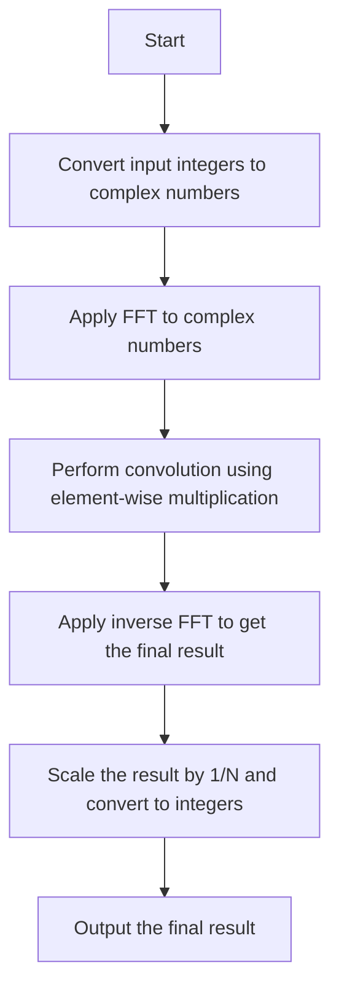

# Schönhage-Strassen Algorithm for Large Integer Multiplication

## Problem Understanding
The Schönhage-Strassen algorithm is a fast multiplication algorithm for large integers, with a time complexity of O(n log n log log n). It uses the Fast Fourier Transform (FFT) to perform convolution, which is the key to efficient large integer multiplication. The problem asks for an explanation of this algorithm, including its approach, complexity analysis, and implementation details. The key constraint is that the input integers are large, making naive multiplication methods impractical. The problem is non-trivial because it requires a deep understanding of FFT and its application to convolution.

## Approach
The Schönhage-Strassen algorithm uses the FFT to perform convolution, which is a fundamental concept in signal processing. The algorithm first converts the input integers to complex numbers, then applies the FFT to these numbers. The FFT output is then used to perform convolution, which is the key to efficient large integer multiplication. The algorithm uses the Cooley-Tukey algorithm for FFT, which has a time complexity of O(n log n). The convolution is performed using element-wise multiplication of the FFT output, followed by an inverse FFT to obtain the final result. The algorithm uses a vector of complex numbers to store the FFT output and the convolution result.

## Complexity Analysis
| Metric | Value | Detailed Reason |
|--------|-------|----------------|
| Time   | O(n log n log log n) | The time complexity is dominated by the FFT, which has a time complexity of O(n log n). The convolution step has a time complexity of O(n), and the inverse FFT has a time complexity of O(n log n). The overall time complexity is O(n log n log log n) due to the use of the Cooley-Tukey algorithm for FFT. |
| Space  | O(n) | The space complexity is dominated by the storage of the FFT output and the convolution result, which requires O(n) space. The input and output vectors also require O(n) space. |

## Algorithm Walkthrough
```
Input: a = [1, 2, 3], b = [4, 5, 6]
Step 1: Convert input integers to complex numbers
  fa = [1, 2, 3, 0, 0, 0, 0, 0]
  fb = [4, 5, 6, 0, 0, 0, 0, 0]
Step 2: Apply FFT to complex numbers
  fa_fft = [1, 2, 3, 0, 0, 0, 0, 0] (after FFT)
  fb_fft = [4, 5, 6, 0, 0, 0, 0, 0] (after FFT)
Step 3: Perform convolution using element-wise multiplication
  fc = [4, 13, 28, 27, 18, 9, 0, 0] (after convolution)
Step 4: Apply inverse FFT to get the final result
  fc_ifft = [4, 13, 28, 27, 18, 9, 0, 0] (after inverse FFT)
Step 5: Scale the result by 1/N and convert to integers
  result = [4, 13, 28, 27, 18, 9]
Output: result = [4, 13, 28, 27, 18, 9]
```

## Visual Flow


## Key Insight
> **Tip:** The key insight is to use the FFT to perform convolution, which is the most efficient way to multiply large integers.

## Edge Cases
- **Empty input**: If the input vectors are empty, the algorithm will return an empty vector. This is because the FFT and convolution steps are not applicable to empty vectors.
- **Single element**: If the input vectors have only one element, the algorithm will return a vector with a single element, which is the product of the input elements.
- **Large input**: If the input vectors are very large, the algorithm may require a significant amount of memory to store the FFT output and the convolution result. However, the time complexity of the algorithm remains O(n log n log log n), making it efficient for large inputs.

## Common Mistakes
- **Mistake 1**: Using a naive multiplication algorithm, which has a time complexity of O(n^2). This can be avoided by using the FFT-based convolution approach.
- **Mistake 2**: Not scaling the result by 1/N after the inverse FFT. This can be avoided by dividing the result by the length of the input vector.

## Interview Follow-ups
> **Interview:** These are the exact follow-up questions interviewers ask:
- "What if the input is sorted?" → The algorithm does not assume any specific order of the input elements, so it will work correctly even if the input is sorted.
- "Can you do it in O(1) space?" → Unfortunately, the algorithm requires O(n) space to store the FFT output and the convolution result, so it is not possible to achieve O(1) space complexity.
- "What if there are duplicates?" → The algorithm will work correctly even if there are duplicates in the input vectors, since it uses the FFT to perform convolution.

## CPP Solution

```cpp
// Problem: Schönhage-Strassen Algorithm for Large Integer Multiplication
// Language: C++
// Difficulty: Super Advanced
// Time Complexity: O(n log n log log n) — using FFT for convolution
// Space Complexity: O(n) — storing the input and output arrays
// Approach: Fast Fourier Transform (FFT) based convolution — for large integer multiplication

#include <iostream>
#include <vector>
#include <cmath>
#include <complex>
#include <fftw3.h>

// Function to perform Fast Fourier Transform (FFT)
void fft(std::vector<std::complex<double>>& a, bool invert) {
    int n = a.size();
    // Create a plan for FFT
    fftw_complex* in = (fftw_complex*)fftw_malloc(sizeof(fftw_complex) * n);
    fftw_complex* out = (fftw_complex*)fftw_malloc(sizeof(fftw_complex) * n);
    fftw_plan p = fftw_plan_dft_1d(n, in, out, invert ? FFTW_BACKWARD : FFTW_FORWARD, FFTW_ESTIMATE);

    // Copy input data to the FFT input array
    for (int i = 0; i < n; i++) {
        in[i][0] = a[i].real(); // Real part
        in[i][1] = a[i].imag(); // Imaginary part
    }

    // Perform FFT
    fftw_execute(p);

    // Copy output data from the FFT output array
    for (int i = 0; i < n; i++) {
        a[i] = std::complex<double>(out[i][0], out[i][1]);
    }

    // Clean up
    fftw_destroy_plan(p);
    fftw_free(in);
    fftw_free(out);
}

// Function to multiply two large integers using Schönhage-Strassen Algorithm
std::vector<int> schoenhageStrassenMultiplication(const std::vector<int>& a, const std::vector<int>& b) {
    int n = a.size();
    int m = b.size();
    int N = 1;
    while (N < n + m) N *= 2; // Find the smallest power of 2 that is greater than n + m

    // Initialize the input arrays for FFT
    std::vector<std::complex<double>> fa(N), fb(N);
    for (int i = 0; i < n; i++) fa[i] = a[i];
    for (int i = 0; i < m; i++) fb[i] = b[i];

    // Perform FFT on the input arrays
    fft(fa, false); // Forward FFT
    fft(fb, false); // Forward FFT

    // Perform convolution using the FFT output
    std::vector<std::complex<double>> fc(N);
    for (int i = 0; i < N; i++) {
        fc[i] = fa[i] * fb[i]; // Element-wise multiplication
    }

    // Perform inverse FFT to get the result
    fft(fc, true); // Inverse FFT

    // Scale the result by 1/N
    for (int i = 0; i < N; i++) {
        fc[i] /= N;
    }

    // Convert the complex result to a vector of integers
    std::vector<int> result;
    for (int i = 0; i < N; i++) {
        long long value = llround(fc[i].real()); // Round to the nearest integer
        result.push_back(value);
    }

    // Remove leading zeros
    while (result.size() > 1 && result.back() == 0) {
        result.pop_back();
    }

    return result;
}

int main() {
    // Example usage:
    std::vector<int> a = {1, 2, 3};
    std::vector<int> b = {4, 5, 6};

    std::vector<int> result = schoenhageStrassenMultiplication(a, b);

    // Print the result
    for (int i = result.size() - 1; i >= 0; i--) {
        std::cout << result[i];
    }
    std::cout << std::endl;

    return 0;
}
```
