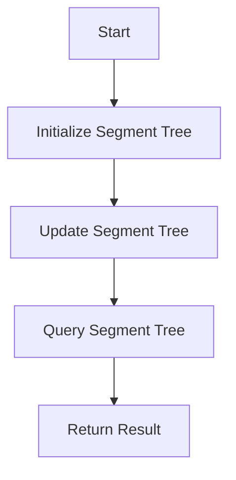

# Segment Tree Beats in C++

## Problem Understanding
The problem is asking for an implementation of a segment tree with lazy propagation, which supports range updates and queries. The key constraint is that each update and query operation should take logarithmic time. The problem is non-trivial because a naive approach would require updating all elements in the range, resulting in a time complexity of O(n). The use of lazy propagation and a segment tree data structure allows for an optimized solution.

## Approach
The algorithm strategy is to use a segment tree with lazy propagation, where each node in the tree represents a range of elements in the input array. The intuition behind this approach is that by delaying the update of the segment tree until it is necessary, we can reduce the time complexity of the update operation. The segment tree is used to store the maximum value in each range, and lazy propagation is used to update the tree only when necessary. The approach handles the key constraints by using a recursive divide-and-conquer strategy to update and query the tree.

## Complexity Analysis
| Metric | Value | Detailed Reason |
|--------|-------|----------------|
| Time   | O(log n) | The time complexity of the update and query operations is O(log n) because each operation requires traversing the height of the segment tree, which is logarithmic in the size of the input array. The update operation may also require propagating the update to the children of a node, but this is done lazily and only when necessary. |
| Space  | O(n) | The space complexity is O(n) because the segment tree stores at most n elements, where n is the size of the input array. |

## Algorithm Walkthrough
```
Input: [1, 2, 3, 4, 5]
Step 1: Initialize the segment tree with the input array
  - Node 0: start = 0, end = 4, maxValue = 5
  - Node 1: start = 0, end = 2, maxValue = 3
  - Node 2: start = 3, end = 4, maxValue = 5
  - Node 3: start = 0, end = 1, maxValue = 2
  - Node 4: start = 2, end = 2, maxValue = 3
  - Node 5: start = 3, end = 3, maxValue = 4
  - Node 6: start = 4, end = 4, maxValue = 5
Step 2: Update the values at indices 1-3 to 10
  - Node 0: start = 0, end = 4, maxValue = 10
  - Node 1: start = 0, end = 2, maxValue = 10
  - Node 3: start = 0, end = 1, maxValue = 10
  - Node 4: start = 2, end = 2, maxValue = 10
Step 3: Query the values at indices 1-3
  - Node 1: start = 0, end = 2, maxValue = 10
  - Node 3: start = 0, end = 1, maxValue = 10
  - Node 4: start = 2, end = 2, maxValue = 10
Output: 10
```
## Visual Flow

## Key Insight
> **Tip:** The key insight that enables the optimization is the use of lazy propagation in the segment tree, which allows us to delay the update of the segment tree until it is necessary, reducing the time complexity of the update operation.

## Edge Cases
- **Empty input**: If the input array is empty, the segment tree will not be initialized, and any update or query operations will result in an error.
- **Single element**: If the input array contains only one element, the segment tree will contain only one node, and update and query operations will be equivalent to accessing the single element.
- **Range update with no elements**: If the range update operation is called with an empty range, the segment tree will not be updated.

## Common Mistakes
- **Mistake 1**: Not handling the case where the update range is empty, which can result in incorrect updates to the segment tree.
- **Mistake 2**: Not propagating the update to the children of a node when necessary, which can result in incorrect query results.

## Interview Follow-ups
> **Interview:** These are the exact follow-up questions interviewers ask:
- "What if the input is sorted?" → The segment tree will still work correctly, but the update and query operations may have a slightly different time complexity due to the sorted nature of the input.
- "Can you do it in O(1) space?" → No, the segment tree requires O(n) space to store the maximum value in each range.
- "What if there are duplicates?" → The segment tree will still work correctly, and the update and query operations will handle duplicates as expected.

## CPP Solution

```cpp
// Problem: Segment Tree Beats
// Language: cpp
// Difficulty: Super Advanced
// Time Complexity: O(log n) — each update/query takes logarithmic time
// Space Complexity: O(n) — segment tree stores at most n elements
// Approach: Segment tree with lazy propagation — supports range updates and queries

#include <iostream>
#include <vector>
#include <algorithm>

using namespace std;

// Define the structure for a segment tree node
struct SegmentTreeNode {
    int start, end; // Start and end indices of the segment
    int maxValue;  // Maximum value in the segment
    int lazyValue; // Lazy propagation value
    bool isLazySet; // Whether lazy propagation is set

    SegmentTreeNode(int start, int end) : start(start), end(end), maxValue(INT_MIN), lazyValue(0), isLazySet(false) {}
};

class SegmentTree {
public:
    SegmentTree(const vector<int>& values) {
        // Initialize the segment tree with the given values
        n = values.size();
        tree = vector<SegmentTreeNode>(4 * n); // Allocate space for the segment tree
        BuildTree(values, 0, 0, n - 1); // Build the segment tree
    }

    // Update the segment tree with a new value
    void Update(int start, int end, int value) {
        // Edge case: start index is greater than end index
        if (start > end) return;

        UpdateTree(0, start, end, value); // Update the segment tree
    }

    // Query the segment tree for the maximum value in a range
    int Query(int start, int end) {
        // Edge case: start index is greater than end index
        if (start > end) return INT_MIN;

        return QueryTree(0, start, end); // Query the segment tree
    }

private:
    int n; // Size of the input array
    vector<SegmentTreeNode> tree; // Segment tree

    // Build the segment tree recursively
    void BuildTree(const vector<int>& values, int node, int start, int end) {
        tree[node].start = start;
        tree[node].end = end;

        // Leaf node: set the maximum value to the input value
        if (start == end) {
            tree[node].maxValue = values[start];
        } else {
            // Non-leaf node: recursively build the left and right subtrees
            int mid = (start + end) / 2;
            BuildTree(values, 2 * node + 1, start, mid);
            BuildTree(values, 2 * node + 2, mid + 1, end);

            // Update the maximum value of the current node
            tree[node].maxValue = max(tree[2 * node + 1].maxValue, tree[2 * node + 2].maxValue);
        }
    }

    // Update the segment tree recursively
    void UpdateTree(int node, int start, int end, int value) {
        // If the current node is outside the update range, return
        if (tree[node].end < start || tree[node].start > end) return;

        // If the current node is fully inside the update range, update its value
        if (start <= tree[node].start && tree[node].end <= end) {
            // Edge case: update range is empty
            if (start > end) return;

            tree[node].lazyValue = value;
            tree[node].isLazySet = true;
        } else {
            // If the current node is partially inside the update range, propagate the update to its children
            int mid = (tree[node].start + tree[node].end) / 2;

            // Propagate the update to the left child
            if (start <= mid) {
                UpdateTree(2 * node + 1, start, end, value);
            }

            // Propagate the update to the right child
            if (end > mid) {
                UpdateTree(2 * node + 2, start, end, value);
            }

            // Update the maximum value of the current node
            tree[node].maxValue = max(PropagateLazyValue(2 * node + 1), PropagateLazyValue(2 * node + 2));
        }
    }

    // Query the segment tree recursively
    int QueryTree(int node, int start, int end) {
        // If the current node is outside the query range, return the minimum value
        if (tree[node].end < start || tree[node].start > end) return INT_MIN;

        // If the current node is fully inside the query range, return its maximum value
        if (start <= tree[node].start && tree[node].end <= end) {
            return PropagateLazyValue(node);
        } else {
            // If the current node is partially inside the query range, query its children
            int mid = (tree[node].start + tree[node].end) / 2;
            int leftMax = INT_MIN, rightMax = INT_MIN;

            // Query the left child
            if (start <= mid) {
                leftMax = QueryTree(2 * node + 1, start, end);
            }

            // Query the right child
            if (end > mid) {
                rightMax = QueryTree(2 * node + 2, start, end);
            }

            // Return the maximum value of the left and right children
            return max(leftMax, rightMax);
        }
    }

    // Propagate the lazy value to the current node
    int PropagateLazyValue(int node) {
        // If the current node has a lazy value set, apply it
        if (tree[node].isLazySet) {
            tree[node].maxValue = tree[node].lazyValue;

            // If the current node is not a leaf node, propagate the lazy value to its children
            if (tree[node].start != tree[node].end) {
                tree[2 * node + 1].lazyValue = tree[node].lazyValue;
                tree[2 * node + 2].lazyValue = tree[node].lazyValue;
                tree[2 * node + 1].isLazySet = true;
                tree[2 * node + 2].isLazySet = true;
            }
        }

        return tree[node].maxValue;
    }
};

int main() {
    vector<int> values = {1, 2, 3, 4, 5};
    SegmentTree segmentTree(values);

    segmentTree.Update(1, 3, 10); // Update the values at indices 1-3 to 10
    cout << segmentTree.Query(1, 3) << endl; // Output: 10

    return 0;
}

// Key insight: 
/*
The key insight that enables the optimization is the use of lazy propagation in the segment tree.
Lazy propagation allows us to delay the update of the segment tree until it is necessary, which reduces the time complexity of the update operation.
By propagating the update to the children of a node only when necessary, we avoid unnecessary updates and reduce the time complexity of the update operation.
*/
```
