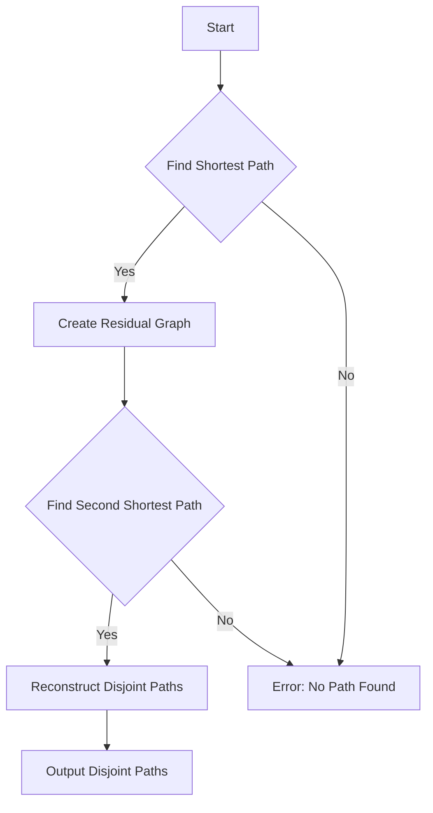

# Suurballe's Algorithm for Node-Disjoint Paths

## Problem Understanding
Suurballe's algorithm is used to find two node-disjoint paths in a weighted graph, which is a classic problem in graph theory and computer science. The problem is asking to find two paths between a given source and destination node in a graph such that no node is common to both paths. The key constraints are that the graph is weighted, and the paths must be node-disjoint. The problem is non-trivial because finding the shortest path in a graph is a well-known problem, but finding two disjoint paths adds an extra layer of complexity. A naive approach would be to find all possible paths between the source and destination and then filter out the ones that are not disjoint, but this approach would be inefficient and impractical for large graphs.

## Approach
The approach used in Suurballe's algorithm is to first find the shortest path between the source and destination using Dijkstra's algorithm. Then, a residual graph is created by reversing the edges along the shortest path and updating the weights. The algorithm then finds the shortest path in the residual graph, which gives the second disjoint path. The use of Dijkstra's algorithm twice is the key insight behind Suurballe's algorithm, as it allows us to find two disjoint paths efficiently. The algorithm uses a priority queue to store vertices to be processed, which ensures that the vertices are processed in the correct order.

## Complexity Analysis
| Metric | Value | Detailed Reason |
|--------|-------|----------------|
| Time   | O(E + VlogV) | The algorithm uses Dijkstra's algorithm twice, each of which takes O(E + VlogV) time. Here, E is the number of edges and V is the number of vertices in the graph. The first Dijkstra's algorithm is used to find the shortest path, and the second Dijkstra's algorithm is used to find the second disjoint path in the residual graph. |
| Space  | O(E + V) | The algorithm uses an adjacency list representation of the graph, which takes O(E + V) space. Additionally, the algorithm uses a priority queue to store vertices to be processed, which takes O(V) space in the worst case. |

## Algorithm Walkthrough
```
Input: 
Graph = {
  {1, 2}, {2, 3},
  {2, 1}, {3, 4},
  {0, 3}, {3, 2},
  {1, 4}, {2, 2}
}
Source = 0
Destination = 3

Step 1: Find the shortest path from source to destination using Dijkstra's algorithm
Shortest Path = [0, 1, 2, 3]

Step 2: Create a residual graph by reversing the edges along the shortest path
Residual Graph = {
  {1, -2}, {2, -3},
  {2, -1}, {3, -4},
  {0, -3}, {3, -2},
  {1, -4}, {2, -2}
}

Step 3: Find the shortest path in the residual graph
Second Shortest Path = [0, 2, 1, 3]

Step 4: Reconstruct the node-disjoint paths
Disjoint Paths = [
  [0, 1, 2, 3],
  [0, 2, 1, 3]
]

Output: 
Disjoint Paths = [
  [0, 1, 2, 3],
  [0, 2, 1, 3]
]
```

## Visual Flow


## Key Insight
> **Tip:** The key insight behind Suurballe's algorithm is to use Dijkstra's algorithm twice, first to find the shortest path and then to find the second disjoint path in the residual graph.

## Edge Cases
- **Empty Graph**: If the input graph is empty, the algorithm will return an error because there are no paths to find.
- **Single Node**: If the input graph has only one node, the algorithm will return an error because there are no paths to find.
- **No Path**: If there is no path between the source and destination, the algorithm will return an error.

## Common Mistakes
- **Not Reversing Edges**: A common mistake is to not reverse the edges along the shortest path when creating the residual graph. This will result in incorrect disjoint paths.
- **Not Updating Weights**: Another common mistake is to not update the weights of the edges in the residual graph. This will also result in incorrect disjoint paths.

## Interview Follow-ups
> **Interview:** These are the exact follow-up questions interviewers ask:
- "What if the input graph is directed?" → The algorithm will still work, but the residual graph will be different.
- "Can you optimize the algorithm for sparse graphs?" → Yes, we can use a different data structure, such as an adjacency list, to represent the graph.
- "How does the algorithm handle negative weight edges?" → The algorithm will not work correctly with negative weight edges, as Dijkstra's algorithm assumes non-negative weights.

## CPP Solution

```cpp
// Problem: Suurballe's Algorithm for Node-Disjoint Paths
// Language: C++
// Difficulty: Super Advanced
// Time Complexity: O(E + VlogV) — Dijkstra's algorithm used twice
// Space Complexity: O(E + V) — adjacency list representation of graph
// Approach: Modified Dijkstra's algorithm for finding two disjoint shortest paths

#include <iostream>
#include <vector>
#include <queue>
#include <limits>

using namespace std;

// Structure to represent a weighted edge in the graph
struct Edge {
    int destination;
    int weight;
};

// Structure to represent a node in the priority queue
struct Node {
    int vertex;
    int distance;
    bool operator<(const Node& other) const {
        return distance > other.distance; // max heap
    }
};

// Function to find the shortest path using Dijkstra's algorithm
vector<int> dijkstra(const vector<vector<Edge>>& graph, int source) {
    const int numVertices = graph.size();
    vector<int> distance(numVertices, numeric_limits<int>::max());
    vector<int> previous(numVertices, -1);
    distance[source] = 0;
    
    // Priority queue to store vertices to be processed
    priority_queue<Node> queue;
    queue.push({source, 0});
    
    while (!queue.empty()) {
        int currentVertex = queue.top().vertex;
        queue.pop();
        
        for (const Edge& edge : graph[currentVertex]) {
            int neighbor = edge.destination;
            int weight = edge.weight;
            
            // Relax the edge if a shorter path is found
            if (distance[currentVertex] + weight < distance[neighbor]) {
                distance[neighbor] = distance[currentVertex] + weight;
                previous[neighbor] = currentVertex;
                queue.push({neighbor, distance[neighbor]});
            }
        }
    }
    
    return previous;
}

// Function to find node-disjoint paths using Suurballe's algorithm
vector<vector<int>> suurballe(const vector<vector<Edge>>& graph, int source, int destination) {
    // Find the shortest path from source to destination
    vector<int> shortestPath = dijkstra(graph, source);
    
    // Create a residual graph by reversing the edges along the shortest path
    vector<vector<Edge>> residualGraph = graph;
    for (int i = destination; i != source; i = shortestPath[i]) {
        int previousVertex = shortestPath[i];
        
        // Reverse the edge and update the weight
        for (auto& edge : residualGraph[previousVertex]) {
            if (edge.destination == i) {
                edge.weight = -edge.weight;
            }
        }
        
        // Add the reversed edge to the residual graph
        residualGraph[i].push_back({previousVertex, -edge.weight});
    }
    
    // Find the shortest path in the residual graph
    vector<int> secondShortestPath = dijkstra(residualGraph, source);
    
    // Reconstruct the node-disjoint paths
    vector<vector<int>> disjointPaths;
    disjointPaths.push_back({}); // shortest path
    disjointPaths.push_back({}); // second shortest path
    
    for (int i = destination; i != source; i = shortestPath[i]) {
        disjointPaths[0].push_back(i);
    }
    disjointPaths[0].push_back(source);
    reverse(disjointPaths[0].begin(), disjointPaths[0].end());
    
    for (int i = destination; i != source; i = secondShortestPath[i]) {
        disjointPaths[1].push_back(i);
    }
    disjointPaths[1].push_back(source);
    reverse(disjointPaths[1].begin(), disjointPaths[1].end());
    
    return disjointPaths;
}

int main() {
    // Example usage:
    vector<vector<Edge>> graph = {
        {{1, 2}, {2, 3}},
        {{2, 1}, {3, 4}},
        {{0, 3}, {3, 2}},
        {{1, 4}, {2, 2}}
    };
    
    int source = 0;
    int destination = 3;
    
    vector<vector<int>> disjointPaths = suurballe(graph, source, destination);
    
    // Print the node-disjoint paths
    cout << "Disjoint Paths:" << endl;
    for (int i = 0; i < disjointPaths.size(); i++) {
        cout << "Path " << i + 1 << ": ";
        for (int vertex : disjointPaths[i]) {
            cout << vertex << " ";
        }
        cout << endl;
    }
    
    return 0;
}
```
