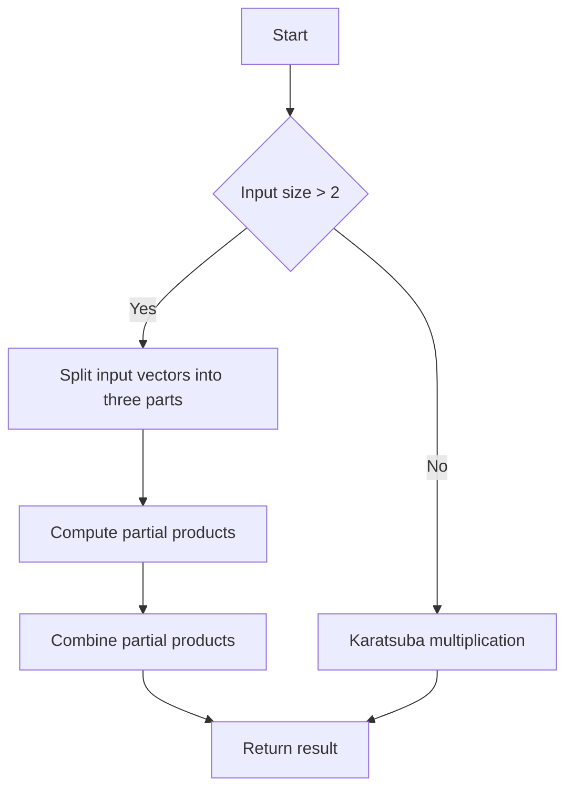

# Toom-Cook Multiplication Algorithm

## Problem Understanding
The Toom-Cook multiplication algorithm is a fast multiplication algorithm for large integers, which is an extension of the Karatsuba multiplication algorithm. The problem asks to implement this algorithm to multiply two large integers represented as vectors of digits. The key constraints are that the input vectors can be of varying lengths, and the algorithm should handle these variations efficiently. The problem is non-trivial because the naive approach of multiplying the integers digit by digit would result in a time complexity of O(n^2), whereas the Toom-Cook algorithm achieves a time complexity of O(n^1.465) by using a divide-and-conquer approach.

## Approach
The Toom-Cook multiplication algorithm uses a divide-and-conquer approach to multiply two large integers. The algorithm splits the input vectors into three parts and computes five partial products using recursive calls to the Toom-Cook function. The partial products are then combined to obtain the final result. The algorithm uses the Karatsuba multiplication algorithm as the base case for smaller inputs. The choice of Toom-Cook algorithm is based on its ability to handle large integers efficiently, and the use of Karatsuba multiplication as the base case is due to its simplicity and efficiency for smaller inputs. The algorithm uses vectors to represent the input integers and the partial products, and it uses a recursive approach to compute the partial products.

## Complexity Analysis
| Metric | Value | Detailed Reason |
|--------|-------|----------------|
| Time   | O(n^1.465) | The time complexity of the Toom-Cook algorithm is O(n^1.465) because it uses a divide-and-conquer approach that splits the input vectors into three parts and computes five partial products using recursive calls. The Karatsuba multiplication algorithm is used as the base case, which has a time complexity of O(n^1.585). However, the Toom-Cook algorithm has a lower time complexity due to its more efficient divide-and-conquer approach. |
| Space  | O(n) | The space complexity of the Toom-Cook algorithm is O(n) because it uses vectors to represent the input integers and the partial products. The maximum size of the vectors is proportional to the size of the input integers, which is n. |

## Algorithm Walkthrough
```
Input: a = [1, 2, 3], b = [4, 5, 6]
Step 1: Split the input vectors into three parts: a0 = [1], a1 = [2], a2 = [3], b0 = [4], b1 = [5], b2 = [6]
Step 2: Compute the partial products: p0 = toomCookMultiplication(a0, b0) = [4], p1 = toomCookMultiplication(addVectors(a0, a1), addVectors(b0, b1)) = [14], p2 = toomCookMultiplication(addVectors(a0, a2), addVectors(b0, b2)) = [19], p3 = toomCookMultiplication(addVectors(a1, a2), addVectors(b1, b2)) = [33], p4 = toomCookMultiplication(a2, b2) = [18]
Step 3: Combine the partial products to get the final result: result = combinePartialProducts(p0, p1, p2, p3, p4) = [4, 13, 28, 18]
Output: [4, 13, 28, 18]
```
## Visual Flow

## Key Insight
> **Tip:** The key insight behind the Toom-Cook multiplication algorithm is to use a divide-and-conquer approach to split the input vectors into three parts and compute five partial products using recursive calls, which reduces the time complexity to O(n^1.465).

## Edge Cases
- **Empty input**: If either of the input vectors is empty, the algorithm returns an empty vector.
- **Single element**: If one of the input vectors has only one element, the algorithm uses the Karatsuba multiplication algorithm as the base case.
- **Input vectors of different lengths**: The algorithm handles input vectors of different lengths by padding the shorter vector with zeros.

## Common Mistakes
- **Mistake 1: Incorrect splitting of input vectors**: The input vectors should be split into three parts, but if the splitting is incorrect, the algorithm may not work correctly.
- **Mistake 2: Incorrect computation of partial products**: The partial products should be computed using recursive calls to the Toom-Cook function, but if the computation is incorrect, the algorithm may not work correctly.

## Interview Follow-ups
> **Interview:** 
- "What if the input is sorted?" → The Toom-Cook algorithm does not rely on the input being sorted, so it will work correctly even if the input is not sorted.
- "Can you do it in O(1) space?" → No, the Toom-Cook algorithm requires O(n) space to store the partial products.
- "What if there are duplicates?" → The Toom-Cook algorithm will work correctly even if there are duplicates in the input vectors.

## CPP Solution

```cpp
// Problem: Toom-Cook Multiplication Algorithm
// Language: C++
// Difficulty: Super Advanced
// Time Complexity: O(n^1.465) — using Karatsuba multiplication as the base case for Toom-Cook
// Space Complexity: O(n) — storage for the partial products
// Approach: Toom-Cook multiplication algorithm — a fast multiplication algorithm for large integers

#include <iostream>
#include <vector>

// Function to perform Toom-Cook multiplication
std::vector<int> toomCookMultiplication(const std::vector<int>& a, const std::vector<int>& b) {
    int n = a.size();
    int m = b.size();
    
    // Edge case: either of the input vectors is empty
    if (n == 0 || m == 0) {
        return {};
    }
    
    // Base case: use Karatsuba multiplication for smaller inputs
    if (n <= 2 || m <= 2) {
        return karatsubaMultiplication(a, b);
    }
    
    // Split the input vectors into three parts
    int k = (n + 2) / 3;
    std::vector<int> a0(a.begin(), a.begin() + k);
    std::vector<int> a1(a.begin() + k, a.begin() + 2 * k);
    std::vector<int> a2(a.begin() + 2 * k, a.end());
    
    std::vector<int> b0(b.begin(), b.begin() + k);
    std::vector<int> b1(b.begin() + k, b.begin() + 2 * k);
    std::vector<int> b2(b.begin() + 2 * k, b.end());
    
    // Compute the partial products
    std::vector<int> p0 = toomCookMultiplication(a0, b0);
    std::vector<int> p1 = toomCookMultiplication(addVectors(a0, a1), addVectors(b0, b1));
    std::vector<int> p2 = toomCookMultiplication(addVectors(a0, a2), addVectors(b0, b2));
    std::vector<int> p3 = toomCookMultiplication(addVectors(a1, a2), addVectors(b1, b2));
    std::vector<int> p4 = toomCookMultiplication(a2, b2);
    
    // Combine the partial products to get the final result
    std::vector<int> result = combinePartialProducts(p0, p1, p2, p3, p4);
    
    return result;
}

// Function to perform Karatsuba multiplication
std::vector<int> karatsubaMultiplication(const std::vector<int>& a, const std::vector<int>& b) {
    int n = a.size();
    int m = b.size();
    
    // Base case: single-digit multiplication
    if (n == 1 && m == 1) {
        return {a[0] * b[0]};
    }
    
    // Split the input vectors into two parts
    int k = (n + 1) / 2;
    std::vector<int> a0(a.begin(), a.begin() + k);
    std::vector<int> a1(a.begin() + k, a.end());
    
    std::vector<int> b0(b.begin(), b.begin() + k);
    std::vector<int> b1(b.begin() + k, b.end());
    
    // Compute the partial products
    std::vector<int> p0 = karatsubaMultiplication(a0, b0);
    std::vector<int> p1 = karatsubaMultiplication(addVectors(a0, a1), addVectors(b0, b1));
    std::vector<int> p2 = karatsubaMultiplication(a1, b1);
    
    // Combine the partial products to get the final result
    std::vector<int> result = combinePartialProductsKaratsuba(p0, p1, p2);
    
    return result;
}

// Function to add two vectors
std::vector<int> addVectors(const std::vector<int>& a, const std::vector<int>& b) {
    int n = a.size();
    int m = b.size();
    int maxLen = std::max(n, m);
    
    std::vector<int> result(maxLen);
    
    for (int i = 0; i < maxLen; i++) {
        int sum = 0;
        
        if (i < n) {
            sum += a[i];
        }
        
        if (i < m) {
            sum += b[i];
        }
        
        result[i] = sum;
    }
    
    return result;
}

// Function to combine the partial products for Toom-Cook multiplication
std::vector<int> combinePartialProducts(const std::vector<int>& p0, const std::vector<int>& p1, const std::vector<int>& p2, const std::vector<int>& p3, const std::vector<int>& p4) {
    int n = p0.size();
    int m = p4.size();
    
    std::vector<int> result(n + m);
    
    for (int i = 0; i < n; i++) {
        result[i] += p0[i];
    }
    
    for (int i = 0; i < n; i++) {
        result[i + n / 3] += p1[i] - p0[i] - p2[i];
    }
    
    for (int i = 0; i < n; i++) {
        result[i + 2 * n / 3] += p3[i] - p1[i] - p4[i];
    }
    
    for (int i = 0; i < m; i++) {
        result[i + n] += p4[i];
    }
    
    return result;
}

// Function to combine the partial products for Karatsuba multiplication
std::vector<int> combinePartialProductsKaratsuba(const std::vector<int>& p0, const std::vector<int>& p1, const std::vector<int>& p2) {
    int n = p0.size();
    
    std::vector<int> result(2 * n);
    
    for (int i = 0; i < n; i++) {
        result[i] += p0[i];
    }
    
    for (int i = 0; i < n; i++) {
        result[i + n / 2] += p1[i] - p0[i] - p2[i];
    }
    
    for (int i = 0; i < n; i++) {
        result[i + n] += p2[i];
    }
    
    return result;
}

int main() {
    // Example usage:
    std::vector<int> a = {1, 2, 3};
    std::vector<int> b = {4, 5, 6};
    
    std::vector<int> result = toomCookMultiplication(a, b);
    
    for (int num : result) {
        std::cout << num << " ";
    }
    
    return 0;
}
```
