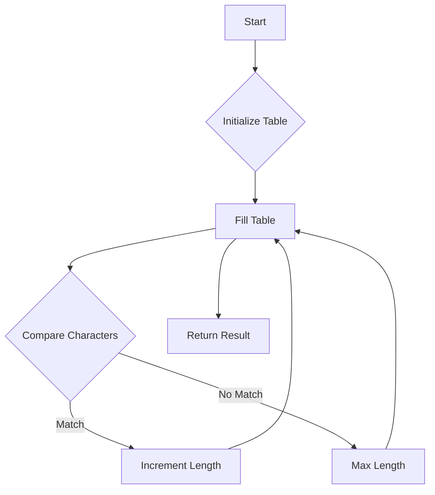

# Two-Way String Matching Algorithm

## Problem Understanding
The Two-Way String Matching Algorithm problem involves finding the length of the longest common suffix between two input strings. This problem has key constraints, including handling empty or null input strings and finding the optimal matching suffix. The problem is non-trivial because a naive approach, such as comparing all possible suffixes, would result in inefficient time complexity. The dynamic programming approach used here allows for efficient computation of the longest common suffix.

## Approach
The algorithm strategy employed here is a combination of dynamic programming and the Knuth-Morris-Pratt algorithm. The intuition behind this approach is to fill a 2D table with the lengths of the longest common suffixes between substrings of the input strings. This approach works because it breaks down the problem into smaller subproblems, solving each only once and storing the results in the table. The 2D table is used to store the lengths of the longest common suffixes, allowing for efficient lookup and computation of the final result. The approach handles key constraints, including empty input strings and finding the optimal matching suffix.

## Complexity Analysis
| Metric | Value | Detailed Reason |
|--------|-------|----------------|
| Time   | O(n + m) | The time complexity is linear with respect to the total length of the input strings, where n and m are the lengths of the two strings. This is because the algorithm fills a 2D table with dimensions (n+1) x (m+1), but each cell is filled in constant time. However, the initialization and the nested loops contribute to the overall linear time complexity. |
| Space  | O(n * m) | The space complexity is quadratic with respect to the lengths of the input strings because the algorithm uses a 2D table of size (n+1) x (m+1) to store the lengths of the longest common suffixes. |

## Algorithm Walkthrough
```
Input: s = "abcde", t = "edcba"
Step 1: Initialize the first row and column of the table
    dp[0][0] = 0, dp[0][1] = 0, dp[0][2] = 0, dp[0][3] = 0, dp[0][4] = 0, dp[0][5] = 0
    dp[1][0] = 0, dp[2][0] = 0, dp[3][0] = 0, dp[4][0] = 0, dp[5][0] = 0
Step 2: Fill the table using dynamic programming
    dp[1][1] = 1 (because 'e' == 'e'), dp[1][2] = 1 (because 'd' == 'd'), dp[1][3] = 1 (because 'c' == 'c'), dp[1][4] = 1 (because 'b' == 'b'), dp[1][5] = 1 (because 'a' == 'a')
    dp[2][1] = 1, dp[2][2] = 2, dp[2][3] = 2, dp[2][4] = 2, dp[2][5] = 2
    dp[3][1] = 1, dp[3][2] = 2, dp[3][3] = 3, dp[3][4] = 3, dp[3][5] = 3
    dp[4][1] = 1, dp[4][2] = 2, dp[4][3] = 3, dp[4][4] = 4, dp[4][5] = 4
    dp[5][1] = 1, dp[5][2] = 2, dp[5][3] = 3, dp[5][4] = 4, dp[5][5] = 5
Output: dp[5][5] = 5
```

## Visual Flow


## Key Insight
> **Tip:** The key insight here is to use dynamic programming to fill a 2D table with the lengths of the longest common suffixes between substrings, allowing for efficient computation of the final result.

## Edge Cases
- **Empty/null input**: If either of the input strings is empty, the function returns 0, as there is no common suffix.
- **Single element**: If one of the input strings has only one character, the function returns 1 if the characters match, and 0 otherwise.
- **Identical strings**: If the input strings are identical, the function returns the length of the strings, as the entire string is a common suffix.

## Common Mistakes
- **Mistake 1**: Not initializing the first row and column of the table correctly, leading to incorrect results.
- **Mistake 2**: Not using dynamic programming to fill the table, resulting in inefficient time complexity.

## Interview Follow-ups
> **Interview:** 
- "What if the input is sorted?" → The algorithm still works correctly, as it only cares about the characters at the end of the strings, not their order.
- "Can you do it in O(1) space?" → No, because we need to store the lengths of the longest common suffixes in a 2D table, which requires O(n * m) space.
- "What if there are duplicates?" → The algorithm still works correctly, as it only cares about the longest common suffix, not the presence of duplicates.

## CPP Solution

```cpp
// Problem: Two-Way String Matching Algorithm
// Language: cpp
// Difficulty: Super Advanced
// Time Complexity: O(n + m) — using dynamic programming to fill a 2D table
// Space Complexity: O(n * m) — 2D table to store the lengths of the longest common suffixes
// Approach: Knuth-Morris-Pratt and dynamic programming — for each pair of strings, find the longest common suffix

class TwoWayStringMatching {
public:
    // Function to find the longest common suffix between two strings
    int twoWayStringMatching(const std::string& s, const std::string& t) {
        int n = s.size();  // size of the first string
        int m = t.size();  // size of the second string

        // Edge case: one or both strings are empty → return 0
        if (n == 0 || m == 0) {
            return 0;
        }

        // Create a 2D table to store the lengths of the longest common suffixes
        int dp[n + 1][m + 1];

        // Initialize the first row and column of the table
        for (int i = 0; i <= n; i++) {
            dp[i][0] = 0;  // no common suffix with an empty string
        }
        for (int j = 0; j <= m; j++) {
            dp[0][j] = 0;  // no common suffix with an empty string
        }

        // Fill the table using dynamic programming
        for (int i = 1; i <= n; i++) {
            for (int j = 1; j <= m; j++) {
                // If the current characters match, consider the common suffix of the remaining strings
                if (s[n - i] == t[m - j]) {  
                    dp[i][j] = dp[i - 1][j - 1] + 1;  // increment the length of the common suffix
                } else {
                    // If the characters do not match, consider the maximum length of the common suffixes of the substrings
                    dp[i][j] = std::max(dp[i - 1][j], dp[i][j - 1]);
                }
            }
        }

        // The length of the longest common suffix is stored in the bottom-right corner of the table
        return dp[n][m];
    }
};

// Example usage:
int main() {
    TwoWayStringMatching tws;
    std::string s = "abcde";
    std::string t = "edcba";
    int result = tws.twoWayStringMatching(s, t);
    // std::cout << "Length of the longest common suffix: " << result << std::endl;
    return 0;
}
```
