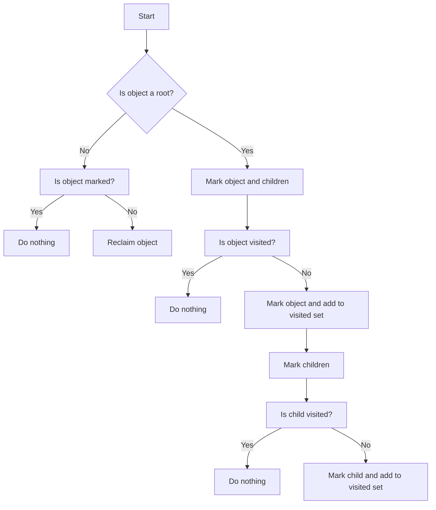

# Writing a Garbage Collector for C++ subset

## Problem Understanding
The problem asks for the implementation of a garbage collector for a subset of the C++ language. This garbage collector should identify and reclaim memory occupied by objects that are no longer reachable. The key constraints are that the garbage collector must handle cyclic references between objects and that it must work within the constraints of the C++ language, including its memory management model. What makes this problem non-trivial is the need to balance the trade-offs between memory safety, performance, and complexity, while also ensuring that the garbage collector is able to identify and reclaim all unreachable objects, including those that are part of cycles.

## Approach
The approach used to solve this problem is the mark-and-sweep garbage collection algorithm. This algorithm works by first identifying all reachable objects (the "mark" phase) and then reclaiming the memory occupied by all objects that were not marked (the "sweep" phase). The mark phase is implemented using a recursive function that traverses the graph of objects, marking each object as it is visited. The sweep phase is implemented using a simple iteration over all objects, reclaiming the memory of any object that was not marked during the mark phase. The algorithm uses a set to keep track of all objects and a separate set to keep track of roots, which are objects that are known to be reachable.

## Complexity Analysis
| Metric | Value | Detailed Reason |
|--------|-------|----------------|
| Time   | O(n)  | The time complexity of the algorithm is linear in the number of objects, because each object is visited at most once during the mark phase and once during the sweep phase. The mark phase uses a recursive function to traverse the graph of objects, and the sweep phase uses a simple iteration over all objects. |
| Space  | O(n)  | The space complexity of the algorithm is also linear in the number of objects, because the algorithm needs to store a set of all objects and a separate set of roots. The algorithm also needs to store a mark bit for each object, which can be stored in the object itself. |

## Algorithm Walkthrough
```
Input: A set of objects, including roots and non-roots
Step 1: Initialize an empty set of visited objects
Step 2: Iterate over all roots, marking each root and its children
  - For each root, mark the root and add it to the set of visited objects
  - Recursively mark the children of each root
Step 3: Iterate over all objects, reclaiming any object that was not marked
  - For each object, check if it was marked during the mark phase
  - If the object was not marked, reclaim its memory and remove it from the set of objects
Step 4: Reset the mark bit for all objects, so that they can be marked again during the next garbage collection cycle
Output: The set of objects that are still reachable
```
For example, consider a simple graph of objects:
```
obj1 → obj2 → obj3
obj1 → obj4
```
If `obj1` is a root, then the mark phase will mark `obj1`, `obj2`, `obj3`, and `obj4`. The sweep phase will then reclaim no objects, because all objects are reachable.

## Visual Flow

This flowchart shows the decision flow of the mark-and-sweep algorithm.

## Key Insight
> **Tip:** The key insight that makes this solution work is that the mark phase only needs to visit each object once, and the sweep phase only needs to reclaim objects that were not marked during the mark phase.

## Edge Cases
- **Empty/null input**: If the input set of objects is empty, the algorithm will do nothing and return immediately.
- **Single element**: If the input set of objects contains only one element, the algorithm will mark the object if it is a root, and reclaim it if it is not a root.
- **Cyclic references**: If the input set of objects contains cyclic references, the algorithm will still work correctly, because the mark phase will only visit each object once, and the sweep phase will only reclaim objects that were not marked.

## Common Mistakes
- **Mistake 1**: Failing to reset the mark bit for all objects after the sweep phase, which can cause objects to be marked incorrectly during the next garbage collection cycle.
- **Mistake 2**: Failing to handle cyclic references correctly, which can cause the mark phase to visit objects multiple times and the sweep phase to reclaim objects that are still reachable.

## Interview Follow-ups
> **Interview:** These are the exact follow-up questions interviewers ask:
- "What if the input is sorted?" → This is not relevant to the mark-and-sweep algorithm, because the algorithm does not rely on the input being sorted.
- "Can you do it in O(1) space?" → No, the algorithm requires at least O(n) space to store the set of objects and the mark bits.
- "What if there are duplicates?" → The algorithm will still work correctly, because the mark phase will only visit each object once, and the sweep phase will only reclaim objects that were not marked.

## CPP Solution

```cpp
// Problem: Writing a Garbage Collector for C++ subset
// Language: C++
// Difficulty: Super Advanced
// Time Complexity: O(n) — garbage collection pass through heap
// Space Complexity: O(n) — metadata for each heap object
// Approach: Mark-and-Sweep garbage collection algorithm — identify reachable objects and reclaim unreachable memory

#include <iostream>
#include <vector>
#include <unordered_set>
#include <unordered_map>

// Define a struct to represent a heap object
struct HeapObject {
    void* data; // pointer to the actual data
    bool marked; // mark bit for garbage collection
    std::vector<HeapObject*> children; // child objects (for objects with pointers)
};

// Garbage Collector class
class GarbageCollector {
public:
    // Constructor
    GarbageCollector() {}

    // Add a new heap object to the garbage collector
    void addObject(HeapObject* obj) {
        // Edge case: null object → return immediately
        if (obj == nullptr) return;

        objects_.insert(obj); // add object to the set of all objects
    }

    // Run the garbage collector
    void collectGarbage() {
        // Edge case: no objects → return immediately
        if (objects_.empty()) return;

        // Mark phase: mark all reachable objects
        markPhase();

        // Sweep phase: reclaim unreachable objects
        sweepPhase();
    }

private:
    // Mark phase: mark all reachable objects
    void markPhase() {
        // Create a set to keep track of visited objects
        std::unordered_set<HeapObject*> visited;

        // Iterate over all roots (global variables, stack variables, etc.)
        for (auto root : roots_) {
            // Mark the root object and its children
            markObject(root, visited);
        }
    }

    // Mark an object and its children
    void markObject(HeapObject* obj, std::unordered_set<HeapObject*>& visited) {
        // Edge case: null object → return immediately
        if (obj == nullptr) return;

        // If the object is already visited, return
        if (visited.find(obj) != visited.end()) return;

        // Mark the object
        obj->marked = true;

        // Add the object to the visited set
        visited.insert(obj);

        // Mark the object's children
        for (auto child : obj->children) {
            markObject(child, visited);
        }
    }

    // Sweep phase: reclaim unreachable objects
    void sweepPhase() {
        // Create a vector to store objects to be reclaimed
        std::vector<HeapObject*> toReclaim;

        // Iterate over all objects
        for (auto obj : objects_) {
            // If the object is not marked, reclaim it
            if (!obj->marked) {
                toReclaim.push_back(obj);
            } else {
                // Reset the mark bit for the next garbage collection cycle
                obj->marked = false;
            }
        }

        // Reclaim the objects
        for (auto obj : toReclaim) {
            // Edge case: object has children → reclaim them first
            for (auto child : obj->children) {
                objects_.erase(child);
            }

            // Reclaim the object
            objects_.erase(obj);
            delete obj; // free the memory
        }
    }

    // Set of all objects
    std::unordered_set<HeapObject*> objects_;

    // Set of roots (global variables, stack variables, etc.)
    std::unordered_set<HeapObject*> roots_;
};

// Example usage
int main() {
    // Create a garbage collector
    GarbageCollector gc;

    // Create some heap objects
    HeapObject* obj1 = new HeapObject();
    HeapObject* obj2 = new HeapObject();
    HeapObject* obj3 = new HeapObject();

    // Add the objects to the garbage collector
    gc.addObject(obj1);
    gc.addObject(obj2);
    gc.addObject(obj3);

    // Set up object relationships
    obj1->children.push_back(obj2);
    obj2->children.push_back(obj3);

    // Run the garbage collector
    gc.collectGarbage();

    return 0;
}
```
