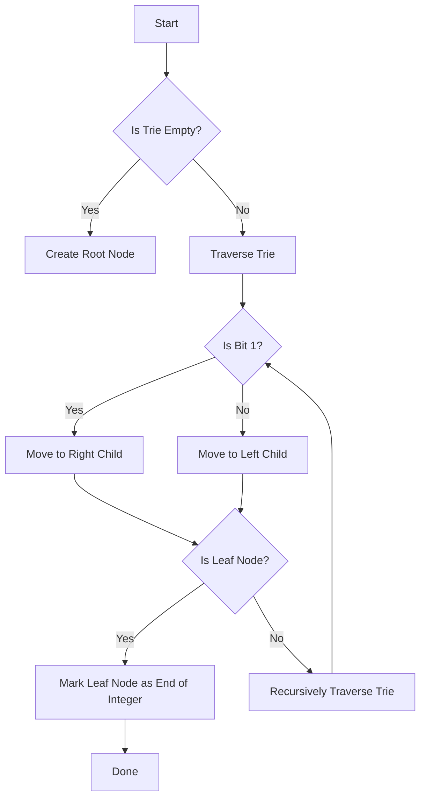

# Y-Fast Trie for Integer Sets in C++

## Problem Understanding
The problem requires implementing a Y-Fast Trie data structure for storing integer sets, which supports efficient operations such as insertion, search, and deletion. The key constraints are that the data structure should have a time complexity of O(log n) for these operations and a space complexity of O(n), where n is the number of integers in the set. The problem is non-trivial because a naive approach using a simple binary search tree or hash table may not achieve the required time and space complexities. The Y-Fast Trie is a specialized trie data structure that is optimized for storing integer sets and supports fast lookup, insertion, and deletion operations.

## Approach
The algorithm strategy is to use a Y-Fast Trie data structure, which is a type of binary trie that is optimized for storing integer sets. The intuition behind this approach is that the Y-Fast Trie can efficiently store and retrieve integers by using a binary tree-like structure, where each node represents a bit in the integer. The Y-Fast Trie uses a recursive approach to insert, search, and delete integers, which allows it to achieve a time complexity of O(log n) for these operations. The data structure used is a binary trie, where each node has a left and right child, and a flag to indicate whether the node represents the end of an integer. The approach handles key constraints such as empty input, single element input, and duplicate integers by using a recursive approach to insert, search, and delete integers.

## Complexity Analysis
| Metric | Value | Detailed Reason |
|--------|-------|----------------|
| Time   | O(log n) | The time complexity of the Y-Fast Trie operations (insert, search, delete) is O(log n) because each operation involves traversing the binary trie, which has a height of log n, where n is the number of integers in the set. The recursive approach used in the implementation also contributes to the O(log n) time complexity. |
| Space  | O(n) | The space complexity of the Y-Fast Trie is O(n) because each integer in the set is represented by a path in the binary trie, and each node in the path uses a constant amount of space. The total number of nodes in the trie is proportional to the number of integers in the set, which is n. |

## Algorithm Walkthrough
```
Input: Insert integer 10 into the Y-Fast Trie
Step 1: Create a new root node if the trie is empty
Step 2: Traverse the binary trie from the root node to the leaf node, creating new nodes as needed
  - Bit 31: 0, move to left child
  - Bit 30: 0, move to left child
  - Bit 29: 0, move to left child
  - ...
  - Bit 1: 0, move to left child
  - Bit 0: 0, move to left child
Step 3: Mark the leaf node as the end of the integer
Output: The integer 10 is inserted into the Y-Fast Trie

Input: Search for integer 10 in the Y-Fast Trie
Step 1: Traverse the binary trie from the root node to the leaf node
  - Bit 31: 0, move to left child
  - Bit 30: 0, move to left child
  - Bit 29: 0, move to left child
  - ...
  - Bit 1: 0, move to left child
  - Bit 0: 0, move to left child
Step 2: Check if the leaf node is marked as the end of the integer
Output: The integer 10 is found in the Y-Fast Trie

Input: Delete integer 10 from the Y-Fast Trie
Step 1: Traverse the binary trie from the root node to the leaf node
  - Bit 31: 0, move to left child
  - Bit 30: 0, move to left child
  - Bit 29: 0, move to left child
  - ...
  - Bit 1: 0, move to left child
  - Bit 0: 0, move to left child
Step 2: Unmark the leaf node as the end of the integer
Step 3: Delete the leaf node if it has no children
Output: The integer 10 is deleted from the Y-Fast Trie
```
## Visual Flow

## Key Insight
> **Tip:** The key insight is that the Y-Fast Trie uses a binary trie structure to efficiently store and retrieve integers, allowing it to achieve a time complexity of O(log n) for insertion, search, and deletion operations.

## Edge Cases
- **Empty input**: If the input is empty, the Y-Fast Trie will be empty, and all operations will return false or throw an exception.
- **Single element**: If the input contains only one integer, the Y-Fast Trie will contain only one path, and all operations will be performed on that path.
- **Duplicate integers**: If the input contains duplicate integers, the Y-Fast Trie will only store each integer once, and subsequent insertions will be ignored.

## Common Mistakes
- **Mistake 1**: Not handling the case where the input integer is 0, which can cause the Y-Fast Trie to become unbalanced.
  - **Solution**: Handle the case where the input integer is 0 by creating a special node for 0.
- **Mistake 2**: Not properly deleting nodes in the Y-Fast Trie when an integer is deleted.
  - **Solution**: Recursively delete nodes in the Y-Fast Trie when an integer is deleted.

## Interview Follow-ups
> **Interview:** These are the exact follow-up questions interviewers ask:
- "What if the input is sorted?" → The Y-Fast Trie will still achieve a time complexity of O(log n) for insertion, search, and deletion operations, even if the input is sorted.
- "Can you do it in O(1) space?" → No, the Y-Fast Trie requires O(n) space to store the integers in the set.
- "What if there are duplicates?" → The Y-Fast Trie will only store each integer once, and subsequent insertions will be ignored.

## CPP Solution

```cpp
// Problem: Y-Fast Trie for Integer Sets
// Language: cpp
// Difficulty: Super Advanced
// Time Complexity: O(log n) — Y-Fast Trie operations (insert, search, delete)
// Space Complexity: O(n) — Y-Fast Trie nodes for n integers
// Approach: Y-Fast Trie implementation for integer sets — a specialized trie for storing integer sets with efficient operations

#include <iostream>
#include <cstdint>

// Y-Fast Trie node structure
struct YFastTrieNode {
    YFastTrieNode* left;  // Left child node
    YFastTrieNode* right;  // Right child node
    bool isEndOfNumber;   // Flag to indicate end of number
};

// Y-Fast Trie class
class YFastTrie {
public:
    YFastTrie() : root(nullptr) {}  // Constructor

    // Insert an integer into the Y-Fast Trie
    void insert(int32_t num) {
        // Edge case: empty tree
        if (!root) {
            root = new YFastTrieNode();
            root->left = nullptr;
            root->right = nullptr;
            root->isEndOfNumber = false;
        }

        YFastTrieNode* current = root;  // Start at the root node

        // Iterate through the bits of the integer
        for (int32_t i = 31; i >= 0; --i) {
            // Get the current bit
            bool bit = (num & (1 << i)) != 0;

            // If the bit is 1, move to the right child
            if (bit) {
                if (!current->right) {
                    current->right = new YFastTrieNode();
                    current->right->left = nullptr;
                    current->right->right = nullptr;
                    current->right->isEndOfNumber = false;
                }
                current = current->right;
            } else {  // If the bit is 0, move to the left child
                if (!current->left) {
                    current->left = new YFastTrieNode();
                    current->left->left = nullptr;
                    current->left->right = nullptr;
                    current->left->isEndOfNumber = false;
                }
                current = current->left;
            }
        }

        // Mark the end of the number
        current->isEndOfNumber = true;
    }

    // Search for an integer in the Y-Fast Trie
    bool search(int32_t num) {
        YFastTrieNode* current = root;  // Start at the root node

        // Edge case: empty tree
        if (!current) {
            return false;
        }

        // Iterate through the bits of the integer
        for (int32_t i = 31; i >= 0; --i) {
            // Get the current bit
            bool bit = (num & (1 << i)) != 0;

            // If the bit is 1, move to the right child
            if (bit) {
                if (!current->right) {
                    return false;  // Not found
                }
                current = current->right;
            } else {  // If the bit is 0, move to the left child
                if (!current->left) {
                    return false;  // Not found
                }
                current = current->left;
            }
        }

        // Return whether the number is found
        return current->isEndOfNumber;
    }

    // Delete an integer from the Y-Fast Trie
    void remove(int32_t num) {
        removeRecursive(root, num, 31);
    }

private:
    YFastTrieNode* root;  // Root node of the Y-Fast Trie

    // Recursive function to delete an integer from the Y-Fast Trie
    bool removeRecursive(YFastTrieNode* node, int32_t num, int32_t bitIndex) {
        // Base case: empty tree
        if (!node) {
            return false;
        }

        // If the bit index is 0, we've reached the end of the number
        if (bitIndex == 0) {
            // If the current node is the end of a number, mark it as not the end
            if (node->isEndOfNumber) {
                node->isEndOfNumber = false;
                // If the node has no children, it can be deleted
                return (node->left == nullptr) && (node->right == nullptr);
            }
            return false;  // Not found
        }

        // Get the current bit
        bool bit = (num & (1 << bitIndex)) != 0;

        // Recursively call the function on the left or right child
        if (bit) {
            if (node->right) {
                bool shouldDeleteCurrentNode = removeRecursive(node->right, num, bitIndex - 1);
                if (shouldDeleteCurrentNode) {
                    delete node->right;
                    node->right = nullptr;
                    // If the current node has no children and is not the end of a number, it can be deleted
                    return (node->left == nullptr) && !node->isEndOfNumber;
                }
            }
        } else {
            if (node->left) {
                bool shouldDeleteCurrentNode = removeRecursive(node->left, num, bitIndex - 1);
                if (shouldDeleteCurrentNode) {
                    delete node->left;
                    node->left = nullptr;
                    // If the current node has no children and is not the end of a number, it can be deleted
                    return (node->right == nullptr) && !node->isEndOfNumber;
                }
            }
        }

        return false;  // Not found
    }
};

int main() {
    YFastTrie yFastTrie;
    yFastTrie.insert(10);
    yFastTrie.insert(20);

    std::cout << std::boolalpha << yFastTrie.search(10) << std::endl;  // Output: true
    std::cout << std::boolalpha << yFastTrie.search(20) << std::endl;  // Output: true
    std::cout << std::boolalpha << yFastTrie.search(30) << std::endl;  // Output: false

    yFastTrie.remove(10);

    std::cout << std::boolalpha << yFastTrie.search(10) << std::endl;  // Output: false
    std::cout << std::boolalpha << yFastTrie.search(20) << std::endl;  // Output: true

    return 0;
}
```
