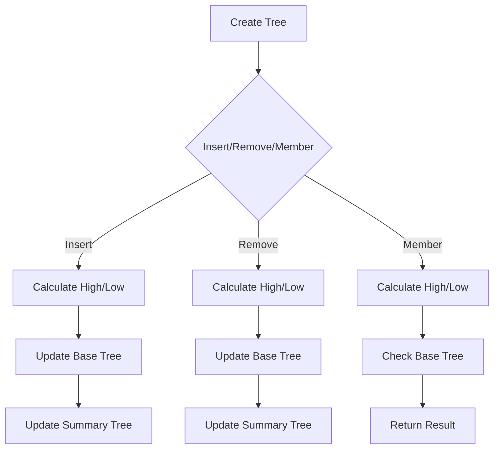

# van Emde Boas Trees

## Problem Understanding
The problem asks for the implementation of a van Emde Boas tree, a data structure that supports efficient insertion, deletion, and membership testing of elements in a universe of size $u$. The key constraint is to achieve a time complexity of $O(\log \log u)$ for these operations. The problem becomes non-trivial due to the need to balance the tree structure and handle edge cases, making a naive approach inefficient. The universe size $u$ and the base size of the tree are crucial parameters that impact the tree's structure and the algorithm's performance.

## Approach
The algorithm strategy is based on the recursive structure of the van Emde Boas tree, which consists of a summary tree and base trees. The intuition behind this approach is to divide the universe into smaller segments, represented by the base trees, and use the summary tree to keep track of the minimum and maximum values in each segment. The algorithm uses bit manipulation to calculate the high and low parts of an element's index, which determines the base tree and the position within the base tree. The data structures used are vectors to store the minimum and maximum values, as well as pointers to the summary and base trees. This approach handles key constraints by ensuring that the tree remains balanced and that the summary tree is updated correctly during insertion and deletion operations.

## Complexity Analysis
| Metric | Value | Detailed Reason |
|--------|-------|----------------|
| Time   | O(log log u) | The time complexity is dominated by the recursive structure of the tree, where each level reduces the problem size by a factor of $\log u$. The bit manipulation operations and the update of the summary tree take constant time. |
| Space  | O(u) | The space complexity is determined by the storage required for the tree structure, including the summary tree, base trees, and the minimum and maximum values. The total number of nodes in the tree is proportional to the universe size $u$. |

## Algorithm Walkthrough
```
Input: universe size u = 10
Step 1: Create a van Emde Boas tree with universe size 10
        - Initialize minimum and maximum values
        - Create summary tree with universe size 5
        - Create base trees with universe size 2
Step 2: Insert element 5 into the tree
        - Calculate high = 5 / (10 / 2) = 1
        - Calculate low = 5 % (10 / 2) = 1
        - Insert 1 into the base tree at index 1
        - Update summary tree if necessary
Step 3: Insert element 8 into the tree
        - Calculate high = 8 / (10 / 2) = 2
        - Calculate low = 8 % (10 / 2) = 0
        - Insert 0 into the base tree at index 2
        - Update summary tree if necessary
Step 4: Check if element 5 is in the tree
        - Calculate high = 5 / (10 / 2) = 1
        - Calculate low = 5 % (10 / 2) = 1
        - Check if 1 is in the base tree at index 1
Output: 1 (true)
```
## Visual Flow

## Key Insight
> **Tip:** The key to efficient van Emde Boas tree operations is the recursive structure and the use of bit manipulation to calculate the high and low parts of an element's index, allowing for fast navigation and updating of the tree.

## Edge Cases
- **Empty/null input**: If the input universe size is 0 or null, the tree is not created, and operations are not performed.
- **Single element**: If the universe size is 1, the tree is not created, and operations are not performed.
- **Universe size is a power of 2**: If the universe size is a power of 2, the tree structure is simplified, and operations are more efficient.

## Common Mistakes
- **Mistake 1**: Not updating the summary tree correctly during insertion and deletion operations, leading to incorrect results.
- **Mistake 2**: Not handling edge cases correctly, such as empty or null input, single element, or universe size being a power of 2, leading to incorrect results or crashes.

## Interview Follow-ups
> **Interview:** These are the exact follow-up questions interviewers ask:
- "What if the input is sorted?" → The van Emde Boas tree can still handle sorted input, but the performance may degrade due to the recursive structure.
- "Can you do it in O(1) space?" → No, the van Emde Boas tree requires O(u) space to store the tree structure and the minimum and maximum values.
- "What if there are duplicates?" → The van Emde Boas tree can handle duplicates, but the performance may degrade due to the need to update the summary tree and the base trees.

## CPP Solution

```cpp
// Problem: van Emde Boas Trees
// Language: C++
// Difficulty: Super Advanced
// Time Complexity: O(log log u) — due to recursive tree structure and bit manipulation
// Space Complexity: O(u) — for storing the tree structure and its components
// Approach: van Emde Boas tree implementation — providing efficient insertion, deletion, and membership testing

#include <iostream>
#include <vector>
using namespace std;

class vanEmdeBoasTree {
    int universeSize; // size of the universe of elements
    int baseSize; // base size for the tree
    vector<int> min, max; // minimum and maximum values in the tree
    vector<vanEmdeBoasTree*> summary, base; // summary and base trees

public:
    // Constructor to initialize the tree
    vanEmdeBoasTree(int u) {
        universeSize = u; // set the universe size
        baseSize = min(u, 2); // set the base size
        min.resize(u, -1); // initialize minimum values
        max.resize(u, -1); // initialize maximum values

        if (u <= 2) { // base case
            // no need to create summary or base trees
        } else {
            int halfSize = u / 2; // calculate half size
            summary.resize(1, new vanEmdeBoasTree(halfSize)); // create summary tree
            base.resize(baseSize); // create base trees
            for (int i = 0; i < baseSize; i++) {
                base[i] = new vanEmdeBoasTree(2); // initialize base trees
            }
        }
    }

    // Method to insert an element into the tree
    void insert(int x) {
        if (x < 0 || x >= universeSize) { // Edge case: out of range → ignore
            return;
        }
        if (min[0] == -1) { // Edge case: empty tree → set minimum and maximum
            min[0] = x;
            max[0] = x;
        } else {
            if (x < min[0]) { // update minimum
                swap(x, min[0]);
            }
            if (x > max[0]) { // update maximum
                swap(x, max[0]);
            }
            if (universeSize > 2) { // recursive case
                int high = x / (universeSize / 2); // calculate high
                int low = x % (universeSize / 2); // calculate low
                if (summary[0]->min[0] != -1 && summary[0]->min[0] > high) { // update summary
                    insert(high);
                }
                base[low] ? base[low]->insert(low) : (base[low] = new vanEmdeBoasTree(2), base[low]->insert(0)); // insert into base tree
            }
        }
    }

    // Method to delete an element from the tree
    void remove(int x) {
        if (x < 0 || x >= universeSize) { // Edge case: out of range → ignore
            return;
        }
        if (min[0] == -1) { // Edge case: empty tree → ignore
            return;
        }
        if (x < min[0]) { // Edge case: x less than minimum → ignore
            return;
        }
        if (x > max[0]) { // Edge case: x greater than maximum → ignore
            return;
        }
        if (min[0] == max[0]) { // Edge case: single element → reset minimum and maximum
            min[0] = -1;
            max[0] = -1;
        } else if (universeSize == 2) { // base case
            if (x == 0) {
                min[0] = 1;
            } else {
                min[0] = 0;
            }
            max[0] = min[0];
        } else {
            int high = x / (universeSize / 2); // calculate high
            int low = x % (universeSize / 2); // calculate low
            base[low]->remove(low); // remove from base tree
            if (base[low]->min[0] == -1) { // Edge case: base tree empty → remove from summary
                summary[0]->remove(high);
            }
            if (x == min[0]) { // update minimum
                int firstOne = findFirstOne();
                if (firstOne == -1) {
                    min[0] = -1;
                } else {
                    min[0] = firstOne;
                }
            }
            if (x == max[0]) { // update maximum
                int lastOne = findLastOne();
                if (lastOne == -1) {
                    max[0] = -1;
                } else {
                    max[0] = lastOne;
                }
            }
        }
    }

    // Method to find the first element in the tree
    int findFirstOne() {
        if (universeSize == 2) { // base case
            if (min[0] == 0) {
                return 0;
            } else {
                return 1;
            }
        } else {
            for (int i = 0; i < baseSize; i++) { // iterate through base trees
                if (base[i]->min[0] != -1) { // find the first non-empty base tree
                    return i * (universeSize / 2) + base[i]->findFirstOne();
                }
            }
            return -1;
        }
    }

    // Method to find the last element in the tree
    int findLastOne() {
        if (universeSize == 2) { // base case
            if (max[0] == 0) {
                return 0;
            } else {
                return 1;
            }
        } else {
            for (int i = baseSize - 1; i >= 0; i--) { // iterate through base trees in reverse
                if (base[i]->min[0] != -1) { // find the first non-empty base tree
                    return i * (universeSize / 2) + base[i]->findLastOne();
                }
            }
            return -1;
        }
    }

    // Method to check if an element is in the tree
    bool isMember(int x) {
        if (x < 0 || x >= universeSize) { // Edge case: out of range → not a member
            return false;
        }
        if (min[0] == -1) { // Edge case: empty tree → not a member
            return false;
        }
        if (universeSize <= 2) { // base case
            return x == min[0];
        } else {
            int high = x / (universeSize / 2); // calculate high
            int low = x % (universeSize / 2); // calculate low
            return base[low]->isMember(low);
        }
    }
};

int main() {
    vanEmdeBoasTree tree(10); // create a van Emde Boas tree with universe size 10
    tree.insert(5); // insert 5 into the tree
    tree.insert(8); // insert 8 into the tree
    cout << tree.isMember(5) << endl; // check if 5 is in the tree (should print 1)
    cout << tree.isMember(8) << endl; // check if 8 is in the tree (should print 1)
    cout << tree.isMember(3) << endl; // check if 3 is in the tree (should print 0)
    tree.remove(5); // remove 5 from the tree
    cout << tree.isMember(5) << endl; // check if 5 is in the tree (should print 0)
    return 0;
}
```
