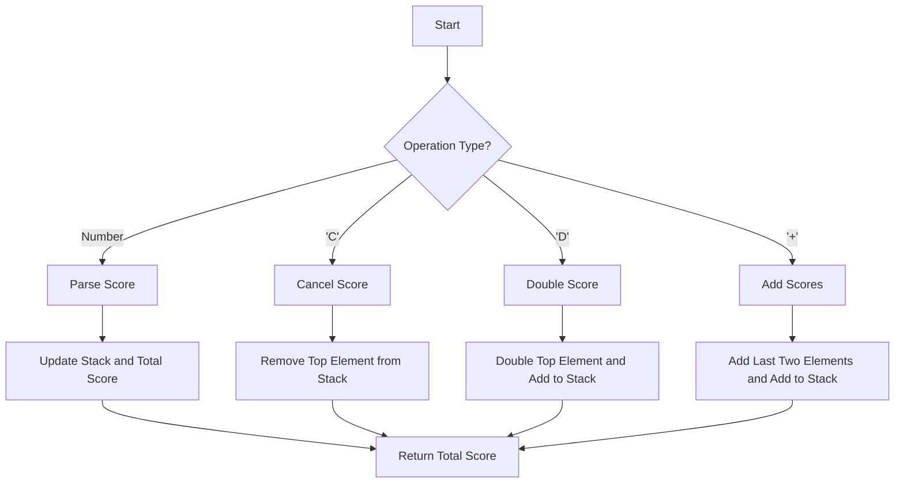

# Baseball Game

## Problem Understanding
The problem asks us to calculate the total score of a baseball game given an array of operations. The operations can be either a number (representing a score), 'C' (cancel the previous score), 'D' (double the previous score), or '+' (add the last two scores). The key constraint is that we need to handle these operations in the order they appear in the array. What makes this problem non-trivial is that we need to efficiently handle the 'C', 'D', and '+' operations, which require us to keep track of the previous scores.

## Approach
The algorithm strategy is to use a stack-based approach to calculate the scores. We iterate through each operation, and for each operation, we calculate the score and update the stack accordingly. We use a stack to store the scores because it allows us to efficiently handle the 'C' operation (by removing the top element from the stack) and the 'D' and '+' operations (by accessing the top elements of the stack). The intuition behind this approach is that we can use the stack to keep track of the scores and update the total score accordingly.

## Complexity Analysis
| Metric | Value | Detailed Reason |
|--------|-------|----------------|
| Time   | O(n)  | We iterate through each operation in the array once, where n is the number of operations. Each operation takes constant time to process. |
| Space  | O(n)  | We use a stack to store the scores, which in the worst case can grow up to the size of the input array. |

## Algorithm Walkthrough
```
Input: ["5", "2", "C", "D", "+"]
Step 1: Initialize the stack and total score. scores = [], top = 0, totalScore = 0
Step 2: Process the first operation "5". scores = [5], top = 1, totalScore = 5
Step 3: Process the second operation "2". scores = [5, 2], top = 2, totalScore = 7
Step 4: Process the third operation "C". scores = [5], top = 1, totalScore = 5
Step 5: Process the fourth operation "D". scores = [5, 10], top = 2, totalScore = 15
Step 6: Process the fifth operation "+". scores = [5, 10, 15], top = 3, totalScore = 30
Output: 30
```

## Visual Flow


## Key Insight
> **Tip:** Use a stack to efficiently handle the 'C', 'D', and '+' operations by keeping track of the previous scores.

## Edge Cases
- **Empty/null input**: If the input array is empty or null, the function will return 0 because there are no operations to process.
- **Single element**: If the input array has only one element, the function will process that element and return the total score.
- **Invalid operation**: If the input array contains an invalid operation, the function will ignore it and continue processing the next operations.

## Common Mistakes
- **Mistake 1**: Not handling the 'C' operation correctly by not removing the top element from the stack.
- **Mistake 2**: Not handling the 'D' and '+' operations correctly by not accessing the top elements of the stack.

## Interview Follow-ups
> **Interview:** 
- "What if the input is sorted?" → The function will still work correctly because it processes the operations in the order they appear in the array, regardless of whether the input is sorted or not.
- "Can you do it in O(1) space?" → No, because we need to use a stack to store the scores, which requires O(n) space in the worst case.
- "What if there are duplicates?" → The function will handle duplicates correctly because it processes each operation independently, regardless of whether the scores are duplicates or not.

## Java Solution

```java
// Problem: Baseball Game
// Language: Java
// Difficulty: Easy
// Time Complexity: O(n) — single pass through operations array
// Space Complexity: O(n) — stack to store scores
// Approach: Stack-based score calculation — for each operation, calculate the score and update the stack

public class Solution {
    public int calPoints(String[] ops) {
        // Initialize a stack to store scores
        int[] scores = new int[ops.length];
        int top = 0; // Stack pointer

        // Initialize the total score
        int totalScore = 0;

        // Iterate through each operation
        for (String op : ops) {
            // Edge case: invalid operation → ignore
            if (op == null || op.isEmpty()) {
                continue;
            }

            // Check if the operation is a number
            if (Character.isDigit(op.charAt(0)) || op.charAt(0) == '-') {
                // Parse the score from the operation
                int score = Integer.parseInt(op);
                // Push the score onto the stack
                scores[top++] = score;
                // Update the total score
                totalScore += score;
            } else {
                // Handle 'C' operation (remove the top element from the stack)
                if (op.equals("C")) {
                    // Edge case: stack is empty → do nothing
                    if (top == 0) {
                        continue;
                    }
                    // Remove the top element from the stack
                    totalScore -= scores[--top];
                } 
                // Handle 'D' operation (double the top element and add it to the stack)
                else if (op.equals("D")) {
                    // Edge case: stack is empty → do nothing
                    if (top == 0) {
                        continue;
                    }
                    // Double the top element and add it to the stack
                    scores[top] = scores[top - 1] * 2;
                    top++;
                    // Update the total score
                    totalScore += scores[top - 1];
                } 
                // Handle '+' operation (add the last two elements and add it to the stack)
                else if (op.equals("+")) {
                    // Edge case: less than two elements on the stack → do nothing
                    if (top < 2) {
                        continue;
                    }
                    // Add the last two elements and add it to the stack
                    scores[top] = scores[top - 1] + scores[top - 2];
                    top++;
                    // Update the total score
                    totalScore += scores[top - 1];
                }
            }
        }

        // Return the total score
        return totalScore;
    }
}
```
