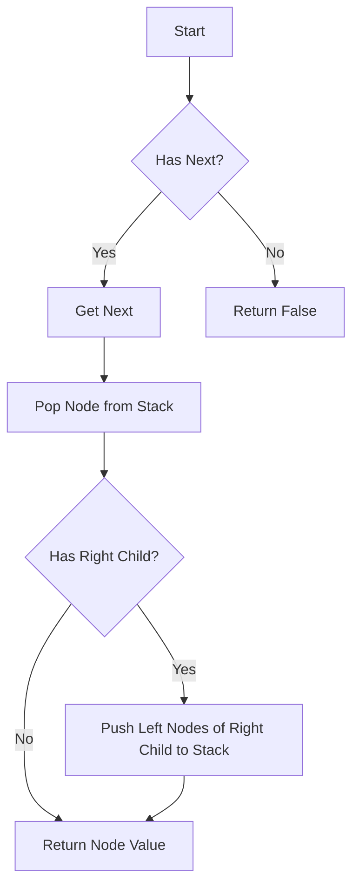

# Binary Search Tree Iterator

## Problem Understanding
The problem is asking to design an iterator for a Binary Search Tree (BST) that allows us to traverse the tree in ascending order. The key constraint is that the iterator should support two operations: `next()` and `hasNext()`, where `next()` returns the next smallest element in the tree, and `hasNext()` checks if there are more elements to iterate. What makes this problem non-trivial is that we need to achieve an average time complexity of O(1) for `next()` and `hasNext()` operations, while also considering the space complexity. The naive approach of traversing the entire tree for each `next()` call would result in a high time complexity, making it inefficient.

## Approach
The algorithm strategy used here is an inorder traversal with a stack, which allows us to iterate through the tree in ascending order. The intuition behind this approach is to use a stack to store nodes that need to be visited, starting from the smallest node in the tree. We use a stack to push all left nodes of the root to start the iteration from the smallest node. The `pushLeft` method is used to push all left nodes of a given node to the stack, and the `next` method pops the top node from the stack and pushes all left nodes of its right child to the stack to continue the iteration. The `hasNext` method simply checks if the stack is not empty.

## Complexity Analysis
| Metric | Value | Detailed Reason |
|--------|-------|----------------|
| Time   | O(1)  | The `next` and `hasNext` operations have an average time complexity of O(1) because we are simply popping and pushing nodes from the stack. However, the initialization of the iterator takes O(h) time, where h is the height of the tree, because we need to push all left nodes of the root to the stack. In the worst case, the tree is skewed, and h = n, resulting in a time complexity of O(n) for initialization. |
| Space  | O(h)  | The space complexity is O(h) because we use a stack to store nodes, and the maximum number of nodes in the stack is equal to the height of the tree. In the worst case, the tree is skewed, and h = n, resulting in a space complexity of O(n). |

## Algorithm Walkthrough
```
Input: 
      7
     / \
    3   15
   / \   \
  2   6   20
 /
1

Step 1: Initialize the stack by pushing all left nodes of the root
Stack: [1, 2, 3, 7]
Step 2: Call next()
Top node: 1, pop from stack
Stack: [2, 3, 7]
Return: 1
Step 3: Call next()
Top node: 2, pop from stack
Push left nodes of right child of 2 to stack: []
Stack: [3, 7]
Return: 2
Step 4: Call next()
Top node: 3, pop from stack
Push left nodes of right child of 3 to stack: [6]
Stack: [6, 7]
Return: 3
Step 5: Call hasNext()
Stack is not empty, return: true
```
## Visual Flow

## Key Insight
> **Tip:** The key insight is to use a stack to store nodes for inorder traversal, allowing us to achieve an average time complexity of O(1) for `next()` and `hasNext()` operations.

## Edge Cases
- **Empty tree**: If the input tree is empty, the iterator will not be initialized, and `hasNext()` will return false.
- **Single node**: If the input tree has only one node, the iterator will be initialized with that node, and `hasNext()` will return true. After calling `next()`, `hasNext()` will return false.
- **Skewed tree**: If the input tree is skewed, the height of the tree will be equal to the number of nodes, resulting in a space complexity of O(n) and a time complexity of O(n) for initialization.

## Common Mistakes
- **Mistake 1**: Not handling the case where the tree is empty, resulting in a `NullPointerException` when calling `next()` or `hasNext()`.
- **Mistake 2**: Not pushing all left nodes of the root to the stack during initialization, resulting in incorrect iteration order.

## Interview Follow-ups
> **Interview:** These are the exact follow-up questions interviewers ask:
- "What if the input is sorted?" → The algorithm will still work correctly, but the time complexity for initialization will be O(n) because we need to push all nodes to the stack.
- "Can you do it in O(1) space?" → No, we cannot achieve O(1) space complexity because we need to use a stack to store nodes for inorder traversal.
- "What if there are duplicates?" → The algorithm will still work correctly, but the `next()` method will return the same value multiple times if there are duplicate values in the tree. To handle duplicates, we can modify the `next()` method to skip duplicate values.

## Java Solution

```java
// Problem: Binary Search Tree Iterator
// Language: Java
// Difficulty: Easy
// Time Complexity: O(1) — average time complexity for next() and hasNext(), O(n) for initialization
// Space Complexity: O(h) — space used by the stack, where h is the height of the tree
// Approach: Inorder traversal with stack — iterate through the tree in ascending order using a stack

import java.util.Stack;

/**
 * Definition for a binary tree node.
 * public class TreeNode {
 *     int val;
 *     TreeNode left;
 *     TreeNode right;
 *     TreeNode() {}
 *     TreeNode(int val) { this.val = val; }
 *     TreeNode(int val, TreeNode left, TreeNode right) {
 *         this.val = val;
 *         this.left = left;
 *         this.right = right;
 *     }
 * }
 */
public class BSTIterator {
    private Stack<TreeNode> stack; // stack to store nodes for inorder traversal

    public BSTIterator(TreeNode root) {
        // Initialize the stack
        stack = new Stack<>();
        // Push all left nodes of the root to the stack
        pushLeft(root); // to start the iteration from the smallest node
    }

    /**
     * Push all left nodes of the given node to the stack.
     * 
     * @param node the given node
     */
    private void pushLeft(TreeNode node) {
        while (node != null) {
            // Push the node to the stack
            stack.push(node);
            // Move to the left child
            node = node.left; // to find the smallest node in the subtree
        }
    }

    public int next() {
        // Get the top node from the stack
        TreeNode top = stack.pop();
        // If the top node has a right child, push all its left nodes to the stack
        if (top.right != null) {
            pushLeft(top.right); // to continue the iteration
        }
        // Return the value of the top node
        return top.val; // the next smallest node in the tree
    }

    public boolean hasNext() {
        // Check if the stack is not empty
        return !stack.isEmpty(); // if there are more nodes to iterate
    }
}
```
