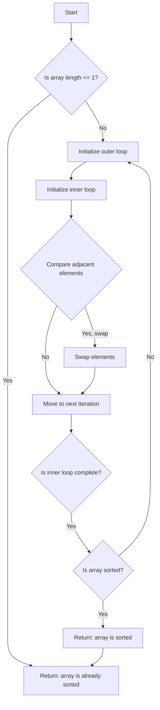

# Bubble Sort

## Problem Understanding
The problem is asking to implement the Bubble Sort algorithm, which is a simple sorting algorithm that repeatedly steps through the list, compares adjacent elements, and swaps them if they are in the wrong order. The key constraints of this problem are that the input is an array of integers and the output should be the sorted array in ascending order. What makes this problem non-trivial is that the naive approach of comparing each pair of elements would result in a time complexity of O(n^2), which can be inefficient for large datasets. The Bubble Sort algorithm has to handle the key constraint of in-place sorting, meaning it should not use any extra space that scales with input size.

## Approach
The algorithm strategy used here is the iterative comparison and swapping approach, where we repeatedly iterate through the array, comparing and swapping adjacent elements if they are in the wrong order. This approach works because with each iteration, the largest element "bubbles" up to the end of the array, hence the name Bubble Sort. We use a flag to track if any swaps were made in the inner loop, and if no swaps were made, we can exit the outer loop early, as the array is already sorted. The data structure used here is a simple array, which is chosen because it allows for efficient random access and swapping of elements.

## Complexity Analysis
| Metric | Value | Detailed Reason |
|--------|-------|----------------|
| Time   | O(n^2) | The algorithm has two nested loops, where the outer loop runs n-1 times and the inner loop runs n-i-1 times. In the worst-case scenario, this results in a time complexity of O(n^2). |
| Space  | O(1) | The algorithm only uses a constant amount of extra space to store the temporary variable for swapping, so the space complexity is O(1), making it an in-place sorting algorithm. |

## Algorithm Walkthrough
```
Input: [64, 34, 25, 12, 22, 11, 90]
Step 1: Compare 64 and 34, swap because 64 > 34, array becomes [34, 64, 25, 12, 22, 11, 90]
Step 2: Compare 64 and 25, swap because 64 > 25, array becomes [34, 25, 64, 12, 22, 11, 90]
Step 3: Compare 64 and 12, swap because 64 > 12, array becomes [34, 25, 12, 64, 22, 11, 90]
Step 4: Compare 64 and 22, swap because 64 > 22, array becomes [34, 25, 12, 22, 64, 11, 90]
Step 5: Compare 64 and 11, swap because 64 > 11, array becomes [34, 25, 12, 22, 11, 64, 90]
Step 6: Compare 64 and 90, no swap because 64 < 90, array remains [34, 25, 12, 22, 11, 64, 90]
Outer loop repeats, and the process continues until the array is sorted.
Output: [11, 12, 22, 25, 34, 64, 90]
```

## Visual Flow


## Key Insight
> **Tip:** The key insight to Bubble Sort is that with each iteration, the largest element "bubbles" up to the end of the array, allowing us to reduce the number of comparisons needed in subsequent iterations.

## Edge Cases
- **Empty array**: If the input array is empty, the algorithm will simply return without making any changes, as an empty array is already sorted.
- **Single-element array**: If the input array has only one element, the algorithm will return without making any changes, as a single-element array is already sorted.
- **Array with duplicate elements**: If the input array contains duplicate elements, the algorithm will still work correctly, swapping adjacent elements if they are in the wrong order, and eventually producing a sorted array with the duplicate elements in their correct positions.

## Common Mistakes
- **Mistake 1: Not checking for the base case**: Failing to check if the array length is <= 1 can result in unnecessary iterations and potential errors. To avoid this, always check for the base case at the beginning of the algorithm.
- **Mistake 2: Not using a flag to track swaps**: Not using a flag to track if any swaps were made in the inner loop can result in unnecessary iterations. To avoid this, always use a flag to track swaps and exit the outer loop early if no swaps were made.

## Interview Follow-ups
> **Interview:** These are the exact follow-up questions interviewers ask:
- "What if the input is sorted?" → In that case, the algorithm will still work correctly, but it will have a best-case time complexity of O(n), as it will only need to iterate through the array once to confirm that it is already sorted.
- "Can you do it in O(1) space?" → Yes, the Bubble Sort algorithm already uses O(1) space, as it only uses a constant amount of extra space to store the temporary variable for swapping.
- "What if there are duplicates?" → The algorithm will still work correctly, swapping adjacent elements if they are in the wrong order, and eventually producing a sorted array with the duplicate elements in their correct positions.

## Java Solution

```java
// Problem: Bubble Sort
// Language: Java
// Difficulty: Easy
// Time Complexity: O(n^2) — two nested loops for comparison and swapping
// Space Complexity: O(1) — in-place sorting, no extra space needed
// Approach: Iterative comparison and swapping — repeatedly swapping adjacent elements if they are in wrong order

public class BubbleSort {
    /**
     * Sorts an array using the Bubble Sort algorithm.
     * 
     * @param array the array to be sorted
     */
    public static void bubbleSort(int[] array) {
        // Edge case: empty or single-element array is already sorted
        if (array.length <= 1) {
            return; // no need to sort
        }

        // Iterate through the array, comparing and swapping adjacent elements
        for (int i = 0; i < array.length - 1; i++) { // outer loop
            // Initialize a flag to track if any swaps were made in the inner loop
            boolean swapped = false;
            
            // Inner loop: compare and swap adjacent elements
            for (int j = 0; j < array.length - i - 1; j++) { // inner loop
                // If the current element is greater than the next element, swap them
                if (array[j] > array[j + 1]) {
                    // Swap the elements
                    int temp = array[j]; // store the current element in a temporary variable
                    array[j] = array[j + 1]; // assign the next element to the current position
                    array[j + 1] = temp; // assign the stored element to the next position
                    swapped = true; // set the flag to indicate a swap was made
                }
            }
            
            // If no swaps were made in the inner loop, the array is already sorted
            if (!swapped) {
                break; // exit the outer loop
            }
        }
    }

    /**
     * Prints the elements of an array.
     * 
     * @param array the array to be printed
     */
    public static void printArray(int[] array) {
        // Edge case: empty array
        if (array.length == 0) {
            System.out.println("[]"); // print an empty array
            return;
        }

        // Print the array elements
        System.out.print("[");
        for (int i = 0; i < array.length; i++) {
            System.out.print(array[i]);
            if (i < array.length - 1) {
                System.out.print(", ");
            }
        }
        System.out.println("]");
    }

    public static void main(String[] args) {
        // Example usage
        int[] array = {64, 34, 25, 12, 22, 11, 90};
        System.out.println("Original array:");
        printArray(array);
        bubbleSort(array);
        System.out.println("Sorted array:");
        printArray(array);
    }
}
```
