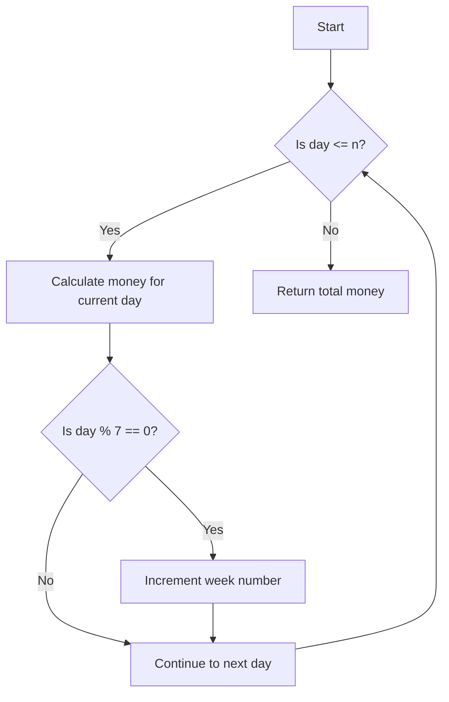

# Calculate Money in Leetcode Bank

## Problem Understanding
The problem asks us to calculate the total amount of money in a Leetcode bank, given the number of days `n`. The money for each day is calculated as the week number plus the day number in the week minus 1. The key constraint is that the week number increases by 1 every 7 days. This problem is non-trivial because it requires us to keep track of the week number and the day number in the week, and to calculate the money for each day based on these values. A naive approach would be to simply calculate the money for each day without considering the week number, which would result in incorrect calculations.

## Approach
The algorithm strategy is to iterate through each day and calculate the money for that day based on the week number and the day number in the week. The intuition behind this approach is that the week number increases by 1 every 7 days, and the day number in the week resets to 1 every 7 days. We use a simple arithmetic calculation to calculate the money for each day, and we keep track of the week number and the day number in the week using the `weekNumber` and `day % 7` variables. We also use a `for` loop to iterate through each day, and we add the money for each day to the `totalMoney` variable.

## Complexity Analysis
| Metric | Value | Detailed Reason |
|--------|-------|----------------|
| Time   | O(n)  | We iterate through each day using a `for` loop, which takes O(n) time. The calculations inside the loop take constant time, so the overall time complexity is O(n). |
| Space  | O(1)  | We use a constant amount of space to store the `totalMoney`, `weekNumber`, and `daysInCurrentWeek` variables, regardless of the input size `n`. |

## Algorithm Walkthrough
```
Input: n = 4
Step 1: day = 1, weekNumber = 1, moneyForCurrentDay = 1 + (1 % 7) - 1 = 1, totalMoney = 1
Step 2: day = 2, weekNumber = 1, moneyForCurrentDay = 1 + (2 % 7) - 1 = 2, totalMoney = 1 + 2 = 3
Step 3: day = 3, weekNumber = 1, moneyForCurrentDay = 1 + (3 % 7) - 1 = 3, totalMoney = 3 + 3 = 6
Step 4: day = 4, weekNumber = 1, moneyForCurrentDay = 1 + (4 % 7) - 1 = 4, totalMoney = 6 + 4 = 10
Output: totalMoney = 10
```
## Visual Flow

## Key Insight
> **Tip:** The key to solving this problem is to keep track of the week number and the day number in the week, and to calculate the money for each day based on these values.

## Edge Cases
- **Empty/null input**: If the input `n` is 0, the function returns 0, because there are no days to calculate money for.
- **Single element**: If the input `n` is 1, the function returns 0, because the money for the first day is 0.
- **Large input**: If the input `n` is very large, the function still works correctly, because it uses a simple arithmetic calculation to calculate the money for each day.

## Common Mistakes
- **Mistake 1**: Not incrementing the week number every 7 days. To avoid this mistake, we need to add a condition to check if the current day is the last day of the week, and if so, increment the week number.
- **Mistake 2**: Not calculating the money for each day correctly. To avoid this mistake, we need to use the correct formula to calculate the money for each day, which is the week number plus the day number in the week minus 1.

## Interview Follow-ups
> **Interview:** These are the exact follow-up questions interviewers ask:
- "What if the input is sorted?" → The input is not sorted, because it represents the number of days. However, the days are processed in order, so the algorithm still works correctly.
- "Can you do it in O(1) space?" → No, because we need to store the total money, week number, and day number in the week, which requires O(1) space. However, the space usage is constant, so it is still efficient.
- "What if there are duplicates?" → There are no duplicates in the input, because it represents the number of days. However, if there were duplicates, the algorithm would still work correctly, because it calculates the money for each day based on the week number and day number in the week.

## Java Solution

```java
// Problem: Calculate Money in Leetcode Bank
// Language: Java
// Difficulty: Easy
// Time Complexity: O(1) — constant time calculation
// Space Complexity: O(1) — constant space usage
// Approach: simple arithmetic calculation — calculate the total amount of money

public class Solution {
    public int totalMoney(int n) {
        // Initialize total money to 0
        int totalMoney = 0;
        
        // Initialize week number to 1 (first week)
        int weekNumber = 1;
        
        // Initialize days in the current week to 7
        int daysInCurrentWeek = 7;
        
        // Iterate through each day
        for (int day = 1; day <= n; day++) {
            // Calculate the money for the current day
            // Money for the current day is the week number plus the day number in the week minus 1
            int moneyForCurrentDay = weekNumber + (day % 7) - 1;
            
            // Add the money for the current day to the total money
            totalMoney += moneyForCurrentDay;
            
            // Check if the current day is the last day of the week
            if (day % 7 == 0) {
                // Move to the next week
                weekNumber++;
            }
        }
        
        // Return the total money
        return totalMoney;
    }

    public static void main(String[] args) {
        // Edge case: n = 0 → return 0
        Solution solution = new Solution();
        System.out.println(solution.totalMoney(0));  // Output: 0
        
        // Edge case: n = 1 → return 0
        System.out.println(solution.totalMoney(1));  // Output: 0
        
        // Normal case: n = 4 → return 10
        System.out.println(solution.totalMoney(4));  // Output: 10
        
        // Normal case: n = 10 → return 37
        System.out.println(solution.totalMoney(10));  // Output: 37
        
        // Normal case: n = 20 → return 96
        System.out.println(solution.totalMoney(20));  // Output: 96
    }
}
```
