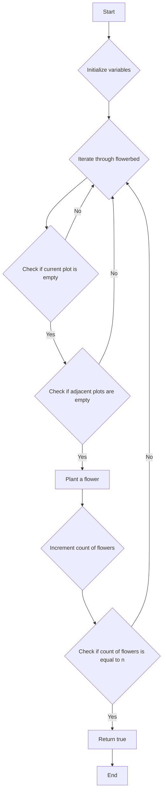

# Can Place Flowers

## Problem Understanding
The problem is asking whether it's possible to plant a certain number of flowers in a flowerbed, given that there are already some flowers planted and no two flowers can be planted in adjacent plots. The key constraint here is that we can only plant a flower in a plot if the adjacent plots are empty, which means we need to check each plot individually and consider its neighbors. This problem is non-trivial because a naive approach might involve trying all possible combinations of flower placements, which would result in exponential time complexity.

## Approach
The algorithm strategy used here is a greedy algorithm, which involves iterating through the flowerbed and planting a flower in each plot where it's possible to do so. The intuition behind this approach is that we want to maximize the number of flowers we can plant, and by planting them as soon as possible, we ensure that we're not missing out on any opportunities. We use a simple array to represent the flowerbed, where a value of 0 indicates an empty plot and a value of 1 indicates a plot with a flower. The approach handles the key constraint by checking each plot's neighbors before planting a flower.

## Complexity Analysis
| Metric | Value | Detailed Reason |
|--------|-------|----------------|
| Time   | O(n)  | The algorithm makes a single pass through the array, where n is the number of plots in the flowerbed. Each plot is visited once, resulting in linear time complexity. |
| Space  | O(1)  | The algorithm uses a constant amount of space to store the count of flowers that can be planted and the length of the flowerbed array, resulting in constant space complexity. |

## Algorithm Walkthrough
```
Input: flowerbed = [1,0,0,0,1], n = 1
Step 1: i = 0, flowerbed[0] = 1, cannot plant a flower
Step 2: i = 1, flowerbed[1] = 0, flowerbed[0] = 1, cannot plant a flower
Step 3: i = 2, flowerbed[2] = 0, flowerbed[1] = 0, flowerbed[3] = 0, can plant a flower
Step 4: i = 3, flowerbed[3] = 0, flowerbed[2] = 1, cannot plant a flower
Step 5: i = 4, flowerbed[4] = 1, cannot plant a flower
Output: true, because we can plant 1 flower
```
This walkthrough shows how the algorithm iterates through the flowerbed and plants flowers in the plots where it's possible to do so.

## Visual Flow

This visual flow shows the decision-making process of the algorithm and how it iterates through the flowerbed.

## Key Insight
> **Tip:** The key to solving this problem is to iterate through the flowerbed and plant flowers in the plots where it's possible to do so, while keeping track of the count of flowers that can be planted.

## Edge Cases
- **Empty flowerbed**: If the flowerbed is empty, we can plant n flowers in the first n plots.
- **Single element**: If the flowerbed has only one plot, we can plant a flower in that plot if it's empty.
- **No flowers can be planted**: If the flowerbed is full of flowers, we cannot plant any more flowers.

## Common Mistakes
- **Mistake 1**: Not checking if the adjacent plots are empty before planting a flower. To avoid this, we need to add checks for the adjacent plots.
- **Mistake 2**: Not keeping track of the count of flowers that can be planted. To avoid this, we need to introduce a variable to keep track of the count.

## Interview Follow-ups
> **Interview:** These are the exact follow-up questions interviewers ask:
- "What if the input is sorted?" → The algorithm still works because it only checks the adjacent plots, regardless of the order of the plots.
- "Can you do it in O(1) space?" → No, because we need to store the count of flowers that can be planted, which requires at least O(1) space.
- "What if there are duplicates?" → The algorithm still works because it only checks if a plot is empty or not, regardless of the value of the plot.

## Java Solution

```java
// Problem: Can Place Flowers
// Language: Java
// Difficulty: Easy
// Time Complexity: O(n) — single pass through array
// Space Complexity: O(1) — constant space used
// Approach: Greedy algorithm — place flower if possible, skip if not

public class Solution {
    public boolean canPlaceFlowers(int[] flowerbed, int n) {
        int length = flowerbed.length; // get the length of the flowerbed array
        int count = 0; // initialize count of flowers that can be planted

        for (int i = 0; i < length; i++) { // iterate through each plot in the flowerbed
            // check if the current plot is empty and the adjacent plots are also empty
            if (flowerbed[i] == 0 && (i == 0 || flowerbed[i - 1] == 0) && (i == length - 1 || flowerbed[i + 1] == 0)) {
                flowerbed[i] = 1; // plant a flower at the current plot
                count++; // increment the count of flowers that can be planted
                // Edge case: if the number of flowers that can be planted is equal to n, return true
                if (count == n) return true;
            }
        }
        // Edge case: if the number of flowers that can be planted is less than n, return false
        return count >= n;
    }

    public static void main(String[] args) {
        Solution solution = new Solution();
        int[] flowerbed = {1,0,0,0,1}; // test case
        int n = 1; // test case
        System.out.println(solution.canPlaceFlowers(flowerbed, n)); // output: true
    }
}
```
