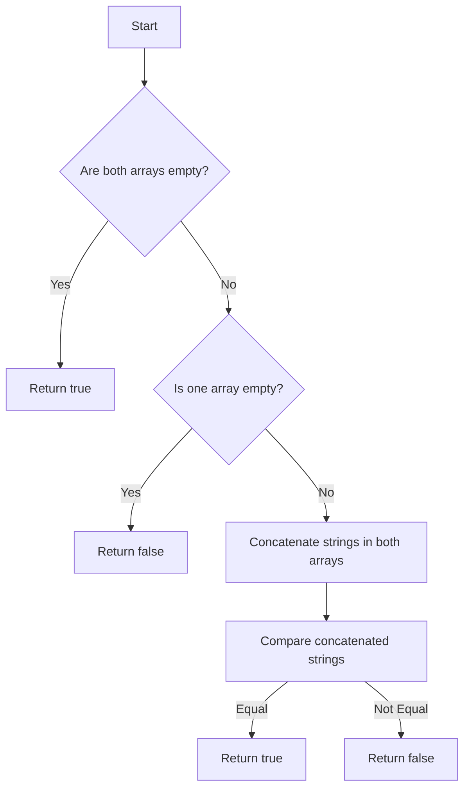

# Check If Two String Arrays are Equivalent

## Problem Understanding
The problem asks to determine if two string arrays are equivalent by checking if the concatenation of strings in both arrays results in the same string. The key constraint here is that the order of strings within each array matters, as it affects the final concatenated string. This problem is non-trivial because a naive approach might involve comparing each string in the arrays individually, which would not account for the concatenated result. The problem requires a strategy that efficiently compares the concatenated strings while handling edge cases such as empty arrays.

## Approach
The algorithm strategy involves concatenating the strings in both arrays and then comparing the resulting strings. This approach works because it directly addresses the problem statement by checking the equivalence of the concatenated strings. The mathematical reasoning behind this approach is based on the concept of string concatenation and comparison. The data structure used is a `StringBuilder`, which is chosen for its efficiency in concatenating strings. This approach handles key constraints such as the order of strings and edge cases like empty arrays by first checking for these conditions and then proceeding with the concatenation and comparison.

## Complexity Analysis
| Metric | Value | Detailed Reason |
|--------|-------|----------------|
| Time   | O(n + m) | The time complexity is O(n + m) because we iterate through both arrays (`word1` and `word2`) once to concatenate their strings, where `n` is the total number of characters in `word1` and `m` is the total number of characters in `word2`. The comparison of the concatenated strings takes O(n + m) time as well, since we are comparing two strings of total length `n + m`. |
| Space  | O(n + m) | The space complexity is O(n + m) because we are storing the concatenated strings in `StringBuilder` objects (`sb1` and `sb2`), which requires space proportional to the total length of the strings in both arrays. |

## Algorithm Walkthrough
```
Input: word1 = ["ab", "c"], word2 = ["a", "bc"]
Step 1: Initialize StringBuilder objects sb1 and sb2.
Step 2: Concatenate strings in word1: sb1 = "abc".
Step 3: Concatenate strings in word2: sb2 = "abc".
Step 4: Compare the concatenated strings: "abc" equals "abc".
Output: true
```
This walkthrough demonstrates how the algorithm handles a simple case where the input arrays are not empty and the concatenated strings are equal.

## Visual Flow

This flowchart illustrates the decision-making process in the algorithm, covering edge cases and the main logic path for comparing concatenated strings.

## Key Insight
> **Tip:** The key insight here is to recognize that checking the equivalence of two string arrays can be simplified to comparing their concatenated strings, which allows for an efficient solution using `StringBuilder` for concatenation and `equals` method for comparison.

## Edge Cases
- **Empty/null input**: If both arrays are empty, the algorithm correctly returns `true` because the concatenated strings are both empty. If one array is empty and the other is not, the algorithm returns `false` because the concatenated strings are not equal.
- **Single element**: If each array contains a single string, the algorithm works by comparing these strings directly after concatenation, which is essentially the same as comparing the original strings.
- **Arrays with same string repeated**: If both arrays contain the same string repeated (e.g., `["a", "a"]` and `["a", "a"]`), the algorithm correctly returns `true` because the concatenated strings are equal.

## Common Mistakes
- **Mistake 1**: Not checking for edge cases like empty arrays before proceeding with concatenation and comparison. → To avoid this, explicitly check for these conditions at the beginning of the algorithm.
- **Mistake 2**: Using string concatenation (`+`) instead of `StringBuilder` for concatenating strings in the arrays. → To avoid this, use `StringBuilder` for efficient string concatenation.

## Interview Follow-ups
> **Interview:** 
- "What if the input is sorted?" → The sorting of the input arrays does not affect the algorithm because it checks for the equivalence of the concatenated strings, not the order of the strings within the arrays.
- "Can you do it in O(1) space?" → Achieving O(1) space complexity is not possible with this approach because we need to store the concatenated strings, which requires space proportional to the input size. However, optimizing the space usage by avoiding unnecessary intermediate strings could be explored.
- "What if there are duplicates?" → The presence of duplicate strings within the arrays does not affect the algorithm's correctness because it checks for the equivalence of the concatenated strings, and duplicates are treated as part of the string sequence.

## Java Solution

```java
// Problem: Check If Two String Arrays are Equivalent
// Language: Java
// Difficulty: Easy
// Time Complexity: O(n + m) — iterating through both arrays
// Space Complexity: O(n + m) — storing the concatenated strings
// Approach: Concatenate strings and compare — concatenate strings in both arrays and compare the results

public class Solution {
    public boolean arrayStringsAreEqual(String[] word1, String[] word2) {
        // Edge case: both arrays are empty → return true
        if (word1.length == 0 && word2.length == 0) {
            return true;
        }
        // Edge case: one array is empty → return false
        if (word1.length == 0 || word2.length == 0) {
            return false;
        }
        
        // Concatenate strings in the first array
        StringBuilder sb1 = new StringBuilder();
        for (String str : word1) {
            sb1.append(str); // append each string to the StringBuilder
        }
        
        // Concatenate strings in the second array
        StringBuilder sb2 = new StringBuilder();
        for (String str : word2) {
            sb2.append(str); // append each string to the StringBuilder
        }
        
        // Compare the concatenated strings
        return sb1.toString().equals(sb2.toString()); // compare the strings using equals method
    }

    public static void main(String[] args) {
        Solution solution = new Solution();
        String[] word1 = {"ab", "c"};
        String[] word2 = {"a", "bc"};
        System.out.println(solution.arrayStringsAreEqual(word1, word2));
    }
}
```
