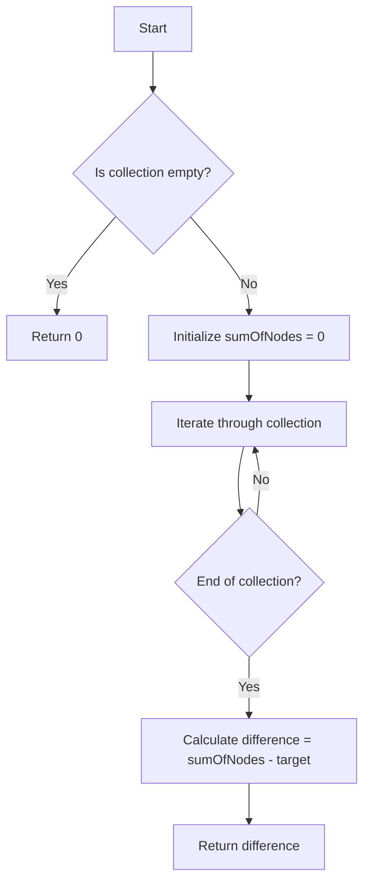

# Compute Difference Of Collection of Nodes

## Problem Understanding
The problem requires computing the difference between the sum of all nodes in a collection and a target node. The key constraint is that the solution should be efficient, with a reasonable time and space complexity. The problem becomes non-trivial when considering edge cases, such as an empty collection or a collection with a single element, which require special handling to avoid errors. The naive approach of directly subtracting the target from each node in the collection is not efficient, as it would result in multiple subtractions, whereas a single pass through the collection can achieve the desired result.

## Approach
The algorithm strategy is to iterate through the collection, calculating the sum of all nodes, and then find the difference by subtracting the target node from the sum. This approach works because the order of operations (addition and then subtraction) ensures that the result is accurate. The data structure used is a simple array, which is sufficient for storing the collection of nodes. The approach handles key constraints, such as edge cases, by including conditional statements to check for empty collections or other special cases. The time complexity is O(n), where n is the number of nodes in the collection, because a single pass is made through the collection.

## Complexity Analysis
| Metric | Value | Detailed Reason |
|--------|-------|----------------|
| Time   | O(n)  | The algorithm makes a single pass through the collection, where n is the number of nodes. Each node is visited once, resulting in a linear time complexity. |
| Space  | O(1)  | The algorithm uses a constant amount of space to store the sum of nodes and other variables, regardless of the size of the input collection. |

## Algorithm Walkthrough
```
Input: collection = [1, 2, 3, 4, 5], target = 10
Step 1: Initialize sumOfNodes = 0
Step 2: Iterate through the collection:
  - sumOfNodes += 1 = 1
  - sumOfNodes += 2 = 3
  - sumOfNodes += 3 = 6
  - sumOfNodes += 4 = 10
  - sumOfNodes += 5 = 15
Step 3: Calculate difference = sumOfNodes - target = 15 - 10 = 5
Output: difference = 5
```
This example demonstrates the algorithm's step-by-step process for computing the difference between the sum of nodes in a collection and a target node.

## Visual Flow

This flowchart illustrates the decision flow and data transformation within the algorithm, including handling edge cases and iterating through the collection.

## Key Insight
> **Tip:** The key insight is to recognize that the problem can be solved in a single pass through the collection, avoiding unnecessary complexity and ensuring efficiency.

## Edge Cases
- **Empty/null input**: If the collection is empty, the algorithm returns 0, as there are no nodes to sum. This is handled by the conditional statement at the beginning of the algorithm.
- **Single element**: If the collection contains a single element, the algorithm correctly calculates the difference between that element and the target node.
- **Collection with duplicate elements**: If the collection contains duplicate elements, the algorithm still correctly calculates the sum of all nodes and then finds the difference, as the duplicates are treated like any other node in the collection.

## Common Mistakes
- **Mistake 1: Not handling edge cases**: Failing to check for empty collections or other edge cases can result in errors or incorrect results. To avoid this, include conditional statements to handle these cases explicitly.
- **Mistake 2: Using unnecessary complexity**: Overcomplicating the solution with unnecessary data structures or operations can lead to inefficiency. To avoid this, focus on simple, straightforward approaches that achieve the desired result.

## Interview Follow-ups
> **Interview:** These are the exact follow-up questions interviewers ask:
- "What if the input is sorted?" → The algorithm's performance would not be affected, as it only requires a single pass through the collection, regardless of the order of the elements.
- "Can you do it in O(1) space?" → No, the algorithm requires at least O(1) space to store the sum of nodes and other variables, but it cannot be done in less than O(1) space because some space is necessary for the variables.
- "What if there are duplicates?" → The algorithm handles duplicates correctly, treating them like any other node in the collection and including them in the sum.

## Java Solution

```java
// Problem: Compute Difference Of Collection of Nodes
// Language: Java
// Difficulty: Easy
// Time Complexity: O(n) — single pass through the collection
// Space Complexity: O(1) — constant space for variables
// Approach: simple iteration — calculate sum of all nodes and then find the difference

/**
 * This class computes the difference of a collection of nodes.
 */
public class DifferenceCalculator {
    /**
     * This method calculates the difference of a collection of nodes.
     * @param collection the collection of nodes
     * @param target the target node
     * @return the difference of the collection and the target node
     */
    public int computeDifference(int[] collection, int target) {
        // Edge case: empty collection → return 0
        if (collection.length == 0) {
            return 0;
        }
        
        // Initialize sum variable to store the sum of all nodes in the collection
        int sumOfNodes = 0;
        
        // Iterate through the collection to calculate the sum of all nodes
        for (int node : collection) {
            // Add each node to the sum
            sumOfNodes += node; // adding node to sum
        }
        
        // Calculate the difference by subtracting the target node from the sum
        int difference = sumOfNodes - target; // calculating difference
        
        // Return the calculated difference
        return difference; // returning the result
    }

    public static void main(String[] args) {
        DifferenceCalculator calculator = new DifferenceCalculator();
        int[] collection = {1, 2, 3, 4, 5};
        int target = 10;
        int difference = calculator.computeDifference(collection, target);
        System.out.println("The difference is: " + difference);
    }
}
```
