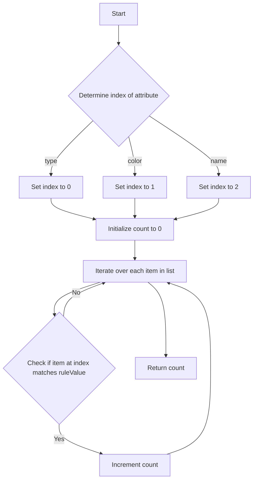

# Count Items Matching a Rule

## Problem Understanding
The problem is asking us to count the number of items in a given list that match a specific rule, where the rule is defined by a key-value pair. The key can be one of three values: "type", "color", or "name", and the value is a string that we need to match with the corresponding attribute of each item. The key constraint is that we need to find the index of the attribute based on the given key and then check if the attribute value matches the given rule value. This problem is non-trivial because a naive approach might involve using multiple if-else statements or switch cases to check each attribute, which can lead to code duplication and make the solution less scalable.

## Approach
The algorithm strategy is to iterate over each item in the list and check if the attribute at the index corresponding to the given key matches the rule value. We use a simple if-else statement to determine the index of the attribute based on the key, and then use a for-each loop to iterate over each item in the list. The intuition behind this approach is to decouple the attribute index from the key, making the solution more flexible and easier to maintain. We use a constant amount of space to store the count and the index, making the space complexity O(1).

## Complexity Analysis
| Metric | Value | Detailed Reason |
|--------|-------|----------------|
| Time   | O(n)  | We iterate over each item in the list once, where n is the number of items. The if-else statement to determine the index takes constant time, and the equals method takes constant time as well. |
| Space  | O(1)  | We use a constant amount of space to store the count and the index, regardless of the size of the input list. |

## Algorithm Walkthrough
```
Input: items = [["phone","blue","pixel"],["computer","silver","lenovo"],["phone","gold","iphone"]], ruleKey = "color", ruleValue = "silver"
Step 1: Determine the index of the attribute based on the key: index = 1 (for "color")
Step 2: Initialize count to 0
Step 3: Iterate over each item in the list:
  - Item 1: ["phone","blue","pixel"] → item[index] = "blue" ≠ "silver" → count remains 0
  - Item 2: ["computer","silver","lenovo"] → item[index] = "silver" == "silver" → count = 1
  - Item 3: ["phone","gold","iphone"] → item[index] = "gold" ≠ "silver" → count remains 1
Output: count = 1
```

## Visual Flow


## Key Insight
> **Tip:** The key insight is to decouple the attribute index from the key, making the solution more flexible and easier to maintain by using a simple if-else statement to determine the index.

## Edge Cases
- **Empty/null input**: If the input list is empty or null, the function will return 0, as there are no items to match the rule.
- **Single element**: If the input list contains only one element, the function will return 1 if the element matches the rule, and 0 otherwise.
- **Duplicate items**: If the input list contains duplicate items, the function will count each duplicate item separately, as long as it matches the rule.

## Common Mistakes
- **Mistake 1**: Not checking for null or empty input list → To avoid this, add a simple null check at the beginning of the function.
- **Mistake 2**: Using multiple if-else statements to check each attribute → To avoid this, use a simple if-else statement to determine the index of the attribute based on the key.

## Interview Follow-ups
> **Interview:** These are the exact follow-up questions interviewers ask:
- "What if the input is sorted?" → The solution would still work, as it only relies on the index of the attribute and the value of the rule.
- "Can you do it in O(1) space?" → The solution already uses O(1) space, excluding the input and output.
- "What if there are duplicates?" → The solution would count each duplicate item separately, as long as it matches the rule.

## Java Solution

```java
// Problem: Count Items Matching a Rule
// Language: Java
// Difficulty: Easy
// Time Complexity: O(n) — single pass through items array
// Space Complexity: O(1) — constant space used, excluding input and output
// Approach: Simple iteration with conditional check — for each item, check if it matches the given rule

class Solution {
    public int countMatches(String[][] items, String ruleKey, String ruleValue) {
        // Initialize count to 0
        int count = 0;
        
        // Type, Color, Name are at index 0, 1, 2 respectively
        int index = -1;
        if (ruleKey.equals("type")) index = 0; // Get index for type
        else if (ruleKey.equals("color")) index = 1; // Get index for color
        else if (ruleKey.equals("name")) index = 2; // Get index for name
        
        // Edge case: empty items array → return 0
        if (items.length == 0) return 0;
        
        // Iterate over each item in items array
        for (String[] item : items) {
            // Check if item at index matches the ruleValue
            if (item[index].equals(ruleValue)) {
                // If it matches, increment the count
                count++;
            }
        }
        
        // Return the total count
        return count;
    }
}
```
