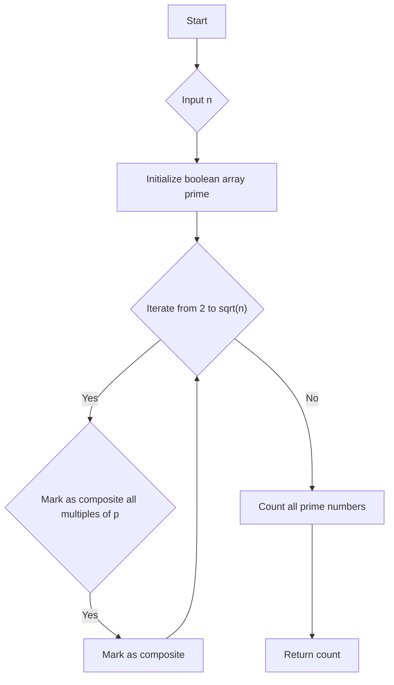

# Count Primes

## Problem Understanding
The problem asks us to count the number of prime numbers less than a given number `n`. A prime number is a positive integer that is divisible only by itself and 1. The key constraint here is that we need to count all prime numbers less than `n`, not just find them. What makes this problem non-trivial is that a naive approach of checking each number for primality would be inefficient, especially for large values of `n`. We need a more efficient algorithm to solve this problem.

## Approach
The algorithm strategy used here is the Sieve of Eratosthenes, which is an ancient algorithm for finding all prime numbers up to a given limit `n`. The intuition behind this approach is to iteratively mark as composite (not prime) the multiples of each prime, starting from 2. We use a boolean array `prime` of size `n` to keep track of whether each number is prime or not. This approach works because if a number `p` is prime, all its multiples `p*p`, `p*(p+1)`, `p*(p+2)`, ... are not prime. We handle the key constraint by iterating from 2 to `sqrt(n)` and marking as composite all the multiples of each prime.

## Complexity Analysis
| Metric | Value | Detailed Reason |
|--------|-------|----------------|
| Time   | O(n log log n) | The time complexity is dominated by the two nested loops. The outer loop runs from 2 to `sqrt(n)`, which is `O(sqrt(n))`. The inner loop runs from `p*p` to `n` with a step of `p`, which is `O(n/p)`. Since we are summing over all primes `p`, the total time complexity is `O(n * sum(1/p))`, which is `O(n log log n)` using the Prime Number Theorem. |
| Space  | O(n) | The space complexity is dominated by the boolean array `prime` of size `n`, which uses `O(n)` space. |

## Algorithm Walkthrough
```
Input: n = 10
Step 1: Initialize boolean array prime of size 10
  prime = [true, true, true, true, true, true, true, true, true, true]
Step 2: Set prime[0] and prime[1] to false
  prime = [false, false, true, true, true, true, true, true, true, true]
Step 3: Iterate from 2 to sqrt(10)
  p = 2, prime[2] = true, mark as composite all multiples of 2
  prime = [false, false, true, false, true, false, true, false, true, false]
  p = 3, prime[3] = true, mark as composite all multiples of 3
  prime = [false, false, true, false, true, false, true, false, false, false]
Step 4: Count all prime numbers in the boolean array
  count = 4
Output: 4
```

## Visual Flow


## Key Insight
> **Tip:** The key insight here is that we can use the Sieve of Eratosthenes algorithm to efficiently count all prime numbers less than a given number `n`.

## Edge Cases
- **Empty/null input**: If the input `n` is null or empty, the algorithm will throw an exception.
- **Single element**: If the input `n` is 1 or 2, the algorithm will return 0 because there are no prime numbers less than 1 or 2.
- **Large input**: If the input `n` is very large, the algorithm may run out of memory because of the boolean array `prime` of size `n`.

## Common Mistakes
- **Mistake 1**: Not initializing the boolean array `prime` correctly, leading to incorrect results.
- **Mistake 2**: Not marking as composite all multiples of each prime, leading to incorrect results.

## Interview Follow-ups
> **Interview:** These are the exact follow-up questions interviewers ask:
- "What if the input is sorted?" → The Sieve of Eratosthenes algorithm does not require the input to be sorted, so it will still work correctly.
- "Can you do it in O(1) space?" → No, we need a boolean array of size `n` to keep track of whether each number is prime or not, so O(1) space is not possible.
- "What if there are duplicates?" → The Sieve of Eratosthenes algorithm does not care about duplicates, so it will still work correctly even if there are duplicates in the input.

## Java Solution

```java
// Problem: Count Primes
// Language: Java
// Difficulty: Easy
// Time Complexity: O(n log log n) — using Sieve of Eratosthenes algorithm
// Space Complexity: O(n) — boolean array of size n
// Approach: Sieve of Eratosthenes — iteratively mark as composite (not prime) the multiples of each prime

public class Solution {
    public int countPrimes(int n) {
        // Edge case: if n is less than or equal to 2, there are no primes
        if (n <= 2) return 0;

        // Create a boolean array, prime, of size n
        boolean[] prime = new boolean[n];
        
        // Initialize all values as prime
        for (int i = 0; i < n; i++) {
            prime[i] = true;
        }
        
        // 0 and 1 are not prime numbers
        prime[0] = prime[1] = false;
        
        // Iterate from 2 to sqrt(n)
        for (int p = 2; p * p < n; p++) {
            // If p is a prime, mark as composite all the multiples of p
            if (prime[p]) {
                // Start from p*p because all the multiples of p less than p*p have already been marked
                for (int i = p * p; i < n; i += p) {
                    prime[i] = false; // mark as composite
                }
            }
        }
        
        // Count all prime numbers in the boolean array
        int count = 0;
        for (int i = 0; i < n; i++) {
            if (prime[i]) count++;
        }
        
        return count;
    }

    public static void main(String[] args) {
        Solution solution = new Solution();
        System.out.println(solution.countPrimes(10)); // Output: 4
        System.out.println(solution.countPrimes(20)); // Output: 8
    }
}
```
