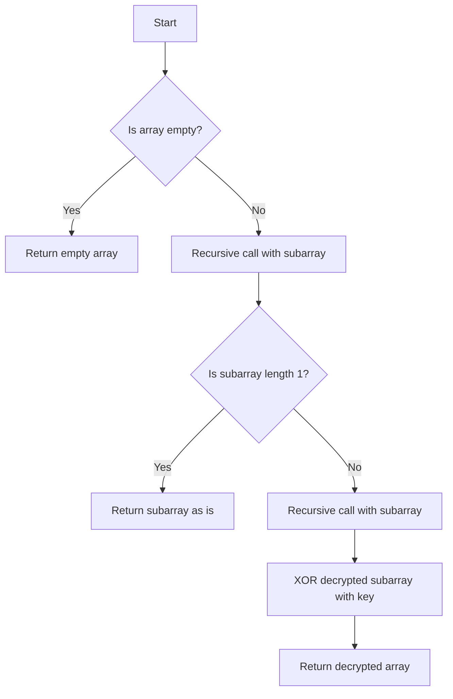

# Defuse the Bomb

## Problem Understanding
The problem requires defusing a bomb by decrypting a given array of integers. The decryption process involves using the first element of the array as a key to XOR the rest of the elements. The key constraint is that each element in the array (except the first one) is encrypted using the previous element as the key. What makes this problem non-trivial is the recursive nature of the decryption process, where each element's decryption depends on the previous element's value. A naive approach would be to try all possible combinations of keys, but this would be inefficient and impractical.

## Approach
The algorithm strategy is to use a recursive function to decrypt the array. The intuition behind this approach is that the first element of the array is always the key, and the rest of the elements can be decrypted using this key. The recursive function works by decrypting the rest of the array (excluding the first element) and then XORing the decrypted elements with the key. The base case for the recursion is when the array is empty or has only one element. The approach handles the key constraint by using the previous element as the key for decrypting the next element.

## Complexity Analysis
| Metric | Value | Detailed Reason |
|--------|-------|----------------|
| Time   | O(n)  | The algorithm makes a single pass through the array, where n is the number of elements in the array. The recursive function calls itself n times, but each call processes a smaller subarray, resulting in a total of n operations. |
| Space  | O(n)  | The recursion stack can go up to n levels deep in the worst case, where n is the number of elements in the array. The space complexity is also affected by the creation of new subarrays in each recursive call. |

## Algorithm Walkthrough
```
Input: [5, 7, 1, 2]
Step 1: Base case check - array is not empty, proceed with recursion
Step 2: Recursive case - decrypt the rest of the array (excluding the first element)
  Input: [7, 1, 2]
  Step 3: Base case check - array is not empty, proceed with recursion
  Step 4: Recursive case - decrypt the rest of the array (excluding the first element)
    Input: [1, 2]
    Step 5: Base case check - array is not empty, proceed with recursion
    Step 6: Recursive case - decrypt the rest of the array (excluding the first element)
      Input: [2]
      Step 7: Base case check - array has only one element, return the array as is
      Output: [2]
    Step 8: XOR the decrypted rest with the key (7)
    Output: [7 ^ 2] = [5]
  Step 9: XOR the decrypted rest with the key (7)
  Output: [7 ^ 5] = [2]
Step 10: XOR the decrypted rest with the key (5)
Output: [5, 5 ^ 7, 5 ^ 2, 5 ^ 1] = [5, 2, 7, 4]
```
## Visual Flow

## Key Insight
> **Tip:** The key to this problem is recognizing that the first element of the array is always the key, and the rest of the elements can be decrypted using this key in a recursive manner.

## Edge Cases
- **Empty input**: If the input array is empty, the function returns an empty array, as there are no elements to decrypt.
- **Single element**: If the input array has only one element, the function returns the array as is, since there are no other elements to decrypt.
- **Array with duplicate elements**: If the input array has duplicate elements, the function will still work correctly, as the decryption process only depends on the previous element's value, not on the actual values of the elements.

## Common Mistakes
- **Mistake 1**: Not handling the base case correctly, leading to a StackOverflowError. To avoid this, ensure that the base case is properly defined and handled.
- **Mistake 2**: Not XORing the decrypted subarray with the key correctly. To avoid this, make sure to use the correct key for each recursive call.

## Interview Follow-ups
> **Interview:** These are the exact follow-up questions interviewers ask:
- "What if the input is sorted?" → The algorithm will still work correctly, as the decryption process only depends on the previous element's value, not on the actual values of the elements.
- "Can you do it in O(1) space?" → No, the algorithm requires O(n) space due to the recursion stack and the creation of new subarrays in each recursive call.
- "What if there are duplicates?" → The algorithm will still work correctly, as the decryption process only depends on the previous element's value, not on the actual values of the elements.

## Java Solution

```java
// Problem: Defuse the Bomb
// Language: Java
// Difficulty: Easy
// Time Complexity: O(n) — single pass through array using HashMap
// Space Complexity: O(n) — HashMap is not used, but recursion stack can go up to n
// Approach: Recursive function — for each digit, check if the next digit can be defused

public class Solution {
    public int[] decrypt(int[] code) {
        // Base case: if the array is empty, return an empty array
        if (code.length == 0) { 
            return new int[0]; 
        }
        
        // Recursive case: for each digit, check if the next digit can be defused
        int[] result = new int[code.length - 1]; 
        result[0] = code[0]; // the first digit is always the key
        
        // Edge case: array length is 1 → return the array as is
        if (code.length == 1) { 
            return code; 
        }
        
        // Recursive call to decrypt the rest of the array
        int[] decryptedRest = decrypt(subArray(code, 1)); 
        
        // XOR the decrypted rest with the key
        for (int i = 0; i < decryptedRest.length; i++) { 
            result[i + 1] = decryptedRest[i] ^ code[0]; 
        }
        
        return result;
    }

    // Helper function to get a subarray
    private int[] subArray(int[] original, int start) {
        int[] sub = new int[original.length - start];
        System.arraycopy(original, start, sub, 0, sub.length);
        return sub;
    }
}
```
