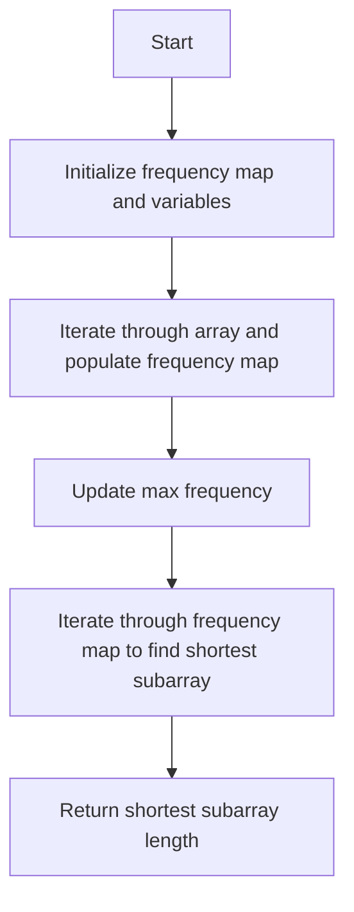

# Degree of an Array

## Problem Understanding
The problem is asking to find the length of the shortest subarray that contains all occurrences of the most frequent element(s) in the given array. The key constraint is to find the shortest subarray, which implies that we need to track the first and last occurrences of each number. The problem becomes non-trivial because a naive approach, such as sorting the array and then finding the most frequent element, would not work as it would not preserve the original order of the elements.

## Approach
The algorithm strategy is to use a HashMap to store the frequency, first, and last occurrence of each number in the array. The intuition behind this approach is to make a single pass through the array to count the occurrences and find the first and last occurrences of each number. This approach works because it allows us to efficiently track the frequency and occurrences of each number, and then use this information to find the shortest subarray with the maximum frequency. The HashMap is used to store the frequency and occurrences of each number, and variables are used to track the maximum frequency and the shortest subarray length.

## Complexity Analysis
| Metric | Value | Detailed Reason |
|--------|-------|----------------|
| Time   | O(n)  | The algorithm makes two passes through the array: one to populate the frequency map and update the max frequency, and another to find the shortest subarray with the maximum frequency. Each pass takes O(n) time, so the overall time complexity is O(n). |
| Space  | O(n)  | The HashMap stores at most n elements, where n is the length of the input array. This is because each number in the array is stored in the HashMap, and there are n numbers in the worst case. |

## Algorithm Walkthrough
Input: `[1, 2, 2, 3, 1]`
Step 1: Initialize the frequency map and variables: `frequencyMap = {}`, `maxFrequency = 0`, `shortestSubArrayLength = 5`
Step 2: Iterate through the array and populate the frequency map:
- `i = 0`, `nums[i] = 1`, `frequencyMap = {1: [1, 0, 0]}`
- `i = 1`, `nums[i] = 2`, `frequencyMap = {1: [1, 0, 0], 2: [1, 1, 1]}`
- `i = 2`, `nums[i] = 2`, `frequencyMap = {1: [1, 0, 0], 2: [2, 1, 2]}`
- `i = 3`, `nums[i] = 3`, `frequencyMap = {1: [1, 0, 0], 2: [2, 1, 2], 3: [1, 3, 3]}`
- `i = 4`, `nums[i] = 1`, `frequencyMap = {1: [2, 0, 4], 2: [2, 1, 2], 3: [1, 3, 3]}`
Step 3: Update the max frequency: `maxFrequency = 2`
Step 4: Iterate through the frequency map to find the shortest subarray with the maximum frequency:
- `values = frequencyMap.get(1) = [2, 0, 4]`, `subArrayLength = 5`, `shortestSubArrayLength = 5`
- `values = frequencyMap.get(2) = [2, 1, 2]`, `subArrayLength = 2`, `shortestSubArrayLength = 2`
Output: `2`

## Visual Flow


## Key Insight
> **Tip:** The key insight is to use a HashMap to efficiently track the frequency, first, and last occurrence of each number in the array, allowing us to find the shortest subarray with the maximum frequency in a single pass.

## Edge Cases
- **Empty input**: If the input array is empty, the function returns 0, as there are no elements to process.
- **Single element**: If the input array contains a single element, the function returns 1, as the shortest subarray is the single element itself.
- **All elements are the same**: If all elements in the input array are the same, the function returns the length of the array, as the shortest subarray is the entire array.

## Common Mistakes
- **Mistake 1**: Not updating the max frequency when iterating through the array. To avoid this, make sure to update the max frequency whenever a higher frequency is found.
- **Mistake 2**: Not handling the case where multiple numbers have the same maximum frequency. To avoid this, make sure to iterate through the frequency map and find the shortest subarray for each number with the maximum frequency.

## Interview Follow-ups
> **Interview:** These are the exact follow-up questions interviewers ask:
- "What if the input is sorted?" → The algorithm still works in O(n) time, as it only needs to make a single pass through the array to populate the frequency map and find the shortest subarray.
- "Can you do it in O(1) space?" → No, it is not possible to solve the problem in O(1) space, as we need to store the frequency and occurrences of each number, which requires at least O(n) space.
- "What if there are duplicates?" → The algorithm handles duplicates correctly, as it uses a HashMap to store the frequency and occurrences of each number, and updates the frequency and last occurrence accordingly.

## Java Solution

```java
// Problem: Degree of an Array
// Language: Java
// Difficulty: Easy
// Time Complexity: O(n) — single pass through array to count occurrences and find first/last occurrences
// Space Complexity: O(n) — HashMap stores at most n elements
// Approach: HashMap frequency count and first/last occurrence tracking — for each number, track its frequency, first, and last occurrence

public class Solution {
    public int findShortestSubArray(int[] nums) {
        // Edge case: empty input → return 0
        if (nums.length == 0) return 0;

        // Initialize a HashMap to store frequency, first, and last occurrence of each number
        java.util.HashMap<Integer, int[]> frequencyMap = new java.util.HashMap<>();

        // Initialize variables to track the maximum frequency and the shortest subarray length
        int maxFrequency = 0;
        int shortestSubArrayLength = nums.length;

        // Iterate through the array to populate the frequency map and update max frequency
        for (int i = 0; i < nums.length; i++) {
            // If the number is not in the map, add it with frequency 1 and current index as first and last occurrence
            if (!frequencyMap.containsKey(nums[i])) {
                frequencyMap.put(nums[i], new int[] {1, i, i});
            } 
            // If the number is already in the map, increment its frequency and update its last occurrence
            else {
                int[] values = frequencyMap.get(nums[i]);
                values[0]++; // increment frequency
                values[2] = i; // update last occurrence
                frequencyMap.put(nums[i], values);
            }

            // Update max frequency if the current number's frequency is higher
            maxFrequency = Math.max(maxFrequency, frequencyMap.get(nums[i])[0]);
        }

        // Iterate through the frequency map to find the shortest subarray with the maximum frequency
        for (int[] values : frequencyMap.values()) {
            // If the current number's frequency is equal to the max frequency, calculate its subarray length
            if (values[0] == maxFrequency) {
                // Calculate the subarray length as the difference between the last and first occurrences plus 1
                int subArrayLength = values[2] - values[1] + 1;
                // Update the shortest subarray length if the current subarray is shorter
                shortestSubArrayLength = Math.min(shortestSubArrayLength, subArrayLength);
            }
        }

        // Return the shortest subarray length
        return shortestSubArrayLength;
    }

    public static void main(String[] args) {
        Solution solution = new Solution();
        int[] nums = {1, 2, 2, 3, 1};
        System.out.println(solution.findShortestSubArray(nums)); // Output: 2
    }
}
```
