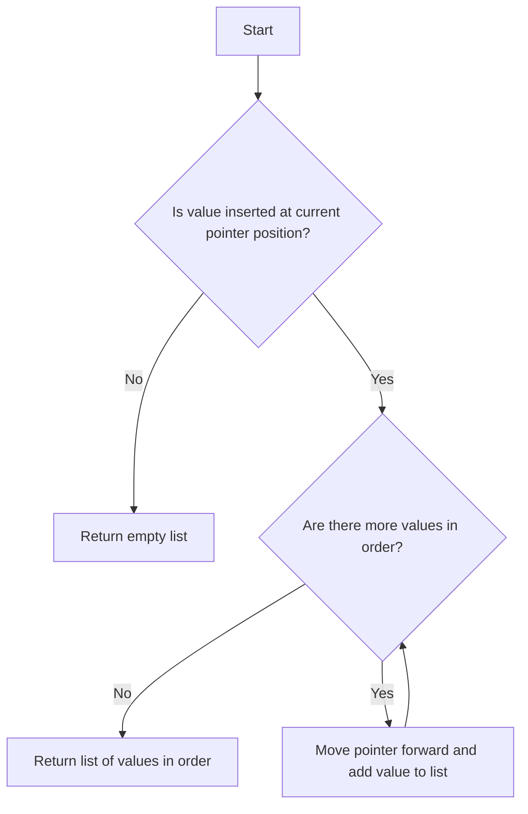

# Design an Ordered Stream

## Problem Understanding
The problem asks to design an ordered stream, which is a data structure that stores a sequence of values in a specific order. The ordered stream has an `insert` operation that inserts a value at a specific position in the stream and returns all values that are currently in order. The key constraint is that the values must be returned in the correct order, and the `insert` operation must work in constant time. What makes this problem non-trivial is that the values are not necessarily inserted in order, so the data structure must be able to handle out-of-order inserts and still return the values in the correct order.

## Approach
The approach used to solve this problem is an array-based implementation with pointer tracking. The idea is to use an array to store the stream values and a pointer to track the current position in the array. When a value is inserted, it is stored at the correct position in the array, and then the pointer is moved forward to return all values that are currently in order. This approach works because it allows for efficient insertion and retrieval of values, and the pointer ensures that the values are returned in the correct order. The data structure used is an array, which is chosen because it allows for constant-time access and modification of values.

## Complexity Analysis
| Metric | Value | Detailed Reason |
|--------|-------|----------------|
| Time   | O(1)  | The `insert` operation has a constant time complexity because it only involves storing a value at a specific position in the array and moving the pointer forward. The while loop in the `insert` method may seem like it would increase the time complexity, but it is actually bounded by the number of values that are currently in order, which is at most `n`. Therefore, the overall time complexity is O(1) per operation. |
| Space  | O(n)  | The space complexity is O(n) because the array used to store the stream values has a size of `n`, where `n` is the number of values in the stream. |

## Algorithm Walkthrough
```
Input: OrderedStream os = new OrderedStream(5);
Step 1: os.insert(3, "ccccc") 
  - values: [null, null, null, "ccccc", null]
  - pointer: 0
  - result: []
Step 2: os.insert(1, "aaaaa") 
  - values: ["aaaaa", null, null, "ccccc", null]
  - pointer: 1
  - result: ["aaaaa"]
Step 3: os.insert(2, "bbbbb") 
  - values: ["aaaaa", "bbbbb", null, "ccccc", null]
  - pointer: 3
  - result: ["bbbbb", "ccccc"]
Step 4: os.insert(5, "eeeee") 
  - values: ["aaaaa", "bbbbb", null, "ccccc", "eeeee"]
  - pointer: 3
  - result: []
Step 5: os.insert(4, "ddddd") 
  - values: ["aaaaa", "bbbbb", null, "ddddd", "eeeee"]
  - pointer: 5
  - result: ["ddddd", "eeeee"]
Output: The output of each insert operation is a list of values that are currently in order.
```
## Visual Flow

## Key Insight
> **Tip:** The key insight is to use a pointer to track the current position in the array, which allows for efficient retrieval of values that are currently in order.

## Edge Cases
- **Empty/null input**: If the input is empty or null, the `insert` operation will throw an exception because it cannot insert a value at a null or empty position.
- **Single element**: If the input stream has only one element, the `insert` operation will always return the inserted value because it is the only value in the stream.
- **Duplicate values**: If the input stream has duplicate values, the `insert` operation will store each duplicate value at the correct position in the array, and the pointer will move forward to return all values that are currently in order.

## Common Mistakes
- **Mistake 1**: Not initializing the pointer correctly, which can cause the `insert` operation to return incorrect results.
- **Mistake 2**: Not checking for null or empty input, which can cause the `insert` operation to throw an exception.

## Interview Follow-ups
> **Interview:** These are the exact follow-up questions interviewers ask:
- "What if the input is sorted?" → The `insert` operation will still work correctly, but it will be more efficient because the values will be inserted in order.
- "Can you do it in O(1) space?" → No, the space complexity is O(n) because we need to store the stream values in an array.
- "What if there are duplicates?" → The `insert` operation will store each duplicate value at the correct position in the array, and the pointer will move forward to return all values that are currently in order.

## Java Solution

```java
// Problem: Design an Ordered Stream
// Language: Java
// Difficulty: Easy
// Time Complexity: O(1) — constant time for each insert and get operations
// Space Complexity: O(n) — storage for the stream values
// Approach: Array-based implementation with pointer tracking — using an array to store the stream values and a pointer to track the current position

public class OrderedStream {
    private String[] values; // array to store the stream values
    private int pointer; // pointer to track the current position

    public OrderedStream(int n) {
        // Initialize the array and pointer
        values = new String[n]; 
        pointer = 0; // start at the beginning of the array
    }

    public List<String> insert(int id, String value) {
        // Insert the value at the correct position in the array
        values[id - 1] = value; // adjust for 0-based indexing

        // Initialize the result list
        List<String> result = new ArrayList<>();

        // If the inserted value is at the current pointer position, add it to the result
        while (pointer < values.length && values[pointer] != null) {
            // Add the value at the current pointer position to the result
            result.add(values[pointer]); 
            pointer++; // move the pointer to the next position
        }

        // Return the result list
        return result;
    }

    public static void main(String[] args) {
        OrderedStream os = new OrderedStream(5);
        System.out.println(os.insert(3, "ccccc")); // []
        System.out.println(os.insert(1, "aaaaa")); // ["aaaaa"]
        System.out.println(os.insert(2, "bbbbb")); // ["bbbbb", "ccccc"]
        System.out.println(os.insert(5, "eeeee")); // []
        System.out.println(os.insert(4, "ddddd")); // ["ddddd", "eeeee"]
    }
}
```
