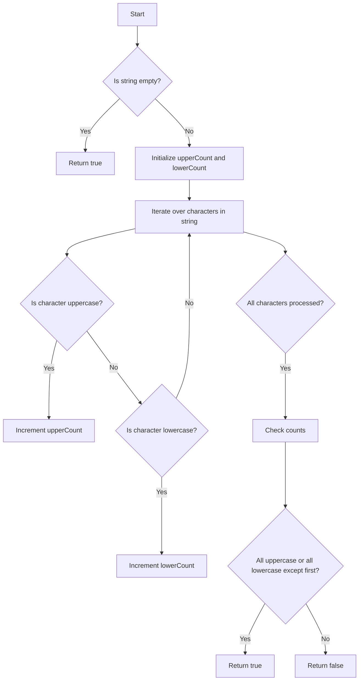

# Detect Capital

## Problem Understanding
The problem is asking to determine whether a given string has proper capitalization, where proper capitalization means the string is either all uppercase, all lowercase, or the first character is uppercase and the rest are lowercase. The key constraint is that the input string can be empty, and the solution should handle this edge case. What makes this problem non-trivial is that a naive approach might involve checking all possible combinations of uppercase and lowercase letters, which would lead to inefficient solutions. However, by classifying characters into uppercase and lowercase, we can simplify the problem and develop a more efficient solution.

## Approach
The algorithm strategy is to classify each character in the string as uppercase or lowercase and then check the counts of these characters to determine if the string has proper capitalization. The intuition behind this approach is that a string with proper capitalization will have either all uppercase letters, all lowercase letters, or a single uppercase letter at the beginning followed by all lowercase letters. This approach works because it leverages the properties of uppercase and lowercase letters to simplify the problem. The data structure used is a simple iteration over the characters in the string, and the approach handles the key constraint of empty strings by returning true for this edge case.

## Complexity Analysis
| Metric | Value | Detailed Reason |
|--------|-------|----------------|
| Time   | O(n)  | The solution involves a single pass through the string, where n is the length of the string. This is because the solution iterates over each character in the string exactly once. |
| Space  | O(1)  | The solution uses a constant amount of space to store the counts of uppercase and lowercase letters. This is because the space used does not grow with the size of the input string. |

## Algorithm Walkthrough
```
Input: "Google"
Step 1: Initialize upperCount = 0 and lowerCount = 0
Step 2: Iterate over the characters in the string
    - 'G' is uppercase, so upperCount = 1
    - 'o' is lowercase, so lowerCount = 1
    - 'o' is lowercase, so lowerCount = 2
    - 'g' is lowercase, so lowerCount = 3
    - 'l' is lowercase, so lowerCount = 4
    - 'e' is lowercase, so lowerCount = 5
Step 3: Check the counts
    - upperCount = 1 and Character.isUpperCase('G') is true, so return true
Output: true
```

## Visual Flow


## Key Insight
> **Tip:** The single most important insight is that proper capitalization can be determined by checking the counts of uppercase and lowercase letters, allowing for an efficient solution that avoids unnecessary complexity.

## Edge Cases
- **Empty/null input**: The solution returns true for an empty string, as it satisfies all conditions.
- **Single element**: The solution correctly handles strings with a single character, returning true if the character is either uppercase or lowercase.
- **All uppercase**: The solution correctly handles strings with all uppercase letters, returning true.

## Common Mistakes
- **Mistake 1**: Not handling the edge case of an empty string. To avoid this, add a check at the beginning of the solution to return true for an empty string.
- **Mistake 2**: Not correctly counting uppercase and lowercase letters. To avoid this, use the `Character.isUpperCase` and `Character.isLowerCase` methods to accurately classify characters.

## Interview Follow-ups
> **Interview:** These are the exact follow-up questions interviewers ask:
- "What if the input is sorted?" → The solution does not rely on the input being sorted, so it would still work correctly.
- "Can you do it in O(1) space?" → The solution already uses O(1) space, so this is not a concern.
- "What if there are duplicates?" → The solution handles duplicates correctly, as it classifies each character individually and does not rely on the presence or absence of duplicates.

## Java Solution

```java
// Problem: Detect Capital
// Language: Java
// Difficulty: Easy
// Time Complexity: O(n) — single pass through string
// Space Complexity: O(1) — constant space used
// Approach: Character classification — check capitalization of each character

class Solution {
    public boolean detectCapitalUse(String word) {
        // Edge case: empty string → return true, as it satisfies all conditions
        if (word.isEmpty()) return true;
        
        // Count the number of uppercase and lowercase letters
        int upperCount = 0; // count of uppercase letters
        int lowerCount = 0; // count of lowercase letters
        for (char c : word.toCharArray()) {
            // Check if character is uppercase or lowercase
            if (Character.isUpperCase(c)) upperCount++; 
            else if (Character.isLowerCase(c)) lowerCount++;
        }
        
        // Check if all letters are uppercase or all letters except the first are lowercase
        return (upperCount == word.length()) || 
               (upperCount == 1 && Character.isUpperCase(word.charAt(0))) || 
               (lowerCount == word.length());
    }
}
```
