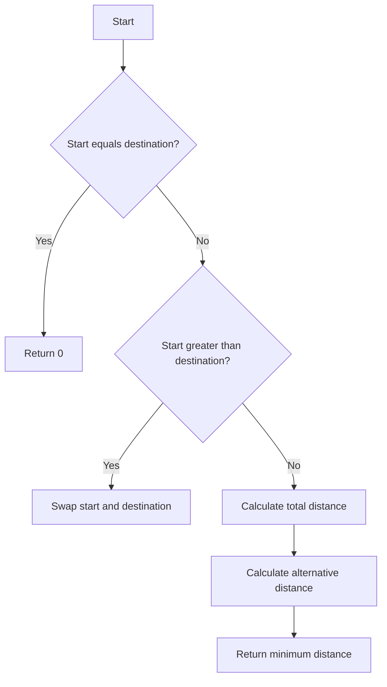

# Distance Between Bus Stops

## Problem Understanding
The problem is asking to find the shortest distance between two bus stops on a circular route. The key constraints are that the bus stops are represented by an array of distances, and the start and destination stops are given. The implication of this circular route is that we can travel from the start to the destination in two ways: directly or by going around the circle. What makes this problem non-trivial is that we need to consider both possibilities and choose the shorter one, which requires a careful comparison of the distances.

## Approach
The algorithm strategy is to calculate the total distance between the start and destination stops directly and indirectly (by going around the circle). The intuition behind this approach is that the shortest distance will be the minimum of these two calculations. We use a simple iterative approach to calculate the distances, adding up the individual distances in the array. We also ensure that the start index is less than or equal to the destination index to simplify the calculation. The key data structure used is the array of distances, which allows us to easily calculate the distances.

## Complexity Analysis
| Metric | Value | Detailed Reason |
|--------|-------|----------------|
| Time   | O(n)  | We iterate through the array of distances twice: once to calculate the direct distance and once to calculate the indirect distance. The maximum number of iterations is equal to the number of bus stops (n). |
| Space  | O(1)  | We only use a constant amount of space to store the total distance and alternative distance variables, regardless of the input size. |

## Algorithm Walkthrough
```
Input: distance = [1, 2, 3, 4], start = 0, destination = 1
Step 1: Ensure start is less than or equal to destination (already true)
Step 2: Calculate the total distance between start and destination: totalDistance = 2
Step 3: Calculate the distance from start to the end and then from the beginning to destination: alternativeDistance = 1 + 3 + 4 = 8
Step 4: Return the minimum of the total distance and the alternative distance: min(totalDistance, alternativeDistance) = min(2, 8) = 2
Output: 2
```

## Visual Flow


## Key Insight
> **Tip:** The key insight is to recognize that the shortest distance between two bus stops on a circular route can be either the direct distance or the indirect distance (by going around the circle), and we need to calculate and compare both possibilities.

## Edge Cases
- **Empty/null input**: If the input array is empty or null, we should throw an exception or return an error message, as there are no bus stops to calculate the distance between.
- **Single element**: If the input array has only one element, the start and destination indices should be the same, and the function should return 0, as there is no distance to calculate.
- **Start equals destination**: If the start index equals the destination index, the function should return 0, as there is no distance to calculate.

## Common Mistakes
- **Mistake 1**: Forgetting to handle the case where the start index is greater than the destination index, which can lead to incorrect results. To avoid this, we need to ensure that the start index is less than or equal to the destination index.
- **Mistake 2**: Not considering the alternative distance (by going around the circle), which can lead to incorrect results. To avoid this, we need to calculate and compare both the direct distance and the indirect distance.

## Interview Follow-ups
> **Interview:** These are the exact follow-up questions interviewers ask:
- "What if the input is sorted?" → The algorithm still works correctly, as it only relies on the indices and values of the input array, not on the order of the elements.
- "Can you do it in O(1) space?" → No, the algorithm requires at least O(1) space to store the total distance and alternative distance variables, but it cannot be done in less than O(1) space.
- "What if there are duplicates?" → The algorithm still works correctly, as it only relies on the indices and values of the input array, not on the uniqueness of the elements.

## Java Solution

```java
// Problem: Distance Between Bus Stops
// Language: Java
// Difficulty: Easy
// Time Complexity: O(n) — single pass through array
// Space Complexity: O(1) — constant space used
// Approach: prefix sum calculation — for each stop, calculate the distance to the start and end

public class Solution {
    public int distanceBetweenBusStops(int[] distance, int start, int destination) {
        // Edge case: start equals destination → return 0
        if (start == destination) return 0;

        // Ensure start is less than or equal to destination
        if (start > destination) {
            int temp = start; // Swap start and destination
            start = destination;
            destination = temp;
        }

        // Calculate the total distance between start and destination
        int totalDistance = 0; // Initialize total distance
        for (int i = start; i < destination; i++) { // Iterate from start to destination
            totalDistance += distance[i]; // Add the distance to the total
        }

        // Calculate the distance from start to the end and then from the beginning to destination
        int alternativeDistance = 0; // Initialize alternative distance
        for (int i = 0; i < start; i++) { // Iterate from the beginning to start
            alternativeDistance += distance[i]; // Add the distance to the alternative distance
        }
        for (int i = destination; i < distance.length; i++) { // Iterate from destination to the end
            alternativeDistance += distance[i]; // Add the distance to the alternative distance
        }

        // Return the minimum of the total distance and the alternative distance
        return Math.min(totalDistance, alternativeDistance); // Return the minimum distance
    }

    public static void main(String[] args) {
        Solution solution = new Solution();
        int[] distance = {1, 2, 3, 4};
        int start = 0;
        int destination = 1;
        System.out.println(solution.distanceBetweenBusStops(distance, start, destination));
    }
}
```
