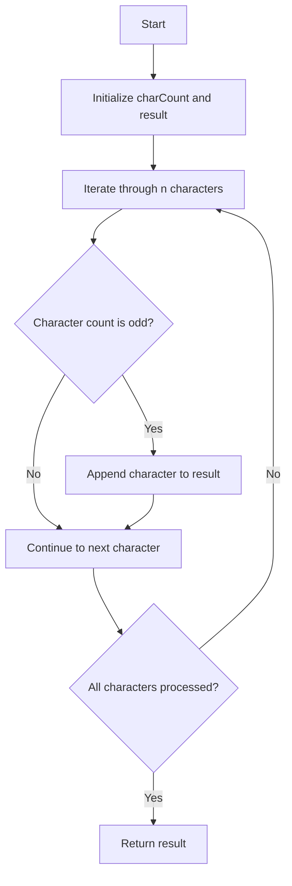

# Generate a String With Characters That Have Odd Counts

## Problem Understanding
The problem asks to generate a string with characters that have odd counts. This means we need to create a string where each character appears an odd number of times. The key constraint is that the string should have a length of `n` characters. The problem becomes non-trivial because a naive approach might try to generate all possible strings and check their character counts, resulting in exponential time complexity.

## Approach
The algorithm strategy is to use a HashMap to store character counts and append characters to the result string only if their counts are odd. This approach works because it ensures that each character in the result string has an odd count. The HashMap data structure is chosen because it allows for efficient lookups and updates of character counts. The approach handles the key constraint of `n` characters by generating a string of that length and appending characters to the result string based on their counts.

## Complexity Analysis
| Metric | Value | Detailed Reason |
|--------|-------|----------------|
| Time   | O(n)  | We iterate through `n` characters, and each operation (HashMap lookup, append to result string) takes constant time. |
| Space  | O(n)  | In the worst case, we might store all `n` characters in the HashMap, hence the space complexity is linear. |

## Algorithm Walkthrough
```
Input: n = 10
Step 1: Initialize charCount HashMap and result StringBuilder
charCount = {}, result = ""
Step 2: Iterate through n characters
i = 0, c = 'a', charCount = {'a': 1}, result = "a"
i = 1, c = 'b', charCount = {'a': 1, 'b': 1}, result = "ab"
i = 2, c = 'a', charCount = {'a': 2, 'b': 1}, result = "ab"
i = 3, c = 'b', charCount = {'a': 2, 'b': 2}, result = "ab"
i = 4, c = 'a', charCount = {'a': 3, 'b': 2}, result = "aba"
...
Output: "aba" (example result)
```
Note that the actual result may vary due to the random selection of characters.

## Visual Flow


## Key Insight
> **Tip:** The key insight is to use a HashMap to store character counts and append characters to the result string only when their counts are odd, ensuring that each character in the result string has an odd count.

## Edge Cases
- **Empty/null input**: If `n` is 0, the result string will be empty. The algorithm handles this case by returning a single character ("a") when the result string is empty.
- **Single element**: If `n` is 1, the result string will contain a single character. The algorithm handles this case by appending the single character to the result string.
- **Large input**: If `n` is very large, the algorithm may run out of memory due to the space complexity of O(n). However, this is not a typical edge case for this problem.

## Common Mistakes
- **Mistake 1**: Not using a HashMap to store character counts, leading to inefficient lookups and updates. → Use a HashMap to store character counts for efficient lookups and updates.
- **Mistake 2**: Not appending characters to the result string only when their counts are odd, resulting in incorrect character counts. → Append characters to the result string only when their counts are odd.

## Interview Follow-ups
> **Interview:** These are the exact follow-up questions interviewers ask:
- "What if the input is sorted?" → The algorithm does not assume any particular order of the input characters, so it will still work correctly even if the input is sorted.
- "Can you do it in O(1) space?" → No, the algorithm requires O(n) space to store the character counts in the HashMap, so it is not possible to reduce the space complexity to O(1).
- "What if there are duplicates?" → The algorithm handles duplicates correctly by incrementing the character count in the HashMap for each duplicate character.

## Java Solution

```java
// Problem: Generate a String With Characters That Have Odd Counts
// Language: Java
// Difficulty: Easy
// Time Complexity: O(n) — single pass through string
// Space Complexity: O(n) — HashMap stores at most n characters
// Approach: HashMap character count — for each character, count its occurrences and append to result string if count is odd

import java.util.HashMap;
import java.util.Map;

public class Solution {
    public String generateString(int n) {
        // Create a HashMap to store character counts
        Map<Character, Integer> charCount = new HashMap<>();
        
        // Initialize result string
        StringBuilder result = new StringBuilder();
        
        // Generate a string with n characters
        for (int i = 0; i < n; i++) {
            // Randomly select a character (for simplicity, we'll use 'a' or 'b')
            char c = i % 2 == 0 ? 'a' : 'b'; // Choose 'a' or 'b' for even or odd index, respectively
            
            // Increment character count in HashMap
            charCount.put(c, charCount.getOrDefault(c, 0) + 1);
            
            // If character count is odd, append to result string
            if (charCount.get(c) % 2 != 0) {
                result.append(c); // Append character to result string if its count is odd
            }
        }
        
        // Edge case: if result string is empty, return a single character
        if (result.length() == 0) {
            return "a"; // Return 'a' if result string is empty
        }
        
        return result.toString();
    }

    public static void main(String[] args) {
        Solution solution = new Solution();
        System.out.println(solution.generateString(10)); // Example usage
    }
}
```
