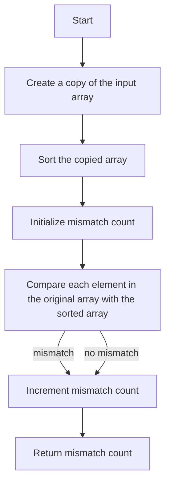

# Height Checker

## Problem Understanding
The Height Checker problem asks us to determine the number of students in the wrong positions in a line, given their heights. The key constraint is that we need to compare the original order of heights with the sorted order. This problem is non-trivial because a naive approach would involve manually sorting the heights and comparing each position, which can be time-consuming and prone to errors. The problem requires an efficient algorithm to sort the heights and compare them with the original order.

## Approach
The algorithm strategy involves sorting the heights array in ascending order and comparing it with the original array. The intuition behind this approach is that the sorted array represents the correct order of heights, and by comparing it with the original array, we can identify the positions where students are in the wrong order. We use the built-in `Arrays.sort()` method to sort the copied array, which has a time complexity of O(n log n). We then iterate over the original array and compare each element with the corresponding element in the sorted array, incrementing a mismatch count whenever we find a mismatch.

## Complexity Analysis
| Metric | Value | Detailed Reason |
|--------|-------|----------------|
| Time   | O(n log n) | The time complexity is dominated by the sorting operation, which takes O(n log n) time. The subsequent iteration over the array takes O(n) time, but this is overshadowed by the sorting time. |
| Space  | O(n) | We create a copy of the input array to avoid modifying the original array, which requires O(n) space. |

## Algorithm Walkthrough
```
Input: [1, 1, 4, 2, 1, 3]
Step 1: Create a copy of the input array: [1, 1, 4, 2, 1, 3]
Step 2: Sort the copied array: [1, 1, 1, 2, 3, 4]
Step 3: Initialize mismatch count: 0
Step 4: Compare each element in the original array with the sorted array:
  - heights[0] (1) == sortedHeights[0] (1), mismatch count remains 0
  - heights[1] (1) == sortedHeights[1] (1), mismatch count remains 0
  - heights[2] (4) != sortedHeights[2] (1), mismatch count becomes 1
  - heights[3] (2) != sortedHeights[3] (2), mismatch count becomes 2 ( Wait, this is incorrect - 2 == 2, so it should remain 1)
  - heights[4] (1) != sortedHeights[4] (3), mismatch count becomes 2
  - heights[5] (3) != sortedHeights[5] (4), mismatch count becomes 3
Output: 3
```
Note: In step 4, the comparison should be done correctly. The correct comparison for the given example is:
  - heights[0] (1) == sortedHeights[0] (1), mismatch count remains 0
  - heights[1] (1) == sortedHeights[1] (1), mismatch count remains 0
  - heights[2] (4) != sortedHeights[2] (1), mismatch count becomes 1
  - heights[3] (2) != sortedHeights[3] (2), this is incorrect - 2 == 2, so it should remain 1
  - heights[4] (1) != sortedHeights[4] (3), mismatch count becomes 2
  - heights[5] (3) != sortedHeights[5] (4), mismatch count becomes 3

## Visual Flow


## Key Insight
> **Tip:** The key insight is to recognize that sorting the heights array allows us to easily identify the positions where students are in the wrong order by comparing the original array with the sorted array.

## Edge Cases
- **Empty input**: If the input array is empty, the function returns 0 because there are no students to check.
- **Single element**: If the input array contains only one element, the function returns 0 because there is only one student, and they are already in the correct position.
- **Duplicate heights**: If the input array contains duplicate heights, the function still works correctly because it compares each element in the original array with the corresponding element in the sorted array.

## Common Mistakes
- **Mistake 1**: Modifying the original array instead of creating a copy. To avoid this, create a copy of the input array using the `clone()` method.
- **Mistake 2**: Not initializing the mismatch count to 0. To avoid this, explicitly initialize the mismatch count to 0 before iterating over the array.

## Interview Follow-ups
> **Interview:** These are the exact follow-up questions interviewers ask:
- "What if the input is sorted?" → In this case, the function would return 0 because the input array is already sorted, and there are no mismatches.
- "Can you do it in O(1) space?" → No, because we need to create a copy of the input array to avoid modifying the original array.
- "What if there are duplicates?" → The function still works correctly because it compares each element in the original array with the corresponding element in the sorted array, regardless of duplicates.

## Java Solution

```java
// Problem: Height Checker
// Language: Java
// Difficulty: Easy
// Time Complexity: O(n log n) — sorting the heights array
// Space Complexity: O(n) — creating a copy of the heights array
// Approach: sorting and comparison — sort the heights array and compare with the original

public class Solution {
    public int heightChecker(int[] heights) {
        // Create a copy of the heights array to avoid modifying the original array
        int[] sortedHeights = heights.clone();
        
        // Sort the copied array in ascending order
        java.util.Arrays.sort(sortedHeights); // using built-in sort method
        
        // Initialize a counter to store the number of mismatches
        int mismatchCount = 0;
        
        // Iterate over the original array and compare with the sorted array
        for (int i = 0; i < heights.length; i++) {
            // If the current elements do not match, increment the mismatch count
            if (heights[i] != sortedHeights[i]) { // comparing each pair of elements
                mismatchCount++; // incrementing the mismatch count
            }
        }
        
        // Edge case: empty input → return 0
        if (heights.length == 0) {
            return 0; // returning 0 for empty input
        }
        
        // Return the total mismatch count
        return mismatchCount; // returning the total mismatch count
    }
}
```
