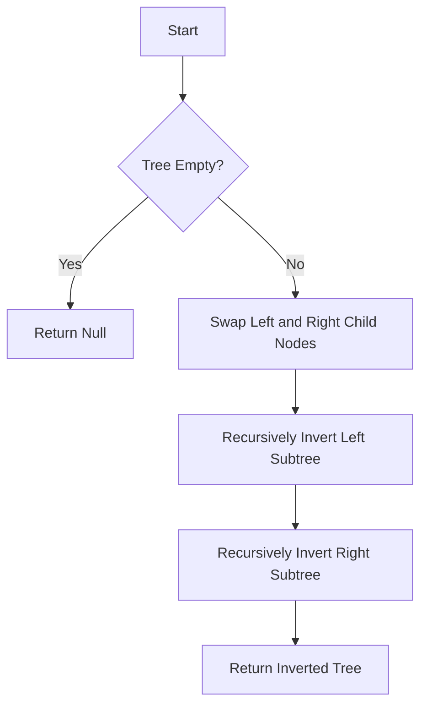

# Invert Binary Tree

## Problem Understanding
The problem is asking to invert a binary tree, which means swapping the left and right child nodes of each internal node. The key constraint is that the tree can be empty, and the problem becomes non-trivial because simply swapping the child nodes of each node would not work if the tree has multiple levels, requiring a recursive approach to handle the nested nodes. The problem requires a solution that can traverse the tree, swap the child nodes, and return the inverted tree.

## Approach
The algorithm strategy is to use recursive tree traversal to swap the left and right child nodes of each internal node. This approach works because it allows us to recursively traverse the tree, swapping the child nodes at each level. The mathematical/logical reasoning behind this approach is that it ensures that all nodes in the tree are visited and their child nodes are swapped, resulting in an inverted tree. The data structure used is a binary tree node, which is chosen because it represents the structure of the tree and allows for easy traversal and manipulation. The approach handles the key constraint of an empty tree by returning null in this case.

## Complexity Analysis
| Metric | Value | Detailed Reason |
|--------|-------|----------------|
| Time   | O(n)  | The time complexity is O(n) because each node in the tree is visited once, where n is the number of nodes in the tree. The recursive calls to invertTree do not increase the time complexity because each node is only visited once. |
| Space  | O(h)  | The space complexity is O(h) because the recursive call stack size is equal to the height of the tree, where h is the height of the tree. In the worst case, the tree is completely unbalanced, and the height of the tree is equal to the number of nodes, resulting in a space complexity of O(n). However, in the average case, the tree is balanced, and the height of the tree is logarithmic in the number of nodes, resulting in a space complexity of O(log n). |

## Algorithm Walkthrough
```
Input: 
    4
   / \
  2   7
 / \ / \
1  3 6  9
Step 1: 
    root = 4, left = 2, right = 7
    Recursively call invertTree on right subtree (7)
Step 2: 
    root = 7, left = 6, right = 9
    Recursively call invertTree on right subtree (9)
Step 3: 
    root = 9, left = null, right = null
    Return 9 (no children to invert)
Step 4: 
    root = 7, left = 6, right = 9
    Swap left and right child nodes
    root = 7, left = 9, right = 6
    Return 7
Step 5: 
    root = 4, left = 2, right = 7
    Recursively call invertTree on left subtree (2)
Step 6: 
    root = 2, left = 1, right = 3
    Recursively call invertTree on right subtree (3)
Step 7: 
    root = 3, left = null, right = null
    Return 3 (no children to invert)
Step 8: 
    root = 2, left = 1, right = 3
    Swap left and right child nodes
    root = 2, left = 3, right = 1
    Return 2
Step 9: 
    root = 4, left = 2, right = 7
    Swap left and right child nodes
    root = 4, left = 7, right = 2
    Return 4
Output: 
    4
   / \
  7   2
 / \ / \
9  6 3  1
```
## Visual Flow

## Key Insight
> **Tip:** The key insight to solving this problem is to realize that inverting a binary tree can be done recursively by swapping the left and right child nodes of each internal node.

## Edge Cases
- **Empty tree**: If the input tree is empty (i.e., null), the function returns null, as there are no nodes to invert.
- **Single node tree**: If the input tree has only one node, the function returns the same tree, as there are no child nodes to invert.
- **Unbalanced tree**: If the input tree is unbalanced, the function still works correctly by recursively inverting the left and right subtrees.

## Common Mistakes
- **Mistake 1: Not handling the empty tree case**: Failing to check for an empty tree can result in a NullPointerException when trying to access the child nodes.
- **Mistake 2: Not using recursion**: Trying to invert the tree iteratively can be complex and error-prone, whereas recursion provides a simple and elegant solution.

## Interview Follow-ups
> **Interview:** These are the exact follow-up questions interviewers ask:
- "What if the input is sorted?" → The algorithm still works correctly, as it only relies on the tree structure, not the values of the nodes.
- "Can you do it in O(1) space?" → No, because the recursive call stack requires O(h) space, where h is the height of the tree.
- "What if there are duplicates?" → The algorithm still works correctly, as it only relies on the tree structure, not the values of the nodes.

## Java Solution

```java
// Problem: Invert Binary Tree
// Language: Java
// Difficulty: Easy
// Time Complexity: O(n) — visiting each node once
// Space Complexity: O(h) — recursive call stack size, where h is the height of the tree
// Approach: Recursive tree traversal — swapping left and right child nodes

/**
 * Definition for a binary tree node.
 * public class TreeNode {
 *     int val;
 *     TreeNode left;
 *     TreeNode right;
 *     TreeNode() {}
 *     TreeNode(int val) { this.val = val; }
 *     TreeNode(int val, TreeNode left, TreeNode right) {
 *         this.val = val;
 *         this.left = left;
 *         this.right = right;
 *     }
 * }
 */
class Solution {
    public TreeNode invertTree(TreeNode root) {
        // Edge case: empty tree → return null
        if (root == null) return null;

        // Swap left and right subtree
        TreeNode temp = root.left; // Store left subtree
        root.left = invertTree(root.right); // Recursively invert right subtree and assign to left
        root.right = invertTree(temp); // Recursively invert stored left subtree and assign to right

        return root; // Return the inverted tree
    }
}
```
