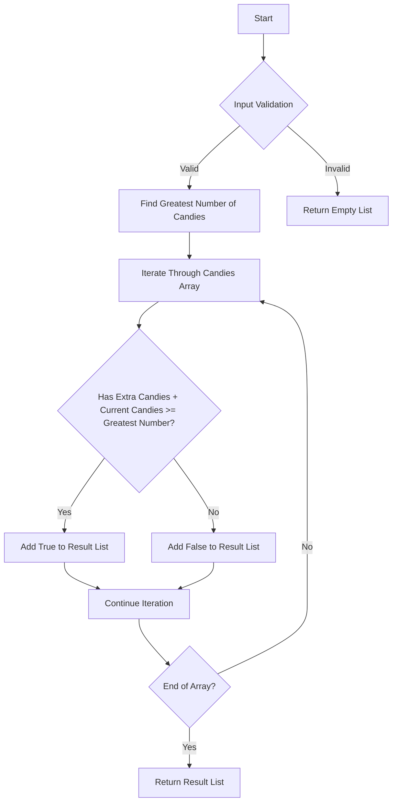

# Kids With the Greatest Number of Candies

## Problem Understanding
The problem "Kids With the Greatest Number of Candies" asks to determine which kids will have the greatest number of candies after receiving a certain number of extra candies. The key constraint is that we need to compare each kid's candy count after receiving extra candies to the greatest number of candies any kid has initially. What makes this problem non-trivial is the need to efficiently find the greatest number of candies and then compare each kid's candy count to this maximum, all while handling edge cases such as empty input or a single kid. The problem requires a careful approach to avoid unnecessary iterations or comparisons.

## Approach
The algorithm strategy is a two-pass iteration: first, find the greatest number of candies any kid has, and then iterate through the candies array again to determine which kids will have the greatest number of candies after receiving extra candies. This approach works because it ensures we have the maximum candy count to compare against, allowing us to accurately determine which kids will be among the top after receiving extra candies. We use a simple iterative method to find the maximum and then a list to store the results of our comparisons, where each element in the list corresponds to whether a kid will have the greatest number of candies or not. The approach handles key constraints by efficiently finding the maximum candy count and then making direct comparisons to this maximum.

## Complexity Analysis
| Metric | Value | Detailed Reason |
|--------|-------|----------------|
| Time   | O(n)  | We make two passes through the candies array: one to find the greatest number of candies (O(n)) and another to compare each kid's candy count to this maximum (O(n)), resulting in a total time complexity of O(n) + O(n) = O(2n), which simplifies to O(n). |
| Space  | O(n)  | We use a list to store the results, and in the worst case, every kid could have the greatest number of candies after receiving extra candies, leading to a list of size n, hence the space complexity is O(n). |

## Algorithm Walkthrough
```
Input: candies = [2,3,5,1,3], extraCandies = 3
Step 1: Initialize result list and find the greatest number of candies
  - Initialize result = []
  - greatestNumber = 5 (found by iterating through candies array)
Step 2: Iterate through candies array to find kids with the greatest number of candies
  - For candies[0] = 2, 2 + 3 = 5 >= greatestNumber, so result.add(true)
  - For candies[1] = 3, 3 + 3 = 6 >= greatestNumber, so result.add(true)
  - For candies[2] = 5, 5 + 3 = 8 >= greatestNumber, so result.add(true)
  - For candies[3] = 1, 1 + 3 = 4 < greatestNumber, so result.add(false)
  - For candies[4] = 3, 3 + 3 = 6 >= greatestNumber, so result.add(true)
Output: result = [true, true, true, false, true]
```
This walkthrough demonstrates how the algorithm iterates through the candies array to find the greatest number of candies and then determines which kids will have the greatest number of candies after receiving extra candies.

## Visual Flow

This flowchart illustrates the decision flow of the algorithm, including input validation, finding the greatest number of candies, and iterating through the candies array to determine which kids will have the greatest number of candies after receiving extra candies.

## Key Insight
> **Tip:** The key insight is to first find the maximum candy count and then compare each kid's candy count plus extra candies to this maximum, allowing for an efficient determination of which kids will be among the top.

## Edge Cases
- **Empty/null input**: If the input array is empty, the algorithm returns an empty list because there are no kids to compare.
- **Single element**: If there is only one kid, the algorithm will always return a list with a single true element, indicating that this kid will have the greatest number of candies after receiving extra candies.
- **All kids have the same number of candies**: In this case, the algorithm will return a list where all elements are true, indicating that all kids will have the greatest number of candies after receiving extra candies.

## Common Mistakes
- **Mistake 1**: Not initializing the greatest number of candies to the minimum possible value, leading to incorrect results if all candy counts are negative.
  → Avoid this by initializing `greatestNumber` to `Integer.MIN_VALUE`.
- **Mistake 2**: Not checking for the edge case where the input array is empty, leading to a potential `NullPointerException`.
  → Avoid this by explicitly checking for an empty input array and returning an empty list in such cases.

## Interview Follow-ups
> **Interview:** These are the exact follow-up questions interviewers ask:
- "What if the input is sorted?" → The algorithm's time complexity remains O(n) because we still need to make two passes through the array: one to find the maximum and another to compare each kid's candy count. However, knowing the array is sorted could allow for a slight optimization in finding the maximum by starting from the end of the array, but this does not change the overall time complexity.
- "Can you do it in O(1) space?" → This is not possible because we need to store the results for each kid, and in the worst case, this requires a list of size n, leading to a space complexity of O(n).
- "What if there are duplicates?" → The presence of duplicates does not affect the algorithm's time or space complexity. The algorithm will correctly identify which kids will have the greatest number of candies after receiving extra candies, even if there are duplicate candy counts.

## Java Solution

```java
// Problem: Kids With the Greatest Number of Candies
// Language: Java
// Difficulty: Easy
// Time Complexity: O(n) — single pass through array to find maximum and another pass to find kids with greatest number of candies
// Space Complexity: O(n) — result list stores at most n elements
// Approach: Two-pass iteration — first find the greatest number of candies, then find kids with that number of candies

public class Solution {
    public List<Boolean> kidsWithCandies(int[] candies, int extraCandies) {
        // Initialize an empty list to store the results
        List<Boolean> result = new ArrayList<>();
        
        // Edge case: empty input → return empty list
        if (candies.length == 0) {
            return result;
        }
        
        // Find the greatest number of candies
        int greatestNumber = Integer.MIN_VALUE; // initialize with minimum possible value
        for (int candy : candies) {
            // Update the greatest number if current candy count is higher
            greatestNumber = Math.max(greatestNumber, candy);
        }
        
        // Iterate through the candies array again to find kids with the greatest number of candies
        for (int candy : candies) {
            // Check if the kid has the greatest number of candies after receiving extra candies
            if (candy + extraCandies >= greatestNumber) {
                // Add true to the result list if the kid has the greatest number of candies
                result.add(true);
            } else {
                // Add false to the result list if the kid does not have the greatest number of candies
                result.add(false);
            }
        }
        
        return result;
    }
}
```
