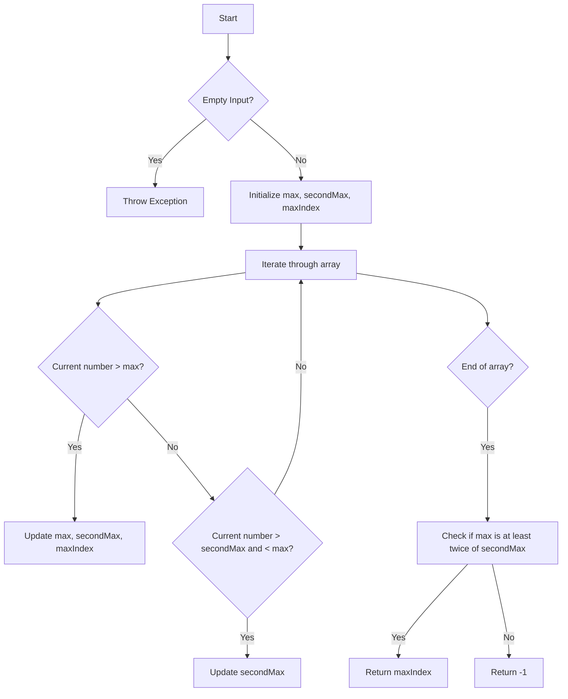

# Largest Number At Least Twice of Others

## Problem Understanding
The problem asks us to find the index of the largest number in an array that is at least twice as large as every other number in the array. If no such number exists, we should return -1. The key constraint is that we need to find a number that is at least twice as large as every other number, which implies that we need to compare each number with all other numbers in the array. What makes this problem non-trivial is that we cannot simply find the maximum number and then compare it with all other numbers, because we need to ensure that the maximum number is at least twice as large as every other number.

## Approach
The algorithm strategy is to find the maximum and second maximum numbers in a single pass through the array, and then check if the maximum number is at least twice as large as the second maximum number. This approach works because we only need to compare the maximum number with the second maximum number to determine if it is at least twice as large as every other number. We use variables to keep track of the maximum and second maximum numbers, as well as the index of the maximum number. We iterate through the array, updating the maximum and second maximum numbers as we go, and finally check if the maximum number is at least twice as large as the second maximum number.

## Complexity Analysis
| Metric | Value | Detailed Reason |
|--------|-------|----------------|
| Time   | O(n)  | We make a single pass through the array to find the maximum and second maximum numbers, where n is the length of the array. |
| Space  | O(1)  | We use a constant amount of space to store the maximum and second maximum numbers, as well as the index of the maximum number, regardless of the size of the input array. |

## Algorithm Walkthrough
```
Input: [3, 6, 1, 0]
Step 1: Initialize max = Integer.MIN_VALUE, secondMax = Integer.MIN_VALUE, maxIndex = -1
Step 2: Iterate through array, updating max and secondMax as we go:
    - For nums[0] = 3, max = 3, secondMax = Integer.MIN_VALUE, maxIndex = 0
    - For nums[1] = 6, max = 6, secondMax = 3, maxIndex = 1
    - For nums[2] = 1, max = 6, secondMax = 3, maxIndex = 1 (no change)
    - For nums[3] = 0, max = 6, secondMax = 3, maxIndex = 1 (no change)
Step 3: Check if max is at least twice of secondMax: 6 >= 2 * 3 = 6, so return maxIndex = 1
Output: 1
```

## Visual Flow


## Key Insight
> **Tip:** The key insight is to realize that we only need to compare the maximum number with the second maximum number to determine if it is at least twice as large as every other number.

## Edge Cases
- **Empty/null input**: If the input array is empty, we throw an exception because there is no maximum number to return.
- **Single element**: If the input array has only one element, we return the index of that element because it is the maximum number and there is no second maximum number to compare with.
- **All elements are equal**: If all elements in the input array are equal, we return -1 because there is no maximum number that is at least twice as large as every other number.

## Common Mistakes
- **Mistake 1**: Not checking for the edge case of an empty input array, which would result in a NullPointerException.
- **Mistake 2**: Not updating the second maximum number correctly, which would result in incorrect results.

## Interview Follow-ups
> **Interview:** These are the exact follow-up questions interviewers ask:
- "What if the input is sorted?" → We would still need to iterate through the array to find the maximum and second maximum numbers, because the problem statement does not guarantee that the input is sorted.
- "Can you do it in O(1) space?" → No, we would still need to use O(1) space to store the maximum and second maximum numbers, as well as the index of the maximum number.
- "What if there are duplicates?" → The algorithm would still work correctly, because we only need to compare the maximum number with the second maximum number, and duplicates would not affect the result.

## Java Solution

```java
// Problem: Largest Number At Least Twice of Others
// Language: Java
// Difficulty: Easy
// Time Complexity: O(n) — single pass through array to find max and second max
// Space Complexity: O(1) — constant space for variables
// Approach: Find max and second max in a single pass — for each number, update max and second max accordingly

public class Solution {
    public int dominantIndex(int[] nums) {
        // Edge case: empty input → throw exception
        if (nums.length == 0) {
            throw new IllegalArgumentException("Input array is empty");
        }

        // Initialize max and second max variables
        int max = Integer.MIN_VALUE; // max value in array
        int secondMax = Integer.MIN_VALUE; // second max value in array
        int maxIndex = -1; // index of max value in array

        // Find max and second max in a single pass
        for (int i = 0; i < nums.length; i++) {
            if (nums[i] > max) { // if current number is greater than max
                secondMax = max; // update second max to old max
                max = nums[i]; // update max to current number
                maxIndex = i; // update max index to current index
            } else if (nums[i] > secondMax && nums[i] < max) { // if current number is greater than second max but less than max
                secondMax = nums[i]; // update second max to current number
            }
        }

        // Check if max is at least twice of second max
        if (max >= secondMax * 2) {
            return maxIndex; // return index of max value
        } else {
            return -1; // return -1 if max is not at least twice of second max
        }
    }

    public static void main(String[] args) {
        Solution solution = new Solution();
        int[] nums = {3, 6, 1, 0};
        System.out.println(solution.dominantIndex(nums)); // Output: 1
    }
}
```
