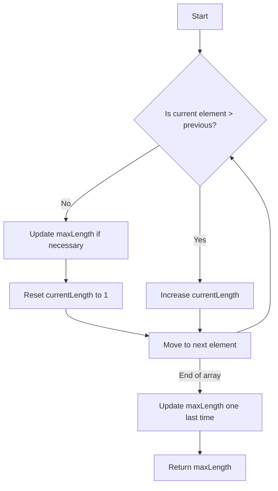

# Longest Continuous Increasing Subsequence

## Problem Understanding
The problem asks for the length of the longest continuous increasing subsequence in a given array of integers. This means we need to find a sequence where each element is greater than the previous one, and this sequence should be as long as possible. The key constraint is that the subsequence must be continuous, meaning the elements must be adjacent in the original array. This problem is non-trivial because a naive approach might involve checking all possible subsequences, which would result in exponential time complexity. However, the given solution achieves a linear time complexity by making a single pass through the array and tracking the length of the longest continuous increasing subsequence found so far.

## Approach
The algorithm strategy is to iteratively track the length of the longest continuous increasing subsequence. The intuition behind this approach is to maintain two variables: `maxLength` to store the maximum length found so far, and `currentLength` to store the length of the current increasing subsequence. We iterate through the array, and if the current element is greater than the previous one, we increase `currentLength`. If the sequence is not increasing, we update `maxLength` if necessary and reset `currentLength` to 1. We use constant space for these variables, achieving a space complexity of O(1). This approach handles the key constraint of continuity by only considering adjacent elements.

## Complexity Analysis
| Metric | Value | Detailed Reason |
|--------|-------|----------------|
| Time   | O(n)  | The algorithm makes a single pass through the array of length n, performing constant time operations for each element. |
| Space  | O(1)  | The algorithm uses a constant amount of space to store variables like `maxLength` and `currentLength`, regardless of the input size. |

## Algorithm Walkthrough
```
Input: [1, 3, 5, 4, 7, 8]
Step 1: Initialize maxLength = 1, currentLength = 1
Step 2: i = 1, nums[i] = 3 > nums[i-1] = 1, so currentLength = 2
Step 3: i = 2, nums[i] = 5 > nums[i-1] = 3, so currentLength = 3
Step 4: i = 3, nums[i] = 4 < nums[i-1] = 5, so maxLength = max(1, 3) = 3, currentLength = 1
Step 5: i = 4, nums[i] = 7 > nums[i-1] = 4, so currentLength = 2
Step 6: i = 5, nums[i] = 8 > nums[i-1] = 7, so currentLength = 3
Step 7: After the loop, maxLength = max(3, 3) = 3
Output: 3
```

## Visual Flow


## Key Insight
> **Tip:** The key to solving this problem efficiently is to maintain a running track of the current increasing subsequence length and update the maximum length whenever a longer subsequence is found, allowing for a single pass through the array.

## Edge Cases
- **Empty/null input**: If the input array is empty, the function returns 0, as there are no elements to form a subsequence.
- **Single element**: If the input array has only one element, the function returns 1, as a single element is itself a subsequence of length 1.
- **Array with equal elements**: If the input array contains equal elements, the function will treat them as not increasing, thus resetting the current length whenever it encounters an element that is not greater than the previous one.

## Common Mistakes
- **Mistake 1**: Not resetting `currentLength` to 1 when the sequence is not increasing, leading to incorrect tracking of the current subsequence length.
- **Mistake 2**: Not updating `maxLength` after the loop ends, which could result in missing the longest increasing subsequence if it ends at the last element of the array.

## Interview Follow-ups
> **Interview:** These are the exact follow-up questions interviewers ask:
- "What if the input is sorted?" → The algorithm will still work correctly, but the longest increasing subsequence will be the entire array if it's sorted in ascending order.
- "Can you do it in O(1) space?" → The given solution already achieves O(1) space complexity by only using a constant amount of space for variables.
- "What if there are duplicates?" → The algorithm treats duplicates as not increasing, so it will reset the current length whenever it encounters a duplicate, ensuring that only strictly increasing subsequences are considered.

## Java Solution

```java
// Problem: Longest Continuous Increasing Subsequence
// Language: Java
// Difficulty: Easy
// Time Complexity: O(n) — single pass through array
// Space Complexity: O(1) — constant space for variables
// Approach: Iterative sequence length tracking — track the length of the longest continuous increasing subsequence

public class Solution {
    /**
     * Returns the length of the longest continuous increasing subsequence.
     * 
     * @param nums an array of integers
     * @return the length of the longest continuous increasing subsequence
     */
    public int findLengthOfLCIS(int[] nums) {
        // Edge case: empty input → return 0
        if (nums.length == 0) {
            return 0;
        }

        int maxLength = 1; // initialize with minimum possible length
        int currentLength = 1; // initialize with minimum possible length

        // Iterate through the array starting from the second element
        for (int i = 1; i < nums.length; i++) {
            // If the current element is greater than the previous one, it's an increasing sequence
            if (nums[i] > nums[i - 1]) {
                // Increase the length of the current increasing subsequence
                currentLength++;
            } else {
                // If the sequence is not increasing, update the max length if necessary
                maxLength = Math.max(maxLength, currentLength);
                // Reset the current length to 1 (start a new subsequence)
                currentLength = 1;
            }
        }

        // Update the max length one last time after the loop ends
        maxLength = Math.max(maxLength, currentLength);

        return maxLength;
    }
}
```
