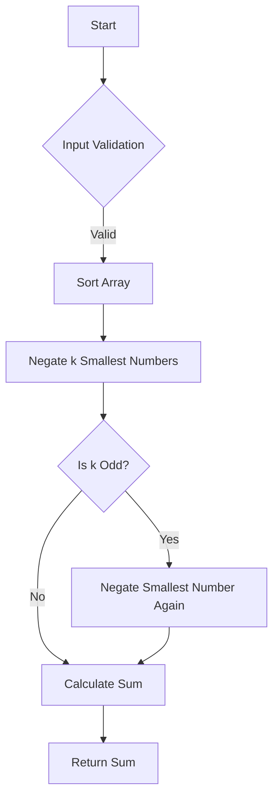

# Maximize Sum Of Array After K Negations

## Problem Understanding
The problem is asking to maximize the sum of an array after performing k negations on its elements. The key constraint is that we can only negate the smallest numbers first to maximize the sum. The problem is non-trivial because simply negating all the numbers would not necessarily result in the maximum sum, as the order of negation matters. The naive approach of negating all numbers or negating the largest numbers first would not work because it would not take into account the optimal order of negation.

## Approach
The algorithm strategy is to sort the array in ascending order to easily find the smallest numbers, and then negate the k smallest numbers. This approach works because by negating the smallest numbers first, we maximize the increase in the sum. The mathematical reasoning behind this is that negating a small number results in a larger increase in the sum compared to negating a larger number. The data structure used is an array, which is suitable for this problem because it allows for efficient sorting and negation of elements. The approach handles the key constraint of negating the smallest numbers first by sorting the array and then negating the k smallest numbers.

## Complexity Analysis
| Metric | Value | Detailed Reason |
|--------|-------|----------------|
| Time   | O(n log n) | The time complexity is dominated by the sorting operation, which takes O(n log n) time. The subsequent negation and sum calculation operations take O(n) time, but are dominated by the sorting operation. |
| Space  | O(1) | The space complexity is O(1) because no additional space is used that scales with the input size. The input array is sorted in-place, and the output sum is calculated using a constant amount of space. |

## Algorithm Walkthrough
```
Input: nums = [3, 2, 20, 1, 1, 3], k = 3
Step 1: Sort the array in ascending order: [1, 1, 2, 3, 3, 20]
Step 2: Negate the k smallest numbers: [1 becomes -1, 1 becomes -1, 2 becomes -2]
Step 3: If k is odd and there are remaining numbers, negate the smallest one again: k is 3 (odd), so negate the smallest number in the un-negated part of the array: [3 becomes -3]
Step 4: Calculate the sum of the array after negations: [-1, -1, -2, 3, -3, 20] = -1 - 1 - 2 + 3 - 3 + 20 = 16
Output: 16
```
## Visual Flow

## Key Insight
> **Tip:** The key insight is to sort the array in ascending order to easily find the smallest numbers and negate them first to maximize the sum.

## Edge Cases
- **Empty/null input**: If the input array is empty or null, the function returns 0, as the sum of an empty array is 0.
- **Single element**: If the input array has only one element, the function negates it if k is odd, and returns the negated value. If k is even, the function returns the original value.
- **k is greater than the length of the array**: If k is greater than the length of the array, the function negates all the numbers in the array and then negates the smallest number again if k is odd.

## Common Mistakes
- **Mistake 1**: Not checking for edge cases, such as an empty or null input array. To avoid this, always check for edge cases at the beginning of the function.
- **Mistake 2**: Not sorting the array in ascending order before negating the k smallest numbers. To avoid this, always sort the array before negating the k smallest numbers.

## Interview Follow-ups
> **Interview:** These are the exact follow-up questions interviewers ask:
- "What if the input is sorted?" → The function would still work correctly, as it sorts the array anyway.
- "Can you do it in O(1) space?" → No, the function uses O(1) space, as it only uses a constant amount of space to store the sum and other variables.
- "What if there are duplicates?" → The function would still work correctly, as it negates the k smallest numbers regardless of duplicates.

## Java Solution

```java
// Problem: Maximize Sum Of Array After K Negations
// Language: Java
// Difficulty: Easy
// Time Complexity: O(n log n) — sorting the array
// Space Complexity: O(1) — no additional space used
// Approach: Sorting and negating smallest numbers — to maximize sum, negate smallest numbers first

public class Solution {
    public int largestSumAfterKNegations(int[] nums, int k) {
        // Edge case: empty input → return 0 (since sum of empty array is 0)
        if (nums.length == 0) return 0;

        // Sort the array in ascending order to easily find the smallest numbers
        Arrays.sort(nums); // smallest numbers will be at the beginning of the array

        // Negate the k smallest numbers
        for (int i = 0; i < k; i++) {
            // If we've reached the end of the array, stop negating
            if (i >= nums.length) break; 
            // Negate the current smallest number
            nums[i] = -nums[i]; 
        }

        // If k is odd and there are remaining numbers, negate the smallest one again
        if (k % 2 == 1 && nums.length > k) {
            // Find the smallest number in the un-negated part of the array
            int minIndex = k; // start looking from the k-th index
            for (int i = k + 1; i < nums.length; i++) {
                if (nums[i] < nums[minIndex]) {
                    minIndex = i; // update the index of the smallest number
                }
            }
            // Negate the smallest number again
            nums[minIndex] = -nums[minIndex];
        }

        // Calculate the sum of the array after negations
        int sum = 0;
        for (int num : nums) {
            sum += num; // add each number to the sum
        }

        return sum; // return the maximum sum
    }
}
```
