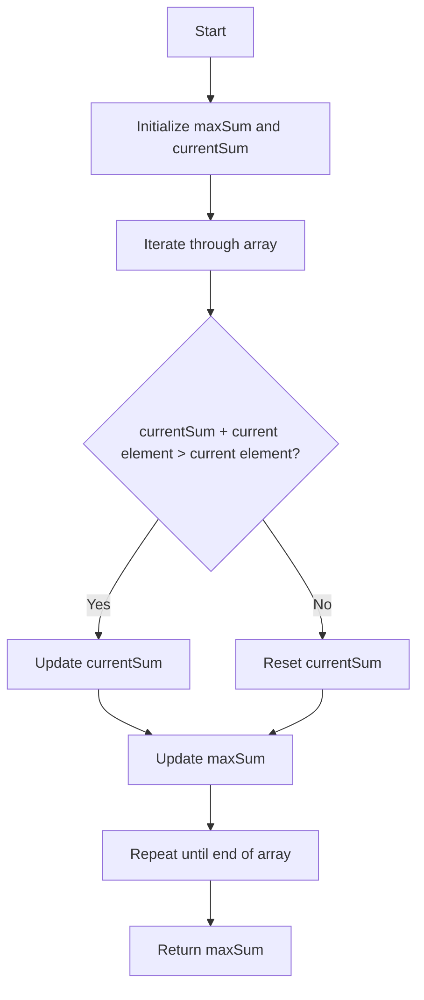

# Maximum Subarray

## Problem Understanding
The Maximum Subarray problem asks to find the maximum sum of a contiguous subarray within a given array of integers. The key constraint is that the subarray must be contiguous, meaning its elements are adjacent to each other in the original array. This problem is non-trivial because a naive approach, such as checking every possible subarray, would have a time complexity of O(n^2) or O(n^3), which is inefficient for large inputs. The problem requires a more efficient algorithm that can find the maximum subarray sum in linear time.

## Approach
The algorithm strategy used to solve this problem is Kadane's algorithm, which iterates through the array and for each element, decides whether to include it in the current subarray or start a new one. This approach works because it keeps track of the maximum sum seen so far and the current sum, allowing it to make informed decisions about which elements to include in the subarray. The data structure used is a simple array to store the input integers, and two variables to keep track of the maximum sum and the current sum. This approach handles the key constraint of contiguity by only considering adjacent elements when deciding whether to extend the current subarray.

## Complexity Analysis
| Metric | Value | Detailed Reason |
|--------|-------|----------------|
| Time   | O(n)  | The algorithm makes a single pass through the array, performing a constant amount of work for each element. The time complexity is linear because the number of operations grows directly with the size of the input array. |
| Space  | O(1)  | The algorithm uses a constant amount of space to store the maximum sum, the current sum, and the input array. The space complexity is constant because the amount of space used does not grow with the size of the input array. |

## Algorithm Walkthrough
```
Input: [-2, 1, -3, 4, -1, 2, 1, -5, 4]
Step 1: maxSum = -2, currentSum = -2 (initialize with the first element)
Step 2: currentSum = max(-2 + 1, 1) = 1, maxSum = max(-2, 1) = 1
Step 3: currentSum = max(1 - 3, -3) = -2, maxSum = max(1, -2) = 1
Step 4: currentSum = max(-2 + 4, 4) = 4, maxSum = max(1, 4) = 4
Step 5: currentSum = max(4 - 1, -1) = 3, maxSum = max(4, 3) = 4
Step 6: currentSum = max(3 + 2, 2) = 5, maxSum = max(4, 5) = 5
Step 7: currentSum = max(5 + 1, 1) = 6, maxSum = max(5, 6) = 6
Step 8: currentSum = max(6 - 5, -5) = 1, maxSum = max(6, 1) = 6
Step 9: currentSum = max(1 + 4, 4) = 5, maxSum = max(6, 5) = 6
Output: 6 (the maximum subarray sum)
```
This walkthrough demonstrates how the algorithm iterates through the array, making decisions about which elements to include in the subarray, and keeping track of the maximum sum seen so far.

## Visual Flow

This flowchart visualizes the decision-making process of the algorithm, showing how it iterates through the array and updates the maximum sum and current sum.

## Key Insight
> **Tip:** The key insight is to realize that the maximum subarray sum can be found by iterating through the array and making local decisions about which elements to include in the subarray, rather than trying to consider all possible subarrays.

## Edge Cases
- **Empty/null input**: If the input array is empty, the algorithm returns 0, as per the LeetCode convention. This is because there are no elements to consider, and the maximum subarray sum is undefined.
- **Single element**: If the input array contains only one element, the algorithm returns that element, since it is the only possible subarray.
- **All negative numbers**: If the input array contains only negative numbers, the algorithm returns the largest negative number, since it is the maximum subarray sum that can be achieved.

## Common Mistakes
- **Mistake 1**: Not initializing the maximum sum and current sum correctly, leading to incorrect results. To avoid this, make sure to initialize the maximum sum and current sum with the first element of the array.
- **Mistake 2**: Not updating the maximum sum correctly, leading to incorrect results. To avoid this, make sure to update the maximum sum whenever the current sum is greater than the maximum sum.

## Interview Follow-ups
> **Interview:** These are the exact follow-up questions interviewers ask:
- "What if the input is sorted?" → The algorithm still works correctly, with a time complexity of O(n), since it only depends on the relative order of the elements, not their absolute values.
- "Can you do it in O(1) space?" → No, the algorithm requires O(1) space to store the maximum sum and current sum, but it cannot be done in O(1) space without using any extra space at all.
- "What if there are duplicates?" → The algorithm works correctly even if there are duplicates in the input array, since it only considers the maximum sum of contiguous subarrays, and duplicates do not affect this.

## Java Solution

```java
// Problem: Maximum Subarray
// Language: Java
// Difficulty: Easy
// Time Complexity: O(n) — single pass through array using Kadane's algorithm
// Space Complexity: O(1) — only a constant amount of space is used
// Approach: Kadane's algorithm — for each element, decide whether to include it in the current subarray or start a new one

public class Solution {
    /**
     * Returns the maximum sum of a contiguous subarray within the given array.
     * 
     * @param nums the input array of integers
     * @return the maximum sum of a contiguous subarray
     */
    public int maxSubArray(int[] nums) {
        // Edge case: empty input → return 0 (as per LeetCode convention)
        if (nums.length == 0) return 0;
        
        // Initialize variables to keep track of the maximum sum and the current sum
        int maxSum = nums[0]; // maximum sum seen so far
        int currentSum = nums[0]; // sum of the current subarray
        
        // Iterate through the array starting from the second element
        for (int i = 1; i < nums.length; i++) {
            // For each element, decide whether to include it in the current subarray or start a new one
            // by choosing the maximum between the current sum plus the current element, and the current element itself
            currentSum = Math.max(nums[i], currentSum + nums[i]);
            
            // Update the maximum sum if the current sum is greater
            maxSum = Math.max(maxSum, currentSum);
        }
        
        // Return the maximum sum found
        return maxSum;
    }

    public static void main(String[] args) {
        Solution solution = new Solution();
        int[] nums = {-2, 1, -3, 4, -1, 2, 1, -5, 4};
        System.out.println("Maximum subarray sum: " + solution.maxSubArray(nums));
    }
}
```
