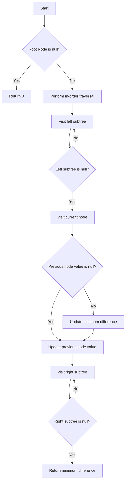

# Minimum Distance Between BST Nodes

## Problem Understanding
The problem is asking to find the minimum distance between two nodes in a Binary Search Tree (BST). The key constraint is that the tree is a BST, which means for every node, all elements in the left subtree are less than the node, and all elements in the right subtree are greater than the node. This constraint implies that an in-order traversal of the tree will visit nodes in ascending order, making it easier to find the minimum distance between adjacent nodes. The problem is non-trivial because a naive approach, such as comparing every pair of nodes, would result in a time complexity of O(n^2), which is inefficient for large trees.

## Approach
The algorithm strategy is to use an in-order traversal of the BST to visit nodes in ascending order, while keeping track of the previous node's value. This approach works because the in-order traversal ensures that nodes are visited in ascending order, allowing us to easily find the minimum difference between adjacent nodes. The data structure used is a recursive call stack to perform the in-order traversal, and two instance variables to keep track of the minimum difference and the previous node's value. This approach handles the key constraint of the BST by leveraging the property of in-order traversal to visit nodes in ascending order.

## Complexity Analysis
| Metric | Value | Detailed Reason |
|--------|-------|----------------|
| Time   | O(n)  | The algorithm visits each node exactly once during the in-order traversal, resulting in a linear time complexity. The comparison and update operations inside the traversal take constant time, so they do not affect the overall time complexity. |
| Space  | O(n)  | In the worst-case scenario, the tree is skewed to one side, resulting in a recursive call stack of depth n. In the best-case scenario, the tree is balanced, resulting in a recursive call stack of depth log(n). However, since we are considering the worst-case scenario, the space complexity is O(n). |

## Algorithm Walkthrough
```
Input: 
     4
   /   \
  2     6
 / \   / \
1   3 5   7

Step 1: Start in-order traversal from the root node (4)
  - prevNodeValue is null, minDiff is Integer.MAX_VALUE
Step 2: Visit node 1 (left subtree of 2)
  - prevNodeValue is still null, minDiff is still Integer.MAX_VALUE
  - Update prevNodeValue to 1
Step 3: Visit node 2 (parent of 1 and 3)
  - prevNodeValue is 1, minDiff is still Integer.MAX_VALUE
  - Update minDiff to 2 - 1 = 1
  - Update prevNodeValue to 2
Step 4: Visit node 3 (right subtree of 2)
  - prevNodeValue is 2, minDiff is 1
  - Update minDiff to min(1, 3 - 2) = 1
  - Update prevNodeValue to 3
Step 5: Visit node 4 (root node)
  - prevNodeValue is 3, minDiff is 1
  - Update minDiff to min(1, 4 - 3) = 1
  - Update prevNodeValue to 4
Step 6: Visit node 5 (left subtree of 6)
  - prevNodeValue is 4, minDiff is 1
  - Update minDiff to min(1, 5 - 4) = 1
  - Update prevNodeValue to 5
Step 7: Visit node 6 (parent of 5 and 7)
  - prevNodeValue is 5, minDiff is 1
  - Update minDiff to min(1, 6 - 5) = 1
  - Update prevNodeValue to 6
Step 8: Visit node 7 (right subtree of 6)
  - prevNodeValue is 6, minDiff is 1
  - Update minDiff to min(1, 7 - 6) = 1
  - Update prevNodeValue to 7
Output: minDiff is 1
```

## Visual Flow


## Key Insight
> **Tip:** The key insight is to leverage the property of in-order traversal to visit nodes in ascending order, allowing us to easily find the minimum difference between adjacent nodes.

## Edge Cases
- **Empty/null input**: If the input tree is empty, the function returns 0 as per the problem definition.
- **Single element**: If the input tree has only one node, the function returns 0 because there are no adjacent nodes to compare.
- **Duplicate values**: If the input tree has duplicate values, the function will still work correctly because it compares the values of adjacent nodes, not the nodes themselves.

## Common Mistakes
- **Mistake 1**: Not initializing the `prevNodeValue` to `null` and `minDiff` to `Integer.MAX_VALUE`. This can lead to incorrect results if the first node's value is greater than the minimum difference.
- **Mistake 2**: Not updating the `prevNodeValue` and `minDiff` correctly during the in-order traversal. This can lead to incorrect results if the minimum difference is not updated correctly.

## Interview Follow-ups
> **Interview:** 
- "What if the input is sorted?" → The algorithm will still work correctly, but the time complexity will be O(n) because we still need to visit each node.
- "Can you do it in O(1) space?" → No, because we need to use a recursive call stack to perform the in-order traversal, which takes O(n) space in the worst case.
- "What if there are duplicates?" → The algorithm will still work correctly, but the minimum difference may be 0 if there are duplicate values.

## Java Solution

```java
// Problem: Minimum Distance Between BST Nodes
// Language: Java
// Difficulty: Easy
// Time Complexity: O(n) — single pass through the tree using in-order traversal
// Space Complexity: O(n) — recursion stack in the worst case (when the tree is skewed)
// Approach: In-order traversal with tracking previous node value — to find the minimum difference between adjacent nodes

class Solution {
    private int minDiff = Integer.MAX_VALUE; // Initialize min difference as max integer value
    private Integer prevNodeValue = null; // Store the value of the previous node

    public int minDiffInBST(TreeNode root) {
        // Edge case: empty tree → return 0 (as per problem definition)
        if (root == null) return 0;

        inOrderTraversal(root); // Perform in-order traversal to visit nodes in ascending order
        return minDiff; // Return the minimum difference found
    }

    private void inOrderTraversal(TreeNode node) {
        if (node == null) return; // Base case: if node is null, stop recursion

        inOrderTraversal(node.left); // Recursively visit the left subtree

        if (prevNodeValue != null) { // If previous node value is not null
            minDiff = Math.min(minDiff, node.val - prevNodeValue); // Update min difference
        }

        prevNodeValue = node.val; // Update previous node value

        inOrderTraversal(node.right); // Recursively visit the right subtree
    }

    // Definition for a binary tree node.
    public class TreeNode {
        int val;
        TreeNode left;
        TreeNode right;
        TreeNode() {}
        TreeNode(int val) { this.val = val; }
        TreeNode(int val, TreeNode left, TreeNode right) {
            this.val = val;
            this.left = left;
            this.right = right;
        }
    }
}
```
